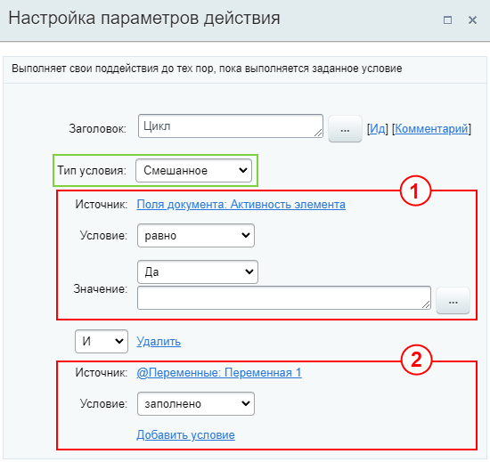

# Цикл

**Навигация**
- [← Оглавление курса](index.md)
- [← Предыдущий: 3859 — Установить статус](lesson_3859.md)
- [Следующий: 3800 — График отсутствия →](lesson_3800.md)

Официальная страница урока: https://dev.1c-bitrix.ru/learning/course/index.php?COURSE_ID=57&LESSON_ID=3792

Цикл повторяет свои действия, пока условие верно. Он проверяет это условие только после того, как выполнит все действия за одну итерацию. Если условие изменится на неверное во время выполнения, цикл все равно завершит текущую итерацию и только потом проверит условие снова.

**Ограничения количества итераций цикла**

- В облачной версии Битрикс24 количество итераций цикла ограничено значением `1000`.
- В коробочной версии ограничить количество можно в настройках модуля Бизнес-процессы в параметре *Максимальное количество итераций цикла в рамках одного запуска*. Настройка доступна с версии 25.100.0. Значение по умолчанию — `1000`.

- **Смешанное**
  Тип дает возможность указать условие одновременно по параметрам, переменным, константам, глобальным константам, глобальным переменным, полям документа и дополнительным результатам без необходимости создавать разные ветки и дополнительные переменные. При этом условия объединяются по правилу **И / ИЛИ**. При выборе **И** ветка условий будет исполняться при выполнении обоих условий, а при **ИЛИ** – любого из указанных.
  
  **Примечание:** В описании конструкции [Условие](lesson_3789.md) вы найдете подробное пояснение как использовать **И/ИЛИ** и описание всех условий с примерами.
  На скриншоте под номером 1 выбрано условие типа **Поле документа**, а под номером 2 – **Глобальная переменная**. Условия объединены правилом **И**.
- **PHP код**
  В качестве условия указывается
  			код
                      **Примечание:** Задавать PHP-код может только пользователь с правами администратора.
  		.
  В случае если указанный PHP код вернет значение `true`, то цикл продолжит работу, если возвратится `false`, то будет произведен выход из цикла.
- **Значение переменной**
  Цикл будет продолжать свою работу, пока совпадают параметры, связанные с переменными бизнес-процесса.
  **Примечание:** В этом типе могут быть использованы значения **переменных** или **параметров** шаблона. Константы, глобальные константы и глобальные переменные доступны только в типе **Смешанное условие**.
- **Поле документа**
  Цикл будет продолжать свою работу, пока совпадают параметры, связанные с полями документа.
- **Истина**
  В этом случае цикл будет выполняться всегда

**Внимание**! НЕ используйте действие **Почтовое сообщение** при тестировании работы цикла. В *облачной версии Битрикс24* в случае некорректной настройки процесс зациклится, почтовое сообщение отработает 1000 раз и клиенту уйдет 1000 писем. Остановить их отправку нельзя.
Сначала убедитесь, что цикл работает правильно, а потом используйте его для отправки писем.

#### Дополнительно

- [Пример использования цикла для утверждения документа](lesson_3842.md)
