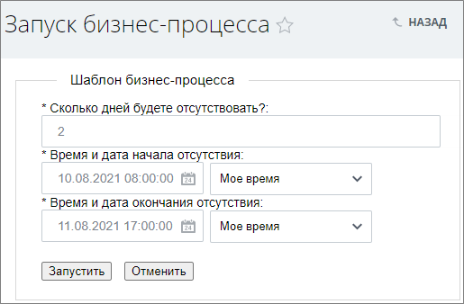
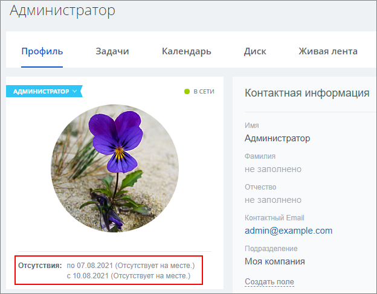
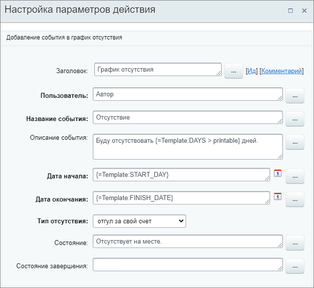

# График отсутствия

**Навигация**
- [← Оглавление курса](index.md)
- [← Предыдущий: 3792 — Цикл](lesson_3792.md)
- [Следующий: 7395 — Добавить новость →](lesson_7395.md)

Официальная страница урока: https://dev.1c-bitrix.ru/learning/course/index.php?COURSE_ID=57&LESSON_ID=3800

Действие позволяет добавить событие в

			график отсутствия

                    В этом графике выводится вся информация об отсутствиях сотрудников на рабочем месте. Их можно проконтролировать, рассортировать все данные, например, для отдела кадров (отпуска, отгулы и больничные) и по личным календарям (командировки, работа вне офиса и т.п.).

Подробнее на [helpdesk.bitrix24.ru](https://helpdesk.bitrix24.ru/open/5349195/).

		 аналогично [добавлению отсутствия](https://helpdesk.bitrix24.ru/open/5349281/) в публичной части Битрикс24.

#### Описание Параметров

- **Пользователь** – укажите пользователя, для которого будет занесено событие в график отсутствия. Обязательный параметр;
- **Название события** – название события в графике. Обязательный параметр;
- **Описание события** – более подробное описание события;
- **Дата начала** – дата и время начала события. Обязательный параметр;
- **Дата окончания** – дата и время окончания события. Обязательный параметр;
- **Тип отсутствия** – выберите тип из списка. Обязательный параметр;
- **Состояние** – укажите состояние пользователя на время отсутствия. Например: *Болеет* или *Отдыхает*. Состояние будет отражено в профиле пользователя в отсутствиях;
- **Состояние завершения** – укажите состояние пользователя по завершению отсутствия. Например: *Работает*.
  **Примечание:** параметр **Состояние завершения** является устаревшим. Результат его заполнения не отобразится где-либо в публичном разделе.

#### Пример

В примере в качестве пользователя указан **Автор**, т.е. пользователь, запустивший бизнес-процесс. В качестве даты начала и окончания отсутствия, а также количества дней в описании, используются

			параметры

                    В нашем примере эти параметры заполнит пользователь при запуске бизнес-процесса:

		 шаблона бизнес-процесса. В поле состояния указана фраза **Отсутствует на месте.**, которая отобразится в профиле в

			отсутствиях

                    

		.

