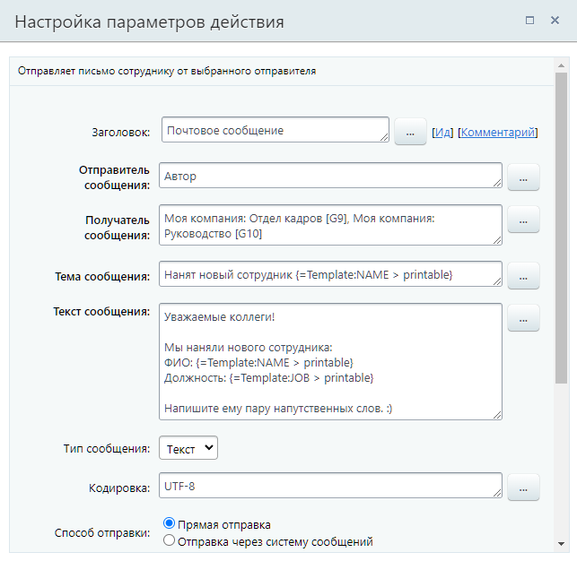

# Почтовое сообщение

**Навигация**
- [← Оглавление курса](index.md)
- [← Предыдущий: 3805 — Поставить задачу](lesson_3805.md)
- [Следующий: 5796 — Событие календаря →](lesson_5796.md)

Официальная страница урока: https://dev.1c-bitrix.ru/learning/course/index.php?COURSE_ID=57&LESSON_ID=3802

Действие отправляет письмо сотруднику от выбранного отправителя.


### Описание


В первую очередь действие предназначено для отправки сообщения в виде письма на e-mail сотруднику портала. При необходимости получателем можно указать любой сторонний e-mail адрес.


Для отправки письма клиенту в CRM используйте действие [Отправить письмо клиенту](lesson_8529.md). В этом случае факт отправки будет отображаться в таймлайне сущности CRM. Действие **Почтовое сообщение** с CRM не связано, поэтому в таймлайне вы не найдете информации об отправке такого письма.


О том, как настроить работу почты в Битрикс24 вы найдете в:


- в статьях [Поддержки24](https://helpdesk.bitrix24.ru/open/18344444/) (для облака);
- в главе [Настройка почты](https://dev.1c-bitrix.ru/learning/course/index.php?COURSE_ID=48&CHAPTER_ID=04796) учебного курса Администратор сервиса Битрикс24 (коробочная версия).


**Примечание:** На текущий момент письма, отправленные действием, не сохраняются в папке **Отправленные** почты отправителя. Таком образом, отследить отправку не получится.


**Внимание:** В облачном Битрикс24 для действия **Почтовое сообщение** введено ограничение

			на отправку сообщений

                    Ограничение касается тех email-ов, с которых планируется отправка сообщения.

		 от неподтвержденных/неподключенных адресов.


### Параметры


- **Отправитель сообщения** – указывается пользователь, от имени которого будет отправлено письмо. Поле принимает значения типа Пользователь или e-mail. Если у пользователя, который является отправителем, нет доступной почты для отправки, то письмо не будет отправлено, а в логе бизнес-процесса вы увидите информацию о том, что свойство «Отправитель не указано». В таком случае проверьте, что у сотрудника есть доступный
  			подключенный адрес
                      Первым делом нужно подключить почтовый ящик: перейдем в раздел Почта в левом меню. В Битрикс24 доступно подключение основных почтовых провайдеров и сервисов.
  Подробнее на [helpdesk.bitrix24.ru](https://helpdesk.bitrix24.ru/open/8233895/).
  		 для отправки писем, который должен быть указан как контактный в
  			профиле
                      У каждого пользователя Битрикс24 есть своя персональная страница с личной информацией.
  Подробнее на [helpdesk.bitrix24.ru](https://helpdesk.bitrix24.ru/open/5392179/).
  		;
- **Получатель сообщения** – указывается, кто получит e-mail. Получателем может быть пользователь, группа пользователей или список адресов;
- **Тема сообщения** – тема отправляемого письма;
- **Текст сообщения** – основной текст письма. Есть возможность использовать HTML форматирование, тогда в следующем параметре важно выбрать тип **html**;
- **Тип сообщения** – указывается, как будет отправлено сообщение: в виде простого **текста** или с использованием **html** форматирования;
- **Кодировка** – задается кодировка отправляемого сообщения. По умолчанию установлена кодировка UTF-8 (самый частый вариант);
- **Способ отправки** – выбирается способ отправки сообщения:

  - **Прямая отправка** – сообщение будет отправлено
    			сразу
                        Предпочтительный вариант для компаний, работающих с почтой в некрупных масштабах.
    		;
  - **Отправка через систему сообщений** – сообщение будет отправлено через встроенную почтовую систему. Отправка может произойти
    			не сразу
                        Если вы активно работаете с почтой и массовыми рассылками, то этот вариант вам подойдет больше.
    		.
- **Сайт шаблона сообщения** – указывается сайт шаблона сообщения для отправки его через встроенную почтовую систему. На разных сайтах могут быть разные
  			шаблоны почтовых сообщений
                      **Примечание:** Если отправка сообщения осуществляется **через систему сообщений** и не проходит, то в первую очередь необходимо проверить выбранный **шаблон сообщения**
  		;
- **Тип вложений** – осуществляется выбор из двух вариантов: **Файл** или **Файлы Диска**;
- **Вложение** – позволяет добавить к письму документы. Если в параметре **Тип вложений** был указан тип **Файл**, то документ добавляется посредством формы Вставка значения (например, параметром или переменной шаблона). Если же выбран тип **Файлы Диска**, то становится доступен диалог прикрепления документа с Диска;
  ## Как добавить переменный файл с Диска (для списков)
  Вариант актуален для бизнес-процессов списков. В списке понадобится создать служебное поле типа Файл (Диск).
  С помощью действия
  			Изменить элемент списка
                      Действие позволяет изменить значение полей внутри элемента указанного списка.
  [Подробнее](lesson_20748.md)...
  		 загружайте созданные файлы в это служебное поле. Затем, уже в действии Почтовое сообщение, прикрепляйте файлы диска следующим образом: добавьте это поле с файлом и к нему допишите
  			модификатор
                      Указанные нами параметры, переменные шаблона или поля документа возможно модифицировать с помощью специальных модификаторов, которые преобразуют данные.
  [Подробнее](lesson_12407.md)...
  		 **file**. Пример записи:
  ```
  {{Файл для письма > file}}
  // где Файл для письма - это поле документа (списка)
  ```
  Таким образом, система выполнит преобразование файла Диска в обычный файл. И его отправит в письме.
  **Подытожим:** штатно в рассматриваемом действии, при выборе типа вложения **Файл**, доступна отправка файлов с Диска только из полей документа, в котором запущен процесс. При этом, требуется преобразовать его тип.
- **Разделитель почтовых адресов** – указывается символ, которым можно разделить почтовые адреса получателей при групповой рассылке. По умолчанию установлен символ запятой.


### Пример





В примере письмо на почту будет отправлено всем сотрудникам отдела кадров и руководства. Отправитель - пользователь, запустивший бизнес-процесс. В теме сообщения и текст рассказываем о найме нового сотрудника. Текст простой, без HTML форматирования. Отправка выполнится системой напрямую.
