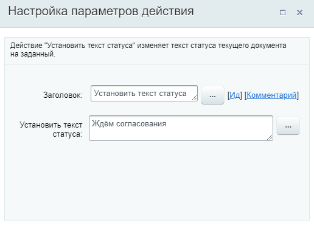
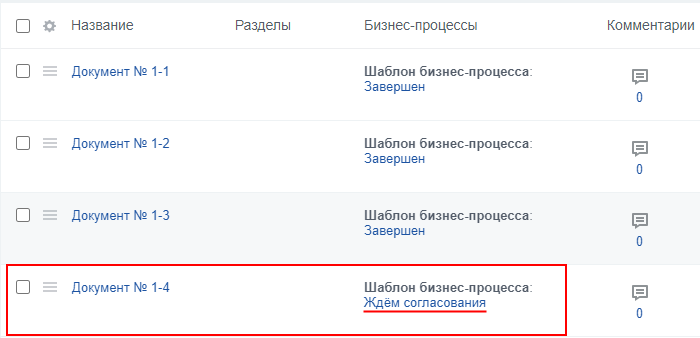
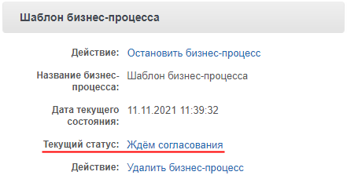

# Установить текст статуса

**Навигация**
- [← Оглавление курса](index.md)
- [← Предыдущий: 3862 — Уведомление пользователя](lesson_3862.md)
- [Следующий: 9003 — Выбор данных crm →](lesson_9003.md)

Официальная страница урока: https://dev.1c-bitrix.ru/learning/course/index.php?COURSE_ID=57&LESSON_ID=3803

Действие позволяет изменить текст статуса документа, что облегчает отслеживание состояния документа в общем списке бизнес-процессов во время выполнения бизнес-процесса. Также в большинстве случаев статус можно посмотреть, перейдя к детальному просмотру документа, для которого запущен бизнес-процесс.

#### Описание параметров

- **Установить текст статуса** – внесите в поле текст, вручную или с помощью формы
  			Вставка значения
                      При работе с бизнес-процессом в параметрах действий, параметрах шаблона и настройках статуса есть возможность указывать как собственный текст (заданный вручную), так и использовать различные переменные значения (поля документа и прочие данные, которые могут меняться и поэтому не задаются вручную). Для подстановки таких переменных значений используется специальная форма **Вставка значения**.
  [Подробнее](lesson_12383.md)...
  		, который отобразится в статусе текущего документа.

#### Пример

#### Где отобразится статус

Статус отображается в списке процессов (Бизнес-процессы &gt; Мои процессы) и общем списке документов (элементов универсального списка):

А также в детальном просмотре документа:

