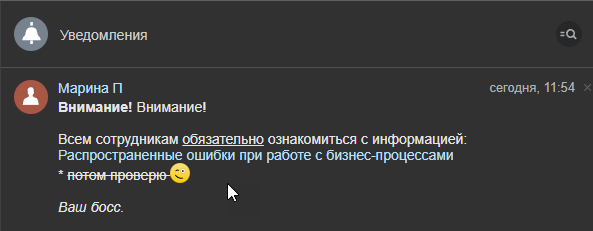

# Сообщение соц.сети

**Навигация**
- [← Оглавление курса](index.md)
- [← Предыдущий: 3032 — Совершить звонок](lesson_3032.md)
- [Следующий: 8543 — Уведомить руководство →](lesson_8543.md)

Официальная страница урока: https://dev.1c-bitrix.ru/learning/course/index.php?COURSE_ID=57&LESSON_ID=3804

Действие, отправляет уведомление модуля социальной сети.

**Примечание**. Если пользователь не активен в течение 10 минут, сообщение будет отправлено на его почту.

#### Описание параметров

- **Отправитель сообщения** — укажите пользователя, который будет отправителем. Это поле необязательно.
  Только администраторы могут настраивать отправителя сообщения. Пользователи из других групп будут отправителями по умолчанию и не смогут это изменить.
  Если поле не заполнить, сообщение будет отправлено как системное.
- **Получатель сообщения** — укажите получателей, пользователей и группы пользователей.
- **Текст сообщения** — произвольный текст уведомления. В тексте доступно форматирование с использованием тегов
  			bb-code
                      **BBCode** — язык разметки, используемый для форматирования сообщений.
  Подробнее на [Википедии](https://ru.wikipedia.org/wiki/BBCode)
  		: **[url]**, **[b]**, **[i]**, **[s]**, **[u]**.

#### Пример

В примере Автор (пользователь, запустивший бизнес-процесс) отправляет всем пользователям группы Администраторы уведомление. Применим в сообщении все перечисленные выше теги bb-code:

Результатом выполнения действия будет сообщение:

