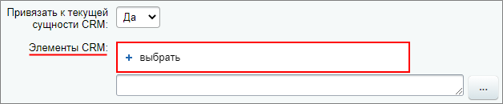
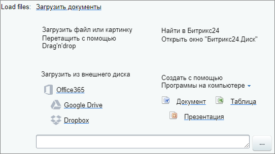
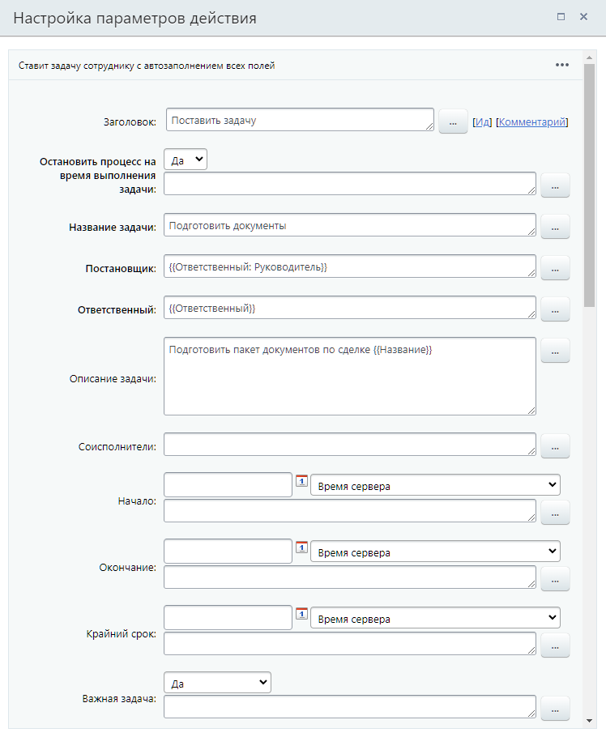

# Поставить задачу

**Навигация**
- [← Оглавление курса](index.md)
- [← Предыдущий: 3801 — Календарь](lesson_3801.md)
- [Следующий: 3802 — Почтовое сообщение →](lesson_3802.md)

Официальная страница урока: https://dev.1c-bitrix.ru/learning/course/index.php?COURSE_ID=57&LESSON_ID=3805

Действие ставит задачу сотруднику с автозаполнением всех полей.

**Примечание**: Действие относится к модулю **Задачи** и доступно только в Битрикс24.

#### Описание параметров

Параметры в действии такие же как и в форме создания новой задачи в

			публичной части Битрикс24

                    **Задачи** — это инструмент для организации работы компании. С их помощью сотрудники планируют свою работу, а руководители учитывают эффективность подчиненных и управляют проектами.

Подробнее о создании задач читайте на [helpdesk.bitrix24.ru](https://helpdesk.bitrix24.ru/open/1412212).

		, за исключение некоторых из них.

Здесь рассмотрим те параметры, которые относятся к бизнес-процессу или по которым могут возникнуть вопросы:

- **Остановить процесс на время выполнения задачи** — при отмеченной опции бизнес-процесс будет остановлен до тех пор, пока созданная задача не перейдет в статус **Завершена**
- **Крайний срок** — установите крайний срок выполнения задачи. С версии 24.0.0 модуля Бизнес-процессы добавлена возможность указать точное время крайнего срока
  Обратите внимание, что в задаче отображаемое время крайнего срока всегда подстраивается под часовой пояс пользователя. Поэтому выбор часового пояса в настройках действия не повлияет на время в созданной задаче. Тоже самое касается параметров «Начало» и «Окончание».
- **Привязать к текущей сущности CRM** — в задаче будет выполнена привязка к той сущности CRM, для которой запущен бизнес-процесс (Например, если бизнес-процесс запущен в определенной сделке, то выполнится привязка к этой сделке)
- **Элементы CRM** — параметр позволяет выполнить привязку к другим элементам CRM. Доступен выбор конкретного элемента CRM из
  			списка
                      
  		 или подстановка через форму Вставка значения. Для привязки элементов через форму необходимо либо использовать
  			поля документа
                      
  		 вида `Контакт: ID элемента CRM` (есть не для всех сущностей), либо использовать следующий синтаксис:
  ## Как привязать элемент смарт-процесса
  Особенностью привязки элемента смарт-процесса является то, что у каждого смарт-процесса имеется свой уникальный префикс. В настоящий момент автоматически этот префикс пока не определяется, но вы можете определить его самостоятельно и выполнить привязку аналогично другим элементам CRM.
  - Сначала определите **Идентификатор типа смарт-процесса**. Самый быстрый способ, это перейти на страницу списка Смарт-процессов (CRM &gt; Настройки &gt; Список смарт-процессов) и посмотреть в таблице в колонке Идентификатор типа смарт-процесса. Например, он может быть равен **174**
  - Cконвертируйте данное число из десятичной системы в
    			шестнадцатеричную
                        Например, с помощью конвертера [https://www.translatorscafe.com/unit-converter/ru-RU/numbers/4-3/hexadecimal-decimal/](https://www.translatorscafe.com/unit-converter/ru-RU/numbers/4-3/hexadecimal-decimal/).
    		.  В случае с идентификатором равным 174, получаем значение **ae**
  - Берем полученное значение в нижнем регистре (это важно!) и к полученному значению дописываем латинскую букву **T** в начале. Таким образом получаем префикс для конкретного смарт-процесса — **Tae**
  Этот код используем в привязке в формате `="Tae_"&{{ID}}`, где {{ID}} — числовой ID элемента смарт-процесса.
  **Примечание:** Также проверьте, чтобы для смарт-процесса была включена привязка к
  			Задачам
                      
  		. Если привязка выключена — то и через действие бизнес-процесса привязка выполнена не будет.
  ## Пример привязки Контакта и Компании, связанных со сделкой, с помощью префиксов
  **Задача**: при создании задачи из бизнес-процесса сделки, привязывать **Контакт** и **Компанию**, связанные с этой сделкой.
  Для привязки Контакта нам понадобится использовать `"C_"&`, а для Компании — `"CO_"&`. В качестве идентификаторов этих элементов выберем в форме Вставка значения, секции **Поля документа**: `Контакт: ID` и `Компания: ID`.
  Итоговая запись будет выглядеть так:
  
  В результате при запуске БП в сделке будет создана задача с привязками к самой сделке (текущей сущности) и к связанными с ней Контакту и Компании:
  

  - Контакты: `="C_"&{{ID}}`
  - Сделки: `="D_"&{{ID}}`
  - Лиды: `="L_"&{{ID}}`
  - Компании: `="CO_"&{{ID}}`
  - Счета (новые): `="SI_"&{{ID}}`
- **Load files** — позволяет прикрепить файлы к задаче. По нажатии на **Загрузить документы** открываются доступные
  			варианты загрузки
                      
  		: перетащить с помощью Drag'n'drop, загрузить с Битрикс24.Диск, загрузить с внешнего диска или создать новый файл. Также доступно прикрепление файлов через форму «Вставка значения»

## Пример заполнения параметров действия

Пример приведём для шаблона БП в сделках.

Здесь мы создаём новую задачу для ответственного за сделку по подготовке документов. Задача отмечена как важная. Постановщиком будет руководитель ответственного. На время выполнения задачи процесс будет остановлен. Полей в действии очень много, поэтому на скриншоте показываем лишь часть из них.

#### Результаты выполнения действия

Результаты выполнения этого действия можно получить с помощью формы **Вставка значения** — **Дополнительные результаты**, в которой они будут доступны сразу после добавления действия в шаблон.

Доступно:

- ID задачи
- Дата завершения задачи
- Пользователь, закрывший задачу
- Задача удалена
