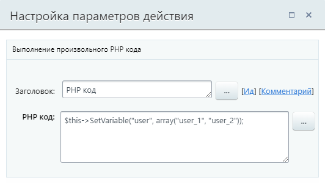

# PHP код

**Навигация**
- [← Оглавление курса](index.md)
- [← Предыдущий: 7729 — Удалить объект Диска](lesson_7729.md)
- [Следующий: 3808 — Блок действий →](lesson_3808.md)

Официальная страница урока: https://dev.1c-bitrix.ru/learning/course/index.php?COURSE_ID=57&LESSON_ID=3806

Действие позволяет выполнить произвольный PHP код. Доступно только для *коробочной версии «Битрикс24»*.


### Описание


Действие имеет один единственный параметр **PHP код** с полем для внесения кода. Код указывается без открывающих и закрывающих тегов (`<?`, `?>`).





**Внимание!** Задавать PHP-код может только пользователь с правами администратора.


Для написания кода и работы с сущностями сайта используйте API:


- [Документация API](https://dev.1c-bitrix.ru/api_help/)
- [Документация API D7](https://dev.1c-bitrix.ru/api_d7/)
- [Раздел Бизнес-процессы в документации API](https://dev.1c-bitrix.ru/api_help/bizproc/index.php)
- [Раздел Бизнес-процессы в документации API D7](https://dev.1c-bitrix.ru/api_d7/bitrix/bizproc/index.php)


### Рекомендации


- **Использование переменных**
  Не рекомендуется использовать стандартную подстановку значений бизнес-процессов в фигурных скобках `{=...}`. Вместо этого используйте метод `GetVariable('VARIABLE_NAME')`.
  ```
  $companyName = $this->GetVariable('COMPANY_NAME');
  ```
- **Работа с полями документа**
  Для чтения поля документа в переменную используйте следующий код:
  ```
  $documentService = $this->workflow->GetService("DocumentService");
  $document = $documentService->getDocument($this->getDocumentId());
  $fieldValue = $document['NAME']; // NAME — название поля документа
  ```
- **Глобальные переменные и константы**
  Для работы с глобальными переменными используйте API `\Bitrix\Bizproc\Workflow\Type\GlobalVar`.
  Пример получения значения глобальной переменной:
  ```
  $globalVar = \Bitrix\Bizproc\Workflow\Type\GlobalVar::getById('orderVacancy');
  if ($globalVar) {
      $value = $globalVar['Default']; // Получаем значение глобальной переменной
      $this->SetVariable('GlobalVarValue', $value); // Сохраняем значение в переменную бизнес-процесса
  }
  ```
  Пример изменения значения глобальной переменной:
  ```
  $globalVar = \Bitrix\Bizproc\Workflow\Type\GlobalVar::getById('orderVacancy');
  if ($globalVar) {
      $globalVar['Default'] = 'Y'; // Изменяем значение
      \Bitrix\Bizproc\Workflow\Type\GlobalVar::upsert('orderVacancy', $globalVar); // Сохраняем изменения
  }
  ```
  Пример получения значения глобальной константы:
  ```
  Bitrix\Main\Loader::includeModule('bizproc');
  use Bitrix\Bizproc\Workflow\Type\GlobalConst;
  $constId = 'Const123456789';
  $result = GlobalConst::getById($varId);
  ```


#### Полезные уроки по теме:


- [Произвольный PHP код в бизнес-процессе](/learning/course/index.php?COURSE_ID=57&CHAPTER_ID=04795) – глава об использовании действия PHP код для разработчиков;
- [Добавление информации в инфоблок из бизнес-процесса](lesson_5368.md) – пример, в котором значения из пользовательских полей списка с помощью бизнес-процесса и действия **PHP код** записываются в пользовательские свойства инфоблока.


### Примеры кода


**1. Как установить значение переменной?**


`$this->SetVariable('Variable1', 12345);`


где:


`Variable1` – идентификатор переменной, которой будет присвоено значение (число 12345).


**2. Как записать нескольких пользователей в переменную типа "Пользователь"?**


`$this->SetVariable("user", array("user_1", "user_2"));`


где:


`array("user_1", "user_2")` – массив пользователей в формате `user_[идентификатор_пользователя_в_системе]`.


**3. Как при помощи PHP кода и существующих значений полей/переменных получить название элемента инфоблока?**


```

$arFilter = Array("IBLOCK_ID" => {=Variable:Variable1_printable}, "ID" => {=Document:PROPERTY_1});
$dc = CIBlockElement::GetList(array(), $arFilter, array("NAME"));
$br = $dc->Fetch();
$Pbrr = $br["NAME"];
$this -> SetVariable('Variable2', $Pbrr);
```


где:


`{=Variable:Variable1_printable}` – значение переменной, в которой содержится идентификатор инфоблока;


`{=Document:PROPERTY_1}` – поле документа, содержащее идентификатор элемента инфоблока;


`Variable2` – идентификатор переменной, которой будет присвоено вычисленное название элемента инфоблока.


**4. Как преобразовать формат поля документа и использовать его в дальнейшем?**


Рассмотрим пример преобразования поля документа **Пользователь** в понятную форму для того, чтобы использовать его при отправке сообщения:


1. В шаблоне бизнес процесса следует создать переменную для хранения преобразованного значения поля документа;
2. Укажем в действии PHP-код приблизительно следующее:
  ```
  $rsUser = CUser::GetByID({=Document:PROPERTY_USER});
  $arUser = $rsUser->Fetch();
  $this->SetVariable('#Имя_переменной#', $arUser[NAME].' '.$arUser[SECOND_NAME].' '.$arUser[LAST_NAME]);
  ```
3. После чего в блоке, используемом для уведомления, необходимо уже использовать вывод данной переменной вместо поля документа.


**5. Как считать поле документа в переменную, произвести с ней какие-либо действия и передать результат в переменную шаблона бизнес-процесса?**


```

// Считываем поле документа PROPERTY_175 в переменную
$documentService = $this->workflow->GetService("DocumentService");
$document = $documentService->getDocument($this->getDocumentId());
$fieldValue = $document['PROPERTY_175'];

// Производим действия с переменной. Например обрабатываем функцией myFunc.
$myVar = myFunc($fieldValue);

// Пишем значение из переменной $myVar в переменную шаблона бизнес-процесса Variable1
$this->SetVariable('Variable1', $myVar);
```
