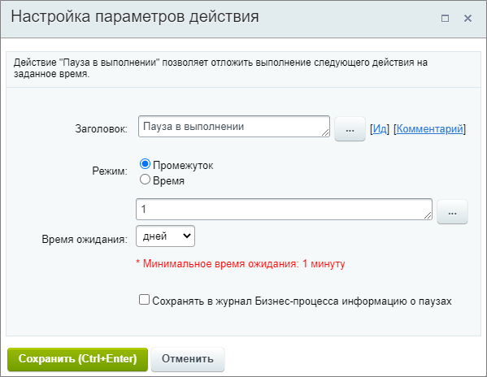
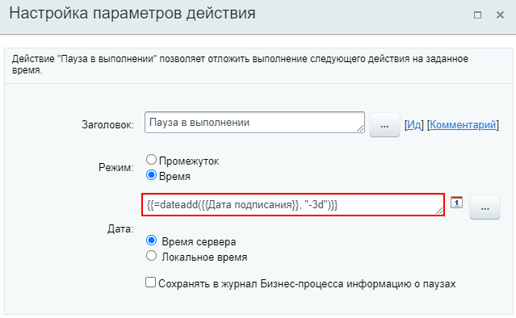

# Пауза в выполнении

**Навигация**
- [← Оглавление курса](index.md)
- [← Предыдущий: 25812 — Ожидание рабочего дня сотрудника](lesson_25812.md)
- [Следующий: 25792 — Пауза робота →](lesson_25792.md)

Официальная страница урока: https://dev.1c-bitrix.ru/learning/course/index.php?COURSE_ID=57&LESSON_ID=3807

Действие позволяет отложить выполнение следующего действия на заданное время.

### Описание параметров

- **Режим** — указывается время возобновления бизнес-процесса одним из способов:
  **Примечание.** Если в режиме **Время**, на момент выполнения действия, указанная дата имеет место в прошлом (например был указан прошлый год, а действие начало выполняться в текущем), то будет произведен автоматический переход к следующему за «паузой в выполнении» действию. Другими словами процесс «перескочит» через него.

  - Промежуток — задайте паузу в секундах, минутах, часах или днях. В облаке минимальное значение — 10 минут. В коробочных продуктах минимальное значение зависит от настроек модуля Бизнес-процессы, параметр [Минимальное время ожидания для действий](https://dev.1c-bitrix.ru/user_help/service/bizproc/settings.php)
  - Время — укажите конкретное время старта. Выберите часовой пояс:

    - Серверное время: для облачных Битрикс24 в зоне RU — UTC+3:00 (Московское время), для коробочных версий — время сервера, на котором установлен продукт
    - Локальное время: часовой пояс пользователя, запустившего процесс
- **Сохранять в журнал Бизнес-процесса информацию о паузах** — при включенном параметре информация о паузе будет записываться в статус БП. Параметр доступен с версии **20.200.0** модуля Бизнес-процессы.

**Важные моменты работы паузы**:

1. Паузу нельзя прервать каким-либо образом для уже запущенного бизнес-процесса
2. Паузы выполняются на хитах, то есть зависят от посещения пользователями самого портала. Если у вас портал создан только для автоматизации деятельности и на нём нет пользователей, постоянно посещающих портал, то возможна ситуация, когда бизнес-процессы (БП) и роботы с опозданием сходят с паузы. Для исключения такой ошибки необходимо организовать периодическую активность пользователей на портале. Например: ежедневный заход одного пользователя на портал

#### Особенность работы бизнес-процесса после паузы

Бизнес-процесс после паузы работает на агентах, без контекста пользователя. Поэтому если в шаблоне используется **Пауза в выполнении**, а после паузы вывод даты и времени каким-либо действием (например, в уведомлении), то дата будет выведена в часовом поясе сервера. Во избежание этого, используйте время пользователя. Например, с помощью

			модификатора

                    Указанные нами параметры, переменные шаблона или поля документа возможно модифицировать с помощью специальных **модификаторов**, которые преобразуют данные.

[Подробнее](lesson_12407.md)...

		 **responsible** выводится время в часовом поясе Ответственного.

### Пример

Простой пример заполнения:

Для указания даты также можно использовать форму

			«Вставка значения»

                    При работе с бизнес-процессом в параметрах действий, параметрах шаблона и настройках статуса есть возможность указывать как собственный текст (заданный вручную), так и использовать различные переменные значения (поля документа и прочие данные, которые могут меняться и поэтому не задаются вручную). Для подстановки таких переменных значений используется специальная форма **Вставка значения**.

[Подробнее](lesson_12383.md)...

		 и функции

			калькулятора выражений

                    При вычислении значений выражений в параметрах действий вы можете использовать различные операторы и функции.

[Подробнее](lesson_4912.md)...

		. Например, поставим паузу так, чтобы процесс возобновлялся за 3 дня до указанной в поле сделки даты:

**Примечание**. Действие часто применяется в конструкции

			Параллельное ожидание действия

                    Конструкция, которая позволяет направить бизнес-процесс по разным сценариям в зависимости от того, какое из событий наступит раньше.

[Подробнее](lesson_3790.md)...

		.
