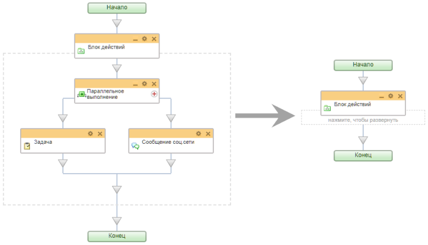
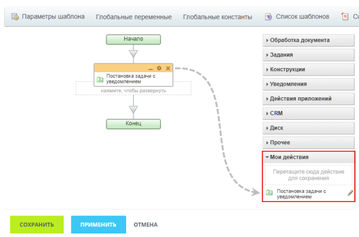

# Блок действий

**Навигация**
- [← Оглавление курса](index.md)
- [← Предыдущий: 3806 — PHP код](lesson_3806.md)
- [Следующий: 3809 — Выбор сотрудника →](lesson_3809.md)

Официальная страница урока: https://dev.1c-bitrix.ru/learning/course/index.php?COURSE_ID=57&LESSON_ID=3808

Блок действий предназначен для удобной группировки набора действий в один блок, который можно свернуть с помощью кнопки  для экономии места на схеме.

Например, разместим в блоке действия [Параллельное выполнение](lesson_3791.md), [Задача](lesson_3805.md) и [Сообщение соц. сети](lesson_3804.md). В развернутом виде он занимает много места, а свернув его – вы значительно сэкономите пространство на схеме:

Также блок действий позволит вам существенно сэкономить трудозатраты при создании шаблонов бизнес-процессов в типовых сценариях. Однажды созданный и настроенный блок действий можно сохранить в группе Мои действия и многократно использовать. При этом будут сохранены и все заполненные поля в параметрах действий.

Измените название блока на понятное для вас и просто перетащите его целиком в

			Мои действия

                    Это позволит сохранить настроенные действия/конструкции и использовать их повторно.

[Подробнее](lesson_5053.md)...

		:

Как только сохраненный блок понадобится вам в шаблоне, добавьте его таким же образом как любое стандартное действие.
