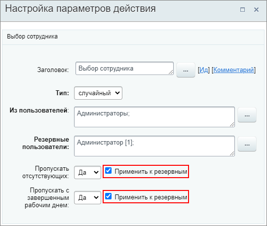
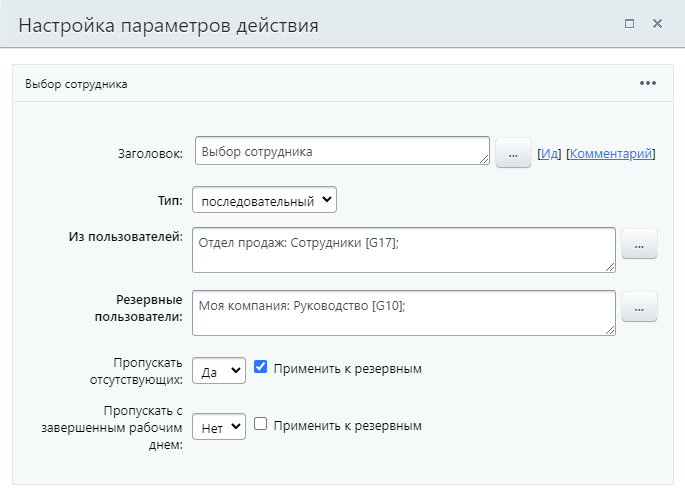

# Выбор сотрудника

**Навигация**
- [← Оглавление курса](index.md)
- [← Предыдущий: 3808 — Блок действий](lesson_3808.md)
- [Следующий: 23564 — Выполнить математические операции →](lesson_23564.md)

Официальная страница урока: https://dev.1c-bitrix.ru/learning/course/index.php?COURSE_ID=57&LESSON_ID=3809

Действие позволяет в автоматическом режиме выбрать сотрудника для дальнейшего использования его в процессе.

#### Описание Параметров

**Тип**:

- **случайный** – выбор обычного сотрудника случайным образом;
- **последовательный** – выбор обычного сотрудника последовательным образом (т.е. по порядку из списка в параметре **Из пользователей**). При каждом новом запуске процесса будет выбран следующий по порядку в списке пользователь;
- **начальник** –
  			выбор начальника
                      Опция выбора начальника недоступна в *1С-Битрикс: Управление сайтом*.
  		 для указанного сотрудника.

**Из пользователей** – указываются пользователи или группы, из которых будет выбран один сотрудник.

**Для пользователя** – указывается пользователь, для которого будет выбран начальник.

**Уровень начальника (чем больше, тем выше уровень)** – выбирается уровень начальника для указанного пользователя.

**Резервные пользователи** – Указываются пользователи, которые будут выбраны в случае невозможности выбора из основных пользователей, указанных выше. Например, если указанная в поле **Из пользователей** группа не содержит сотрудников, то будет выбран кто-то из резервных пользователей.

**Пропускать отсутствующих** – позволяет

			автоматически

                    Действие определяет отсутствие сотрудника согласно записям, которые отображаются на странице **График отсутствий**.

		 пропускать отсутствующих сотрудников, например, если они в отпуске.

**Пропускать с завершенным рабочим днем** – позволяет автоматически пропускать сотрудников, завершивших рабочий день.

**Примечание**. С версии 20.0.700 модуля Бизнес-процессы для параметров **Пропускать отсутствующих** и **Пропускать с завершенным рабочим днем** добавлена опция

			Применить к резервным

                    

		. При включенной опции выбранные настройки будут применены не только к основным пользователям, но и к резервным.

## Подробнее про ситуацию с отсутствующим сотрудником/начальником

Если невозможно выбрать основного начальника (например, в случае отпуска) и опция **Пропускать отсутствующих** равна **Да**, то действие автоматически продолжит выбирать начальника, но уже более высокого уровня. Если будет недоступен и начальник самого верхнего уровня, то выбор будет производиться уже из сотрудников, указанных в поле **Резервные пользователи**.

Если опция **Пропускать отсутствующих** равна **Нет**, то действие завершится и, независимо от отсутствия, будет выбран начальник соответствующего уровня.

Если все начальники будут недоступны или у сотрудника нет начальника, то действие вернет пустое значение.

#### Пример

#### Результаты выполнения действия

Результаты выполнения этого действия можно получить с помощью формы **Вставка значения** – **Дополнительные результаты**, в которой они будут доступны  сразу после добавления действия в шаблон.

Доступно:

- Выбранный сотрудник.
