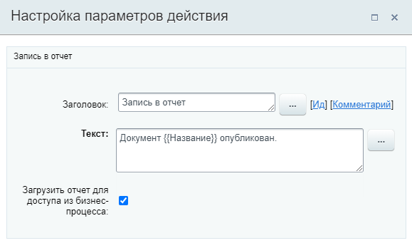
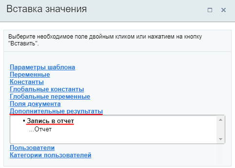
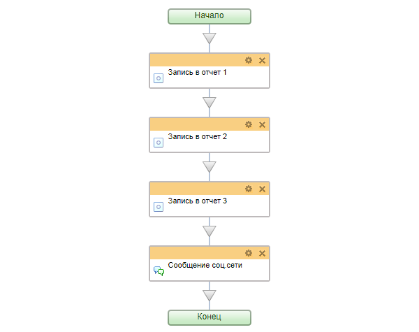
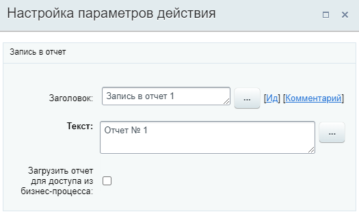
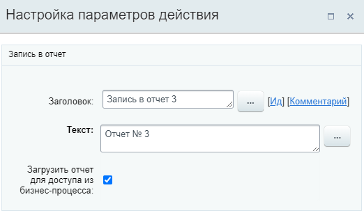
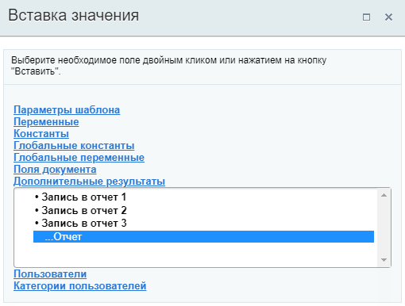
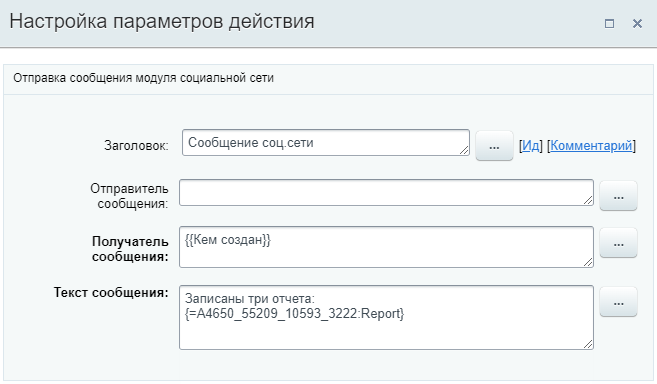
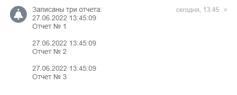
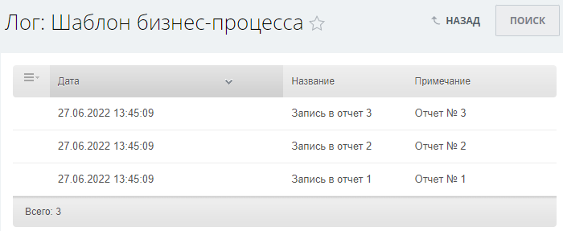

# Запись в отчет

**Навигация**
- [← Оглавление курса](index.md)
- [← Предыдущий: 26984 — Добавить участников в групповой чат](lesson_26984.md)
- [Следующий: 23418 — Изменение глобальных переменных →](lesson_23418.md)

Официальная страница урока: https://dev.1c-bitrix.ru/learning/course/index.php?COURSE_ID=57&LESSON_ID=3810

Действие позволяет добавлять в

			журнал

                    При разработке и использовании уже готовых процессов бывает необходимо узнать подробности выполнения того или иного процесса / действия. Для этого в системе предусмотрен журнал выполнения бизнес-процессов (лог).

[Подробнее](lesson_3837.md)...

		 выполнения бизнес-процесса (лог) произвольные записи и формировать отчеты. Запись в отчет удобно использовать, например, во время отладки бизнес-процесса, сохраняя в отчет данные на нужном этапе.

### Описание параметров

- **Текст** — укажите произвольный текст отчета. Обязательный параметр. В тексте доступно форматирование с использованием тегов
  			bb-code
                      **BBCode** — язык разметки, используемый для форматирования сообщений.
  Подробнее на [Википедии](https://ru.wikipedia.org/wiki/BBCode)
  		: **[url]**, **[b]**, **[i]**, **[s]**, **[u]** и т.д. (будет ли работать тот или иной тег зависит от
  			действия
                      Например, тег **[color]** изменит цвет текста если вывести отчет в ленту Новостей, но не сработает в сообщении соц. сети.
  		, которым будет выводиться отчет). Обратите внимание, что форматирование bb-code не работает для записей в логе;
- **Загрузить отчет для доступа из бизнес-процесса** — опция позволяет получить содержимое всех отчетов, сформированных на текущий момент, в рамках бизнес-процесса для его дальнейшего использования в шаблоне (например, отправить такой отчет можно по почте или в уведомлении). Отчет доступен через форму
  			«Вставка значения»
                      При работе с бизнес-процессом в параметрах действий, параметрах шаблона и настройках статуса есть возможность указывать как собственный текст (заданный вручную), так и использовать различные переменные значения (поля документа и прочие данные, которые могут меняться и поэтому не задаются вручную). Для подстановки таких переменных значений используется специальная форма **Вставка значения**.
  [Подробнее](lesson_12383.md)...
  		 (секция **Дополнительные результаты**).
  При отключенной опции информация записывается только в журнал выполнения бизнес-процесса (лог).

**Обратите внимание**, что в облачном Битрикс24 запись в журнал может быть отключена в [настройках шаблона](lesson_3816.md) бизнес-процесса. В этом случае действие не отработает.

В форме настроек действия отображается напоминание:

#### Пример настройки:

### Дополнительные результаты

Результаты выполнения действия **Запись в отчет** можно получить с помощью формы «Вставка значения» – **Дополнительные результаты**, в которой они становятся доступны сразу после добавления действия в шаблон.

Доступно:

- Отчет

Для каждого использованного в шаблоне действия **Запись в отчет** создаётся

			своя запись

                    Рекомендуем менять заголовки действий, чтобы легче различать их между собой в шаблоне и в форме Вставка значения.

		. Использование вставки этого значения имеет смысл только если в параметрах действия была отмечена опция **Загрузить отчет для доступа из бизнес-процесса**. С её помощью можно получить суммарный отчет по всем отчетам, что расположены до текущего действия и включая его. Таким образом отчет каждого последующего действия включает отчеты предыдущих действий.

**Внимание:** Переменная **Отчет** будет пустой, если опция **Загрузить отчет для доступа из бизнес-процесса** не была отмечена.

**Пример использования опции:** формирование суммарного отчета по данным из всех отчетов на этапе завершения бизнес-процесса без лишних запросов к базе.

### Пример

Для лучшего понимания как работает опция **Загрузить отчет для доступа из бизнес-процесса** рассмотрим очень простой пример. Создадим тестовый шаблон с тремя действиями **Запись в отчет** и одним уведомлением

			Сообщение соц.сети

                    Действие отправляет уведомление модуля социальной сети.

[Подробнее](lesson_3804.md)...

		:

Параметры действий заполнены таким образом:

## Запись в отчет 1

## Запись в отчет 2

## Запись в отчет 3

Мы хотим отправить в уведомлении информацию о всех трех записях. Поэтому в третьем отчете опция загрузки отчета включена. В уведомление добавим с помощью формы «Вставка значения» наш итоговый отчет:

## Сообщение соц. сети

В результате запуска БП сформируется такое уведомление:

Как видно на скриншоте, сообщение содержит все три записи с указанием даты и времени.

В журнале (логе) бизнес-процесса каждый отчет будет записан отдельной строкой:

**Примечание:** Если в примере выше опцию загрузки отчета включить для **Записи в отчет 2** и в сообщении добавить отчет этого действия, то получим данные по двум записям: первой и второй. Третьей записи в сообщении с отчетом не будет. А вот в логе отобразятся все три записи.
