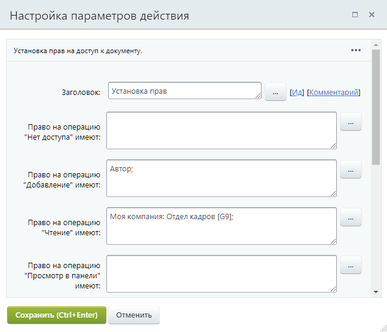

# Установка прав

**Навигация**
- [← Оглавление курса](index.md)
- [← Предыдущий: 25348 — Установить результат бизнес-процесса](lesson_25348.md)
- [Следующий: 5053 — Мои действия →](lesson_5053.md)

Официальная страница урока: https://dev.1c-bitrix.ru/learning/course/index.php?COURSE_ID=57&LESSON_ID=3811

Действие позволяет устанавливать права на доступ к документу.

**Примечание.** Действие отсутствует в бизнес-процессах **Диска** и **CRM**.

#### Описание Параметров

- **Право на операцию "..." имеют** –
  			установка прав документа
                      **Примечание:** Для разных типов документов существуют разные типы прав.
  		 для указанных пользователей/групп пользователей.
- **Текущие права документа** – выберите, что сделать с текущими правами документа:

  - Оставить – оставить без изменений;
  - Перезаписать – позволяет не добавлять права, а производить их замену;
  - Очистить – очистить права полностью.
- **Область применения очистки и перезаписи** – выберите область применения для очистки или перезаписи прав:

  - Права, установленные текущим бизнес-процессом (т.е. производится работа только с правами, которые устанавливаются внутри бизнес-процесса);
  - Все права документа.

## Пример заполнения параметров действия

Пример приведём для шаблона БП процесса ленты новостей.

Здесь мы устанавливаем для пользователя, запустившего бизнес-процесс, право доступа «Добавление», а сотрудникам отдела кадров – право доступа «Чтение».

**Внимание:** В случае использования

			бизнес-процесса со статусами

                    **Бизнес-процесс со статусами** – бизнес-процесс, не имеющий начала и конца, в процессе работы которого происходит переход из одного состояния (статуса) в другое с разделением прав доступа.

[Подробнее](lesson_3467.md)...

		, переход к другому статусу переписывает права доступа к документу, установленные действием **Установка прав** в текущем статусе.

## Особенности назначения прав в системе

Если для документа используется

			упрощенная

                    Простой режим настройки прав доступа к инфоблоку – это режим, когда опция **Расширенное управление правами** отключена, а в секции **Доступ для групп пользователей** перечислены все имеющиеся у вас в системе группы пользователей.
[Подробнее](https://dev.1c-bitrix.ru/learning/course/index.php?COURSE_ID=35&LESSON_ID=9411&LESSON_PATH=3906.4493.4504.9411#simply_mode)...

		 (**старая**) версия прав, то они устанавливаются жестко извне (настройки доступа к инфоблокам/спискам/и т.д.). Единственный вариант, позволяющий устанавливать права прямо из бизнес-процесса – это установка для документа права **бизнес-процессы** извне (права на сам документ). В этом случае с помощью закладки **Доступ** или действия **Установка прав** можно менять права по ходу выполнения процесса.

			 Если используются

			расширенные права

                    **Расширенный режим** позволяет настроить права доступа не только целиком ко всему инфоблоку, но и гибко задать права на отдельные его разделы и элементы.
[Подробнее](https://dev.1c-bitrix.ru/learning/course/index.php?COURSE_ID=35&LESSON_ID=9411&LESSON_PATH=3906.4493.4504.9411#advanced_mode)...

		 доступа, то из бизнес-процесса можно только добавлять новые права на документ, которые будут оставаться у документа даже после выполнения процесса. Переопределить права, которые были установлены извне, внутри бизнес-процесса нельзя.
