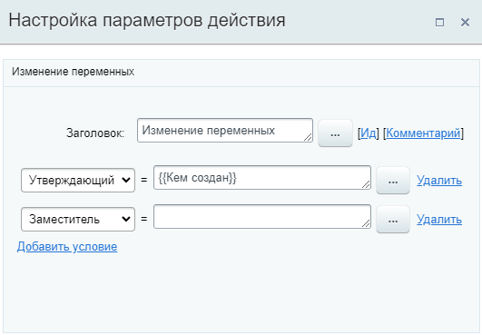
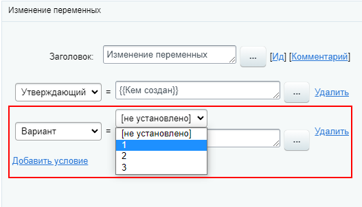
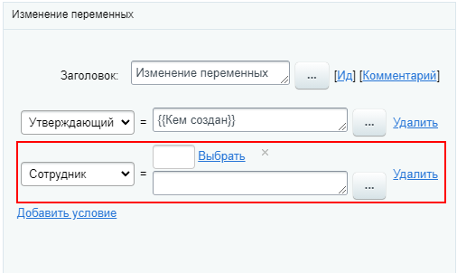
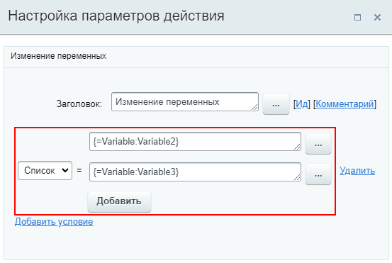
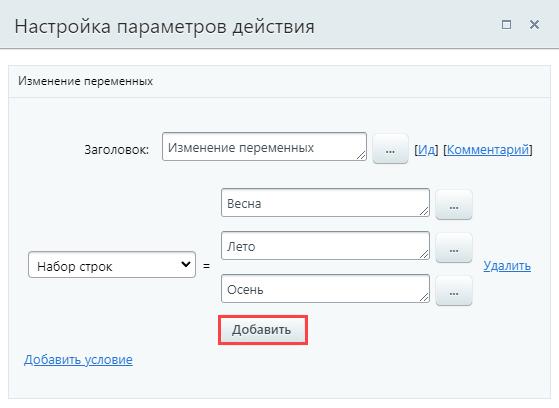
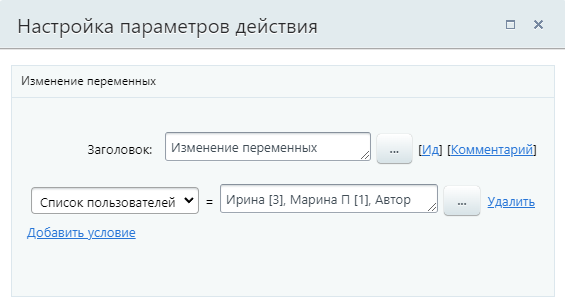
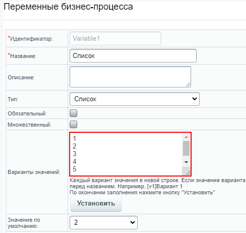
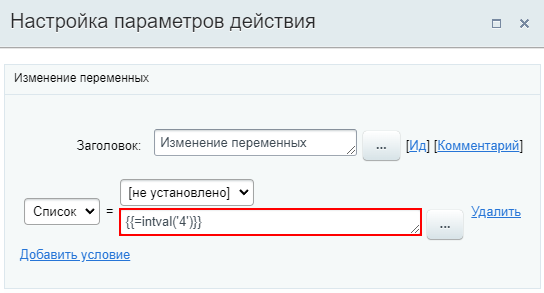

# Изменение переменных

**Навигация**
- [← Оглавление курса](index.md)
- [← Предыдущий: 23418 — Изменение глобальных переменных](lesson_23418.md)
- [Следующий: 8551 — Исходящий Вебхук →](lesson_8551.md)

Официальная страница урока: https://dev.1c-bitrix.ru/learning/course/index.php?COURSE_ID=57&LESSON_ID=3812

Действие позволяет изменить значения

			переменных

                    Переменные используются для временного хранения данных, необходимых для выполняемого процесса.

[Подробнее](lesson_3816.md)...

		, заданных в настройках шаблона.

### Описание Параметров

В выпадающем списке выбирается переменная и устанавливается необходимое значение. Значение указывается вручную или с помощью формы

			«Вставка значения»

                    При работе с бизнес-процессом в параметрах действий, параметрах шаблона и настройках статуса есть возможность указывать как собственный текст (заданный вручную), так и использовать различные переменные значения (поля документа и прочие данные, которые могут меняться и поэтому не задаются вручную). Для подстановки таких переменных значений используется специальная форма **Вставка значения**.

[Подробнее](lesson_12383.md)...

		.

По кнопке **Добавить условие** добавляется новая строка для изменения переменной. Таким образом можно изменить несколько переменных в одном действии.

Вид строк для изменения переменных меняется в зависимости от типа переменной (например для типов

			Список

                    

		,

			Привязка к сотруднику

                    

		 и др.).

### Множественные переменные

Действие работает и с множественными переменными. Например, можно установить в качестве значений множественной переменной типа Строка, значения других двух переменных:

Форма добавления нескольких значений может отличаться для переменных разного типа. К примеру, для переменной типа Строка отображается кнопка

			Добавить

                    

		, которая добавляет новое поле для внесения очередного значения.

Другой вариант – перечисление нескольких значений через запятую в одном поле. Встречается, например, для типов Пользователь и Привязка к сотруднику:

**Важно понимать**, что выполняется полная замена значений. Выборочно заменить или дополнить значения множественной переменной этим действием нельзя.

### Особенности

При подстановке значений через форму «Вставка значения» следует учитывать, что для некоторых типов переменных важен тип данных, которые переменная ожидает получить. Иначе выполнить подстановку может не получится.

Установку значения в таких случаях следует использовать с применением функций из

			калькулятора выражений

                    При вычислении значений выражений в параметрах действий вы можете использовать различные операторы и функции.

[Подробнее](lesson_4912.md)...

		 для преобразования данных.

Приведем простой пример. Пусть создана переменная типа Список с **числовыми** вариантами: 1, 2, 3, 4, 5.

Для установки значения **4** применим функцию **intval** для преобразования в целое число:

