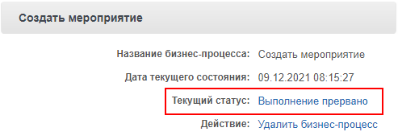
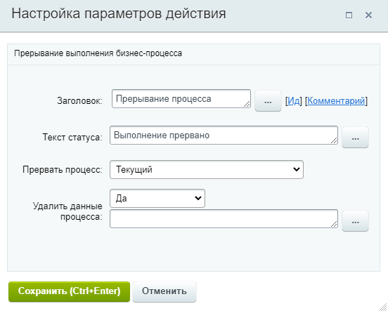

# Прерывание процесса

**Навигация**
- [← Оглавление курса](index.md)
- [← Предыдущий: 20828 — Получить информацию о сотруднике](lesson_20828.md)
- [Следующий: 20830 — Сгенерировать код →](lesson_20830.md)

Официальная страница урока: https://dev.1c-bitrix.ru/learning/course/index.php?COURSE_ID=57&LESSON_ID=3813

Действие позволяет прекратить выполнение бизнес-процесса (БП).

**Важно**! Продолжить выполнение БП с того места, где он был прерван, нельзя. Для выполнения всех последующий после прерывания операций придется запускать БП заново.

#### Описание параметров:

- **Текст статуса** – устанавливает
  			текст
                      Указанный статус установится для всех прерванных БП, если их
  данные не удалены параметром **Удалить данные процесса**.
  
  		 статуса действия;
- **Прервать процесс** – выберите, какие процессы
  			текущего документа
                      Текущим документом может быть элемент универсального списка, элемент CRM (сделка, контакт и т.д.) и др. Подробнее о документах в уроке [Общая информация](lesson_1708.md).
  		 нужно завершить (прервать):
  Параметр доступен с версии **21.400.0** модуля Бизнес-процессы.

  - **Текущий** – будет прерван только текущий БП;
  - **Все процессы шаблона** – будут прерваны все БП этого шаблона для того документа, в котором запущен текущий БП;
  - **Все процессы шаблона, кроме текущего** – будут прерваны все БП этого шаблона для того документа, в котором запущен БП, кроме текущего. Текущий БП продолжит выполнение.
- **Удалить данные процесса** – при включенной опции все связанные с БП данные будут удалены при завершении его работы. Опция доступна с версии **20.200.0** модуля Бизнес-процессы.

#### Пример:

