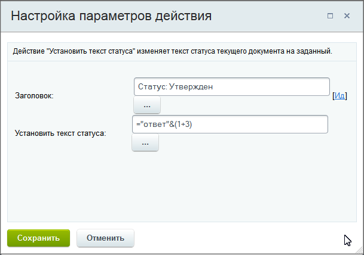

# Вычисление значений выражений в параметрах действий

**Навигация**
- [← Оглавление курса](index.md)
- [← Предыдущий: 4912 — Функции калькулятора выражений](lesson_4912.md)
- [Следующий: 12407 — Модификация данных →](lesson_12407.md)

Официальная страница урока: https://dev.1c-bitrix.ru/learning/course/index.php?COURSE_ID=57&LESSON_ID=3814

В системе имеется возможность вычислять значения выражений в параметрах действий. Например складывать, умножать, вычислять проценты и многое другое.


**Примечание:** Полный список доступных операторов и функций приведен в уроке [Функции калькулятора выражений](lesson_4912.md).


### Вычисляем выражения


Для вычисления математических или логических выражений требуется поставить знак `=` в поле перед операциями.


Пример для математической операции:


```
=6^2 + {=Document:PROPERTY_NUM}/2
```


Пример для логической операции с функцией if:


```
=if({Document:ID}=5, "текст1", "текст2")
```


В каждом поле доступно использовать сразу несколько разных вычислений.


Если Вы хотите не только произвести вычисление, но и вывести дополнительные данные (значение переменных, текст), то доступно два варианта написания:

- Вычисляемые значения можно просто размещать в тексте, поместив вычисление в конструкцию `{{=...}}`.
  Пример:
  ```
  Вам необходимо оформить документы до {{=DateAdd({=Document:CREATED}, '5d')}}
  ```
- Либо можно использовать оператор конкатенации (`&`), а текст написать в кавычках (`"` или `'`).
  			Пример
                      
  		:
  ```
  ='Ответ: ' & (1+3)
  ```
  или
  ```
  ="Автор: " & {=Document:CREATED_BY} & ", " & "Конечный срок: " & Dateadd({=Document:DATE_CREATE}, "1d")
  ```


**Примечание:** Синтаксис символьных операторов аналогичен синтаксису соответствующих php-функций.


### Как ставить кавычки


Система может неверно интерпретировать записанное вами выражение, когда в текстовых частях выражения присутствуют кавычки. Такой текст заключайте в кавычки, отличные от используемых в тексте. Например запись с конкатенацией текста, рассмотренная ранее в уроке, может быть изменена так:


```
// Слово Конечный в двойных кавычках, все текстовые части выражения в одинарных кавычках.
='Автор: ' & {=Document:CREATED_BY} & ', ' & '"Конечный" срок: ' & Dateadd({=Document:DATE_CREATE}, '1d')
```


или так:

```
// Слово Конечный в двойных кавычках, а фраза заключена в одинарные кавычки.
// Все остальные текстовые части выражения остались в двойных кавычках.
="Автор: " & {=Document:CREATED_BY} & ", " & '"Конечный" срок: ' & Dateadd({=Document:DATE_CREATE}, "1d")
```


### Как использовать скобки


Будьте внимательны при использовании фигурных скобок `{{...}}` или их автоматической подстановке, когда выбираете функции из списка. Неверная постановка скобок – это частая ошибка при работе с вычислениями выражений в бизнес-процессах.


**Верная запись**


Если в поле нет дополнительного текста, то можно не писать фигурные скобки:


```
=datediff({{Дата создания элемента}},{{Дата изменения элемента}},"%a") * 2
```


Если требуется добавить дополнительный текст в поле, помимо выражения, ставим двойные фигурные скобки в начале и в конце:


```
{{=datediff({{Дата создания элемента}},{{Дата изменения элемента}},"%a") * 2}}
```


При использовании нескольких функций в одном выражении (например, в качестве параметров одной из функций), фигурные скобки и равно во вложенных функциях не нужны:


```
/* простой пример со строками в параметрах */
1. {{=if ({=Variable:Variable1_printable}>0, "да", "нет")}}
/* Если использовать функции в параметрах.
Двойные фигурные скобки и символ равно для dateadd здесь не нужны. */
2. {{=if ({=Template:Parameter1}=1, dateadd({=System:Now},"10d"), dateadd({=System:Now},"30d"))}}
/* В качестве параметра функции firstvalue используется функция explode */
3. {{=firstvalue(explode(',' , {{Строка}}))}}
```


**Неверная запись**


Ниже показаны примеры неверного использования фигурных скобок при записи выражения:


```
={{=datediff({{Дата создания элемента}},{{Дата изменения элемента}},"%a")}} * 2
// или
{{={{=datediff({{Дата создания элемента}},{{Дата изменения элемента}},"%a")}} * 2}}

// для нескольких функций неверно писать так:
{{=if ({=Template:Parameter1}=1, {{=dateadd({=System:Now},"10d")}}, {{=dateadd({=System:Now},"30d"}}))}}
{{=firstvalue({{explode(',' , {{Строка}})}})}}
```


### Рекомендации


#### Перенос вычислений в переменную


Для больших и сложных выражений удобен такой способ: перенести часть вычислений в

			переменную

                    Переменные используются для временного хранения данных, необходимых для выполняемого процесса. Значения переменных хранятся до тех пор, пока выполняется бизнес-процесс. После его завершения они все стираются.

[Подробнее...](lesson_3816.md)

		. На примере выражения


```
=datediff({{Дата создания элемента}},{{Дата изменения элемента}},"%a") * 2
```


можно перенести вычисление функции datediff в переменную (действие

			Изменение переменных

                    Действие позволяет изменить значения переменных, заданных в настройках шаблона.

[Подробнее](lesson_3812.md)...

		). А затем уже эту переменную умножать на 2. В результате получим краткую и понятную запись вида:

```
={=Variable:Variable2}*2
```

где в переменной Variable2 хранится значение вычисления функции: `=datediff({{Дата создания элемента}},{{Дата изменения элемента}},"%a")`.


#### Действие «Математические операции»


Для выполнения простых операций (сложение, вычитание и т.д.) со значениями переменных рассмотрите действие [Математические операции](lesson_23564.md).
