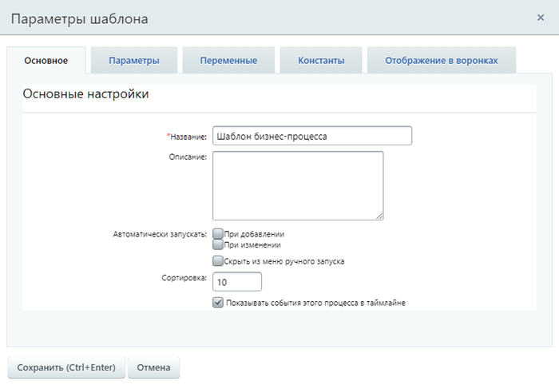
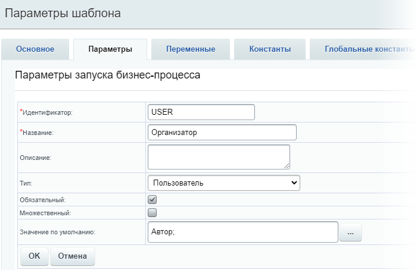
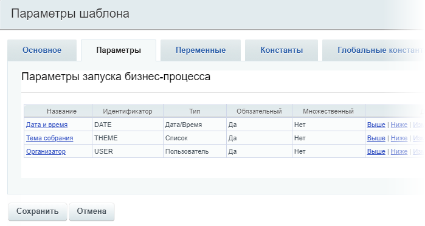
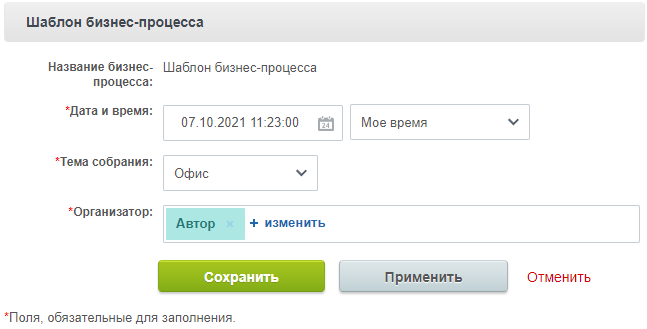
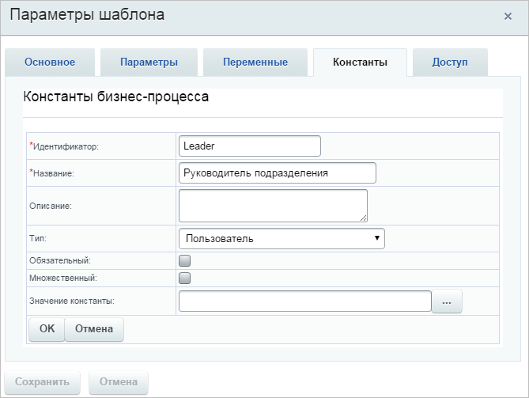
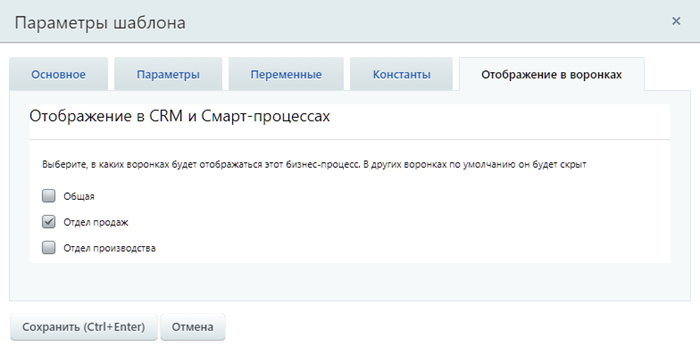
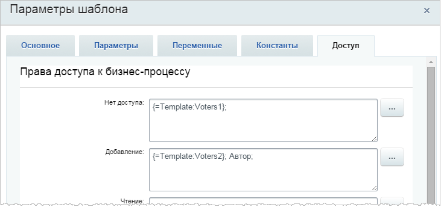

# Настройка параметров шаблона

**Навигация**
- [← Оглавление курса](index.md)
- [← Предыдущий: 26610 — Создать новый шаблон](lesson_26610.md)
- [Следующий: 3868 — Создание шаблона последовательного бизнес-процесса →](lesson_3868.md)

Официальная страница урока: https://dev.1c-bitrix.ru/learning/course/index.php?COURSE_ID=57&LESSON_ID=3816

Шаблоны бизнес-процессов используются для быстрой и эффективной настройки формы бизнес-процесса согласно потребностям сотрудника. При создании бизнес-процесса на основе шаблона происходит не только изменение внешнего вида бизнес-процесса, но и заполнение его некоторыми начальными параметрами.

> **Шаблон БП** представляет собой последовательность шагов (действий) от начального к конечному, которые выполняются один за другим. Необходимо таким образом и в таком порядке составить шаги (действия), чтобы реализовать нужный нам алгоритм и получить необходимый результат.

### Создание шаблона

Процесс проектирования шаблона бизнес-процесса разделим на два этапа:

- Первый — это задание основных параметров шаблона
- Второй — конструирование шаблона, по которому будет выполняться бизнес-процесс

Второй этап рассматривается в следующих уроках. А в этом уроке остановимся на первом этапе. Форма настройки параметров шаблона бизнес-процесса разделена на несколько закладок, с помощью которых задаются параметры запуска и настройки бизнес-процесса.

**Примечание**: Созданные параметры, переменные и константы будут доступны для использования в шаблоне бизнес-процесса через форму

			Вставка значения

                    При работе с бизнес-процессом в параметрах действий, параметрах шаблона и настройках статуса есть возможность указывать как собственный текст (заданный вручную), так и использовать различные переменные значения (поля документа и прочие данные, которые могут меняться и поэтому не задаются вручную). Для подстановки таких переменных значений используется специальная форма **Вставка значения**.

[Подробнее](lesson_12383.md)...

		.

**Внимание**! В бизнес-процессах отсутствует возможность использования параметров, переменных и констант родительского процесса **дочерними** БП. Для передачи данных из одного процесса в другой можно использовать действие

			Запуск бизнес-процесса

                    Действие выполняет запуск нового бизнес-процесса для указанного документа и по выбранному шаблону бизнес-процесса.

[Подробнее](lesson_7721.md)...

		.

### Основное

На закладке **Основное** указываются название шаблона бизнес-процесса, его описание и определяются параметры автоматического запуска. Бизнес-процесс имеет два варианта автоматического запуска: при создании и/или при изменении элемента. Если оба флага сняты, то бизнес-процесс возможно запустить только вручную.

С версии дизайнера бизнес-процессов 24.600.0 для бизнес-процессов в CRM можно включить или отключить показ событий процесса в таймлане.

**Примечание**. C 1 августа 2024 в облачном Битрикс24  появилась новая настройка «Запись журнала». Вы можете включать и отключать хранение лога бизнес-процесса раздельно для каждого шаблона. Лог будет записываться 7 дней. При необходимости настройку можно включить повторно.

Подробнее читайте в статье на [helpdesk.bitrix24.ru](https://helpdesk.bitrix24.ru/open/21994508).

### Параметры

Параметры используются для явного указания каких-либо значений во время исполнения бизнес-процесса и задаются пользователем, запустившим бизнес-процесс. Значения параметров запрашиваются непосредственно при запуске бизнес-процесса. И не могут быть изменены бизнес-процессом, в отличие от переменных.

Для создания параметра нажимаем ссылку Добавить параметр на закладке **Параметры** и заполняем

			поля

                    Так выглядит форма создания для параметра типа Пользователь:

		 в форме:

- **Идентификатор** — символьный идентификатор параметра
- **Описание** — произвольное описание параметра
- **Тип** — с помощью выпадающего списка указывается тип данных параметра запуска
- **Обязательный** — при отмеченной опции параметр будет обязательным для заполнения и бизнес-процесс не запустится без указания значения параметра
- **Множественный** — при отмеченной опции может быть задано несколько значений параметра
- **Значение по умолчанию** — указывается значение параметра, установленное по умолчанию. Вид поля меняется в зависимости от выбранного типа
  **Примечание:** для некоторых типов данных значение по умолчанию можно указать с помощью кнопки **[...]**, по нажатии которой открывается форма
  			Вставка значения
                      При работе с бизнес-процессом в параметрах действий, параметрах шаблона и настройках статуса есть возможность указывать как собственный текст (заданный вручную), так и использовать различные переменные значения (поля документа и прочие данные, которые могут меняться и поэтому не задаются вручную). Для подстановки таких переменных значений используется специальная форма **Вставка значения**.
  [Подробнее](lesson_12383.md)...
  		.

Перечисленные выше поля — общие для всех типов параметров. Также для некоторых типов доступны дополнительные поля. Например, для типа **Список** появится поле **Варианты значений** для составления значений списка. А для типа **Привязка к элементам в виде списка** — поле выбора инфоблока.

После создания параметр отобразится в

			общем списке

                    

		 параметров.

При запуске бизнес-процесса будут запрошены значения для этих параметров. Например так:

### Переменные и Константы

Переменные и константы создаются аналогично параметрам.

#### Переменные

Переменные используются для временного хранения данных, необходимых для выполняемого процесса. Значения переменных хранятся до тех пор, пока выполняется бизнес-процесс. После его завершения они

			все стираются

                    Поэтому если необходимо куда-то сохранять переменную, например файл, добавленный пользователем, то следует использовать действие **Изменение документа**. С помощью него значение переменной сохраняется в предварительно созданное дополнительное поле документа соответствующего типа (файл, например).

		.

В отличие от параметров бизнес-процесса, значения переменных могут быть изменены по ходу бизнес-процесса действием

			Изменение переменных

                    Действие позволяет изменить значения переменных, заданных в настройках шаблона.

[Подробнее](lesson_3812.md)...

		.

**Примечание:** Также в шаблоне доступны к использованию

			Глобальные переменные

                    На контекстной панели визуального конструктора расположены две кнопки: Глобальные переменные и Глобальные константы. По нажатии на кнопку открывается слайдер со списком глобальных переменных или констант соответственно.

[Подробнее](lesson_23718.md)...

		. Список глобальных переменных открывается через

			визуальный конструктор

                    Контекстная панель визуального конструктора состоит из набора кнопок:

[Подробнее](lesson_12409.md)...

		. Глобальные переменные попадают сразу во **все** шаблоны бизнес-процессов. Доступны с версии 21.500.0 модуля Бизнес-процессы.

#### Константы

**Константы** нужны для хранения информации, значение которой **не должно меняться** во время исполнения данного процесса. Их значение настраиваем до запуска бизнес-процесса.
**Константы** добавляются по ссылке Добавить константу на соответствующей закладке. При этом откроется

			вкладка

                    

		 создания константы. В поле **Значение константы** указываем, какое значение имеет константа в процессе исполнения бизнес-процесса.

**Примечание:** Также в шаблоне доступны к использованию

			Глобальные константы

                    На контекстной панели визуального конструктора расположены две кнопки: Глобальные переменные и Глобальные константы. По нажатии на кнопку открывается слайдер со списком глобальных переменных или констант соответственно.

[Подробнее](lesson_23718.md)...

		. Список глобальных констант открывается через

			визуальный конструктор

                    Контекстная панель визуального конструктора состоит из набора кнопок:

[Подробнее](lesson_12409.md)...

		. Глобальные константы попадают сразу во **все** шаблоны бизнес-процессов.

### Отображение в воронках

С версии дизайнера бизнес-процессов 24.700.0 можно настроить отображение процессов в воронках CRM. Отметьте те воронки, в которых должен быть доступен бизнес-процесс.

### Доступ

На закладке **Доступ** для пользователей задаются начальные права, которые устанавливаются для документа при его запуске. Причем права доступа

			задаются

                    

		 как явно, так и с помощью переменных.

#### Особенности назначения прав в системе

Если для документа используется

			упрощенная

                    Простой режим настройки прав доступа к инфоблоку — это режим, когда опция **Расширенное управление правами** отключена, а в секции **Доступ для групп пользователей** перечислены все имеющиеся у вас в системе группы пользователей.
[Подробнее](https://dev.1c-bitrix.ru/learning/course/index.php?COURSE_ID=35&LESSON_ID=9411&LESSON_PATH=3906.4493.4504.9411#simply_mode)...

		 (**старая**) версия прав, то они устанавливаются жестко извне (настройки доступа к инфоблокам/спискам/и т.д.). Единственный вариант, позволяющий устанавливать права прямо из бизнес-процесса — это установка для документа права **бизнес-процессы** извне (права на сам документ). В этом случае с помощью закладки **Доступ** или действия **Установка прав** можно менять права по ходу выполнения процесса.

			 Если используются

			расширенные права

                    **Расширенный режим** позволяет настроить права доступа не только целиком ко всему инфоблоку, но и гибко задать права на отдельные его разделы и элементы.
[Подробнее](https://dev.1c-bitrix.ru/learning/course/index.php?COURSE_ID=35&LESSON_ID=9411&LESSON_PATH=3906.4493.4504.9411#advanced_mode)...

		 доступа, то из бизнес-процесса можно только добавлять новые права на документ, которые будут оставаться у документа даже после выполнения процесса. Переопределить права, которые были установлены извне, внутри бизнес-процесса нельзя.

<!-- -
&lt;div class="tab"&gt;
 &lt;a name="access"&gt;&lt;/a&gt;
&lt;h3 class="tab-title"&gt;&lt;i style="font-size: 25px;" class="fa fa-check-square-o fa-border" aria-hidden="true"&gt;&lt;/i&gt;&nbsp;&nbsp;Заключение&lt;/h3&gt;

&lt;p&gt;Мы посмотрели первый этап процесса проектирования шаблона бизнес-процесса. Заполнили все закладки, с помощью которых задаются параметры запуска и настройки бизнес-процесса. В следующих уроках разберем второй этап — конструирование шаблона, по которому работает бизнес-процесс.&lt;/p&gt;

&lt;/div&gt;

-- -->
