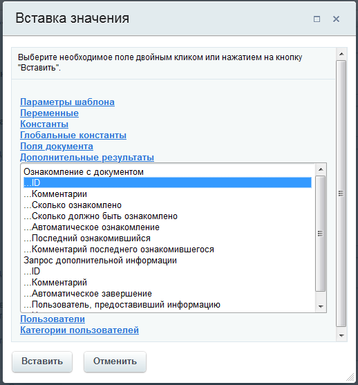

# Примеры работы со ссылками

**Навигация**
- [← Оглавление курса](index.md)
- [← Предыдущий: 13640 — Коды подстановки сущностей](lesson_13640.md)
- [Следующий: 12840 — Примеры работы с датами →](lesson_12840.md)

Официальная страница урока: https://dev.1c-bitrix.ru/learning/course/index.php?COURSE_ID=57&LESSON_ID=3817

Предлагаем, для лучшего понимания, посмотреть несколько примеров создания ссылок на файлы и документы.


### Использование переменных в ссылках


В полях действий,

			поддерживающих тег

                    Поля **Описание задания** позволяют использовать следующие теги bb-code:
[Подробнее](lesson_12321.md)...

		 `[url]`, доступно использование собственных переменных для создания ссылок.


```

	[url=http://{=Variable:Domain}/{=Variable:Path}]название ссылки[/url]
```


 где: `{=Variable:Domain}` и `{=Variable:Path}` - переменные, содержащие адрес сервера и требуемый путь.


### Создание прямой ссылки на страницу с заданием


Используйте ссылку, например, для отправки пользователю сообщения о необходимости выполнить задание в рамках бизнес-процесса.


```

	Ссылка на страницу с заданием: [url=https://[адрес_портала]/company/personal/bizproc/{=Workflow:ID}/]ссылка на страницу просмотра документа[/url]
```


**Если заданий несколько**


Если в бизнес-процессе есть несколько заданий, то прямую ссылку можно формировать не с использованием идентификатора бизнес-процесса (`{=Workflow:ID}`), а с выбором идентификатора конкретного задания через форму

			Вставка значения

                    При работе с бизнес-процессом в параметрах действий, параметрах шаблона и настройках статуса есть возможность указывать как собственный текст (заданный вручную), так и использовать различные переменные значения (поля документа и прочие данные, которые могут меняться и поэтому не задаются вручную). Для подстановки таких переменных значений используется специальная форма **Вставка значения**.

[Подробнее](lesson_12383.md)...

		, раздел

			Дополнительные результаты

                    

		.


Но вариант с использованием `{=Workflow:ID}` универсальный, так как открывает текущее невыполненное задание по конкретному бизнес-процессу. ID задания откроет конкретное задание этого процесса, даже если оно выполнено.


### Создание ссылки на страницу детального просмотра документа


Используйте ссылку, например, для отправки пользователю сообщения из которого он перейдет непосредственно к просмотру документа.


```

	Ссылка на страницу детального просмотра документа: [url]{=Document:DETAIL_PAGE_URL}[/url]
```


Такое выражение работает для элементов инфоблоков и элементов универсальных списков.


**Примечание:** Выражение `{=Document:DETAIL_PAGE_URL}` формирует нужную ссылку при условии, что в настройках инфоблока корректно заполнен **URL страницы детального просмотра**.


### Создание публичной ссылки на файл


Для создания публичной ссылки на файл, не требующей авторизации на портале, используйте модификатор `publink`:


```

	Публичная ссылка на файл: {=Document:PROPERTY_MY_FILE > publink}
// где Document:PROPERTY_MY_FILE – свойство документа типа Файл
```


**Примечание:** Модификатор `publink` доступен с версии **20.0.700** модуля Бизнес-процессы (**bizproc**).


В результате получим ссылку вида: `https://[адрес_портала]/bitrix/services/main/ajax.php?action=bizproc.file.show&token=305.0904b680f9932ca0ad3c378fb5159dac1a6521a6a9023408451a5e7a3a1061`


### Создание короткой публичной ссылки


Намного удобнее прислать клиенту короткую ссылку на файл. Для создания такой ссылки воспользуйтесь модификатором `shortlink`, который генерирует короткую версию ссылки `publink`:


```

	Короткая публичная ссылка на файл: {=Document:PROPERTY_MY_FILE > shortlink}
// где Document:PROPERTY_MY_FILE – свойство документа типа Файл
```


**Примечание:** Модификатор `shortlink` доступен с версии **20.0.700** модуля Бизнес-процессы (**bizproc**).


В результате получим ссылку вида: `https://[адрес_портала]/~tcMLt`


### Создание прямой ссылки к файлу на сервере


**Примечание:** C версии **20.0.700** модуля Бизнес-процессы (**bizproc**) для создания публичных ссылок доступны модификаторы `publink` и `shortlink`. Рекомендуем использовать их.


Такой сценарий понадобится, если нужно отправить, например, ссылку на скачивание файла клиенту (т.е. кому-то извне).


Допустим, в документе имеется поле **Файл**. Для получения внутренней ссылки используем: вставка значения Поля документа &gt; Файл (имя).


```

Ссылка на файл  - {=Document:PROPERTY_FILE_PRINTABLE}
```


Такая ссылка потребует авторизации на портале. Получить публичную ссылку можно с помощью модификатора **src**, который нужно указать вручную таким образом:


```

// удалим _PRINTABLE и добавим модификатор >src и bb-code [url].
Ссылка на файл - [url={=Document:PROPERTY_FILE > src}]link[/url]
```


**Внимание**! Использование такого модификатора на **коробочных** версиях может быть **небезопасно**. Например, если данный файл загружает пользователь: он может загрузить HTML и по такой ссылке откроется в браузере страница вашего сайта, в которой пользователем может быть написан вредоносный код. Но возможно обойти
использованием **CDN** (как в облачной версии Битрикс24) или настройкой вашего сервера (правила .htaccess и т.п., запрещающие выполнение html/php файлов в папке из папки /upload/).
