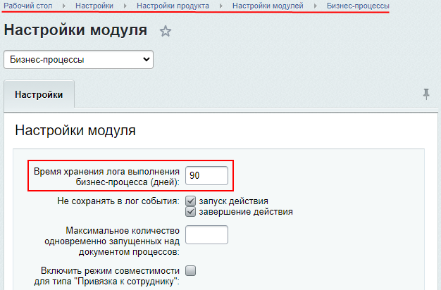
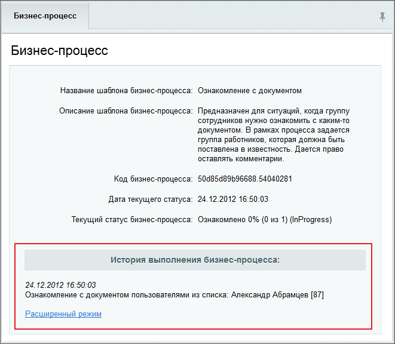
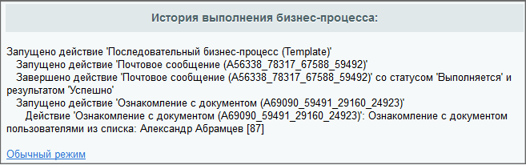
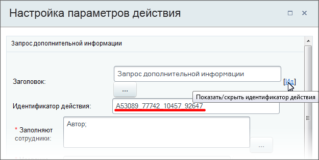

# Журнал выполнения бизнес-процесса

**Навигация**
- [← Оглавление курса](index.md)
- [← Предыдущий: 2363 — Бизнес-процессы ленты новостей](lesson_2363.md)
- [Следующий: 5276 — Задания бизнес-процессов →](lesson_5276.md)

Официальная страница урока: https://dev.1c-bitrix.ru/learning/course/index.php?COURSE_ID=57&LESSON_ID=3837

При разработке и использовании уже готовых процессов бывает необходимо узнать подробности выполнения того или иного процесса / действия. Для этого в системе предусмотрен журнал выполнения бизнес-процессов (лог).
Доступ к журналам имеет Администратор и все пользователи, у которых есть доступ к документу, для которого запущен бизнес-процесс.

**Время хранения логов**

- **В облачной версии Битрикс24** с 1 августа 2024 хранение логов можно включить только на семь дней — через неделю события перестанут фиксироваться в журнале. Подробнее читайте об этом в статье на [helpdesk.bitrix24.ru](https://helpdesk.bitrix24.ru/open/21994508).
  Если нужно проверить историю выполнения заданий, а не выполнить отладку, используйте [Протокол](https://helpdesk.bitrix24.ru/open/21290220/).
- **В коробочной версии Битрикс24** время хранения логов по умолчанию установлено **90** дней. Изменить это значение можно в настройках модуля Бизнес-процессы, параметр
  			Время хранения лога выполнения бизнес-процесса (дней)
                      
  		 . Логи удаляются автоматически по истечении указанного периода

### Административная часть

Информация об административной части актуальна только для продуктов «1С-Битрикс: управление сайтом» и коробочной версии «Битрикс24».

Журнал выполнения бизнес-процесса для элементов информационного блока находится в административной части сайта / портала.

Для просмотра журнала перейдем в режим редактирования элемента инфоблока (документа, для которого запущен бизнес-процесс) на вкладку **Бизнес-процессы** и затем используем ссылку в поле **Текущий статус**. Откроется форма с

			Историей выполнения бизнес-процесса

                    

		.

Для просмотра более подробной информации используем ссылку **Расширенный режим**:

## Идентификатор действия в расширенном режиме

В расширенном режиме просмотра истории в скобках отображается идентификатор для каждого действия. Посмотрите его или задайте свой идентификатор непосредственно при создании/редактировании

			шаблона бизнес-процесса

                    **Шаблон бизнес-процесса** представляет собой последовательность шагов (действий) от начального к конечному, которые будут выполняться один за другим. Необходимо таким образом и в таком порядке составить шаги (действия), чтобы реализовать нужный нам алгоритм и получить необходимый результат.
[Подробнее](/learning/course/index.php?COURSE_ID=41&CHAPTER_ID=05042)...

		 в форме **Настройка параметров действия** с помощью ссылки [Ид].

В поле допустимо вводить только символ подчеркивания (`_`), буквы латинского алфавита или цифры.
