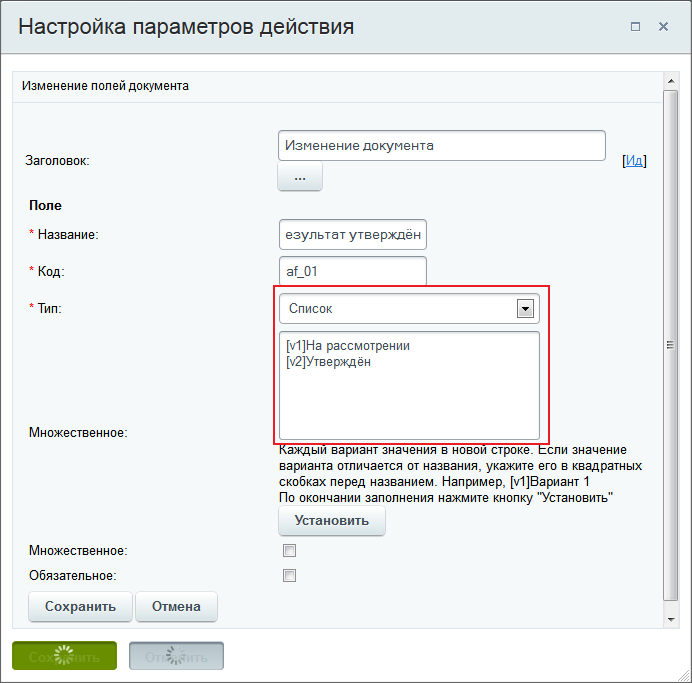
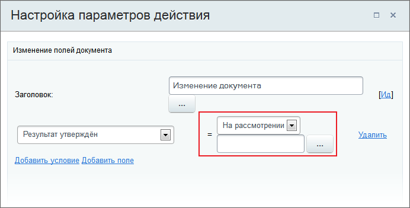
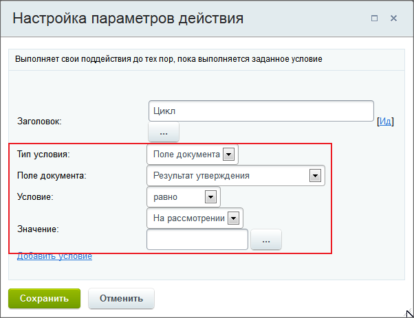
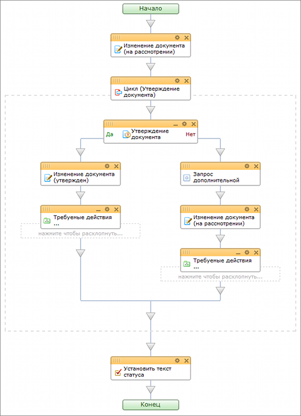

# Пример использования цикла для утверждения документа

**Навигация**
- [← Оглавление курса](index.md)
- [← Предыдущий: 5053 — Мои действия](lesson_5053.md)
- [Следующий: 3845 — Пример работы с переменными и дополнительными результатами действий →](lesson_3845.md)

Официальная страница урока: https://dev.1c-bitrix.ru/learning/course/index.php?COURSE_ID=57&LESSON_ID=3842

|  | ### Используем цикл для процесса утверждения документа |
| --- | --- |

Рассмотрим такой пример: документ проходит процедуру утверждения до тех пор, пока начальство не исправит его и не одобрит. Если документ не утвержден, то запрашивается дополнительная информация и он вновь направляется на утверждение.

Пример упрощен, и описание касается только работы конструкции

			Цикл

                    Конструкция выполняет свои поддействия до тех пор, пока выполняется заданное условие.
[Подробнее](lesson_3792.md)...

		. В примере используем **тип условия** - **Поле документа**.

#### Порядок действий:

- Первым делом добавим действие
  			Изменение документа
                      Действие изменяет указанные поля документа.
  [Подробнее](lesson_3785.md)...
  		. C помощью ссылки **Добавить поле** создадим дополнительное поле типа **список** с названием **Результат утверждения**. Укажем
  			2 варианта
                      
  		 значений поля с новой строки: **на рассмотрении** и **утвержден**. По значениям этого поля будет принято решение - выходить из цикла или нет.
  Теперь выберем созданное поле **Результат утверждения** и установим для него значение
  			на рассмотрении
                      
  		.
- Добавим действие **Цикл**. В параметрах
  			укажем
                      
  		: **тип условия** - **поле документа**; **условие** - **равно**; **значение** - **на рассмотрении**.
- В цикле добавим действие
  			Утверждение документа
                      Действие позволяет произвести утверждение документа, для которого запущен бизнес-процесс.
  [Подробнее](lesson_3771.md)...
  		:

  - В ветку **Да** добавляем действие **Изменение документа**. В параметрах поля **Результат утверждения** выбираем значение **утвержден**. Этим мы заставим процесс больше не входить в цикл.
  - После этого действия, если требуется, ставим
    			дополнительные действия
                        **Примечание:** В процессе изучения работы конструкции **Цикл** можно на этом этапе использовать действие **Запись в отчет**. Это позволит в журнале отследить, какое именно решение было принято и как цикл продолжил свою работу дальше.
    [Подробнее](lesson_3810.md)...
    		.
  - В ветку **Нет** добавляем действие
    			Запрос дополнительной информации
                        Действие создает задание, в ходе которого у пользователя будет запрошена дополнительная информация необходимая для выполнения бизнес-процесса.
    [Подробнее](lesson_3782.md)...
    		. Оно используется, например, для указания информации о правках старой версии документа или каких-либо замечаний, связанных с повторным рассмотрением документа.
  - Добавляем действие **Изменение документа**. В поле **Результат утверждения** выбираем значение **на рассмотрении**. Этим мы заставим процесс повторно войти в цикл. Также в этом действии мы обновим значения полей документа на значения, полученные из предыдущего действия, т.е. отправим на рассмотрение уже измененный документ.
  - При необходимости укажем в этой ветке дополнительные действия.
- После конструкции **Цикл** установим действие, которое оповестит нас о том, что цикл
  			завершил
                      документ может постоянно отклоняться и соответственно выхода из цикла не будет
  		 свою работу. В качестве оповещения выберем действие
  			Установить текст статуса
                      Действие позволяет изменить текст статуса документа, что облегчает отслеживание состояния документа в общем списке бизнес-процессов во время выполнения бизнес-процесса.
  [Подробнее](lesson_3803.md)...
  		 или
  			Почтовое сообщение
                      Действие позволяет отослать уведомление о событии на e-mail, указанный в настройках действия.
  [Подробнее](lesson_3802.md)...
  		.

Итоговая схема шаблона бизнес-процесса с **Циклом**:

