# Пример работы с переменными и дополнительными результатами действий

**Навигация**
- [← Оглавление курса](index.md)
- [← Предыдущий: 3842 — Пример использования цикла для утверждения документа](lesson_3842.md)
- [Следующий: 5060 — Пример использования действия "Выбор сотрудника" →](lesson_5060.md)

Официальная страница урока: https://dev.1c-bitrix.ru/learning/course/index.php?COURSE_ID=57&LESSON_ID=3845

|  | ### Когда нужна дополнительная информация |
| --- | --- |

Рассмотрим пример создания простого шаблона

			последовательного бизнес-процесса

                    **Последовательный бизнес-процесс** – действия выполняются одно за другим от точки входа до точки выхода.

[Подробнее](lesson_3466.md)...

		, в котором у пользователя запрашивается дополнительная информация, и затем она используется для записи в отчет и установку статуса документа.

#### Порядок действий:

- Добавим действие
  			Запрос дополнительной информации
                      Действие создает задание, в ходе которого у пользователя запрашивается дополнительная информация необходимая для выполнения бизнес-процесса.
  [Подробнее](lesson_3782.md)...
  		.
- Перейдем к форме настройки параметров действия. Заполним обязательные поля и добавим новые с помощью cсылки **Добавить поле**:
  В рамках этого действия мы
  			создаем поля
                      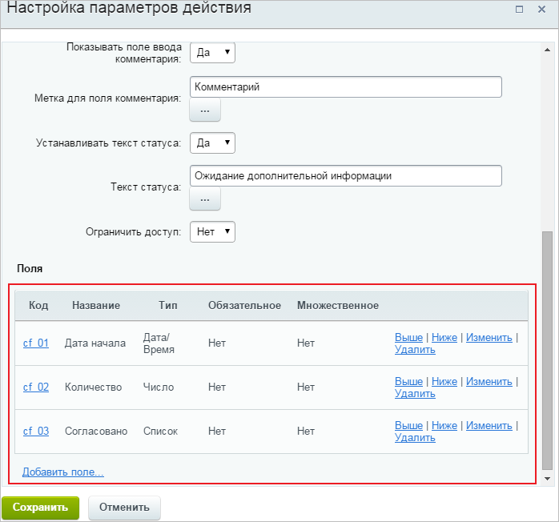
  		, которые отобразятся пользователю. Заполняя эти поля, пользователь задает нужные значения переменных. Для внесения изменений в поля заходим в параметры действия или пользуемся кнопкой
  			Параметры шаблона
                      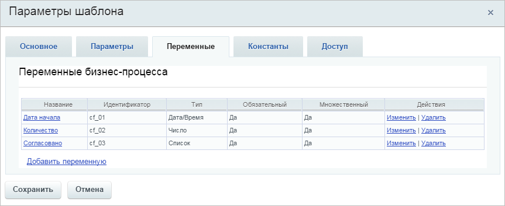
  		 на контекстной панели дизайнера бизнес-процессов.

  - Дата начала
                        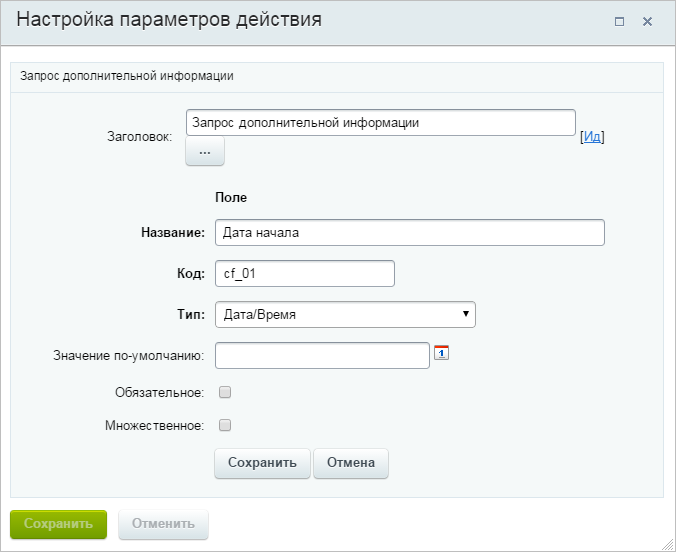
    		 (тип **Дата/Время**);
  - Количество
                        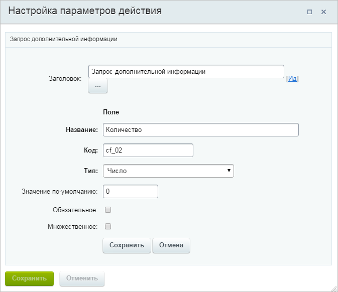
    		 (тип **Число**);
  - Согласовано
                        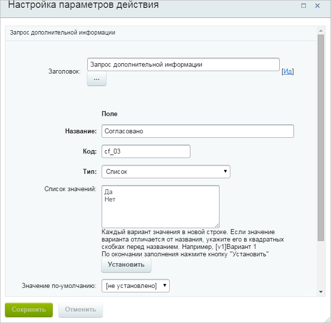
    		 (тип **Список**).
- Добавим действие
  			Запись в отчет
                      Действие позволяет добавлять в отчет и лог, соответственно, произвольные записи.
  [Подробнее](lesson_3810.md)...
  		. Вызовем окно настроек действия и, используя форму **Вставка значений**, вставим в поле
  			Текст
                      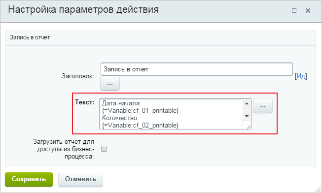
  		 наши переменные (группа **Переменные**) и комментарии (группа **Дополнительные параметры**).
- Добавим действие
  			Установить текст статуса
                      Действие позволяет изменить текст статуса документа, что облегчает отслеживание состояния документа в общем списке бизнес-процессов во время выполнения бизнес-процесса.
  [Подробнее](lesson_3803.md)...
  		 и укажем
  			текст
                      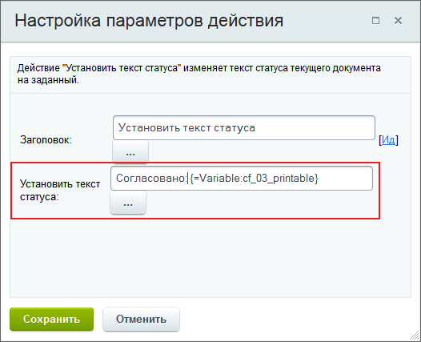
  		.
- Запустим бизнес-процесс на исполнение и введем требуемые данные:
  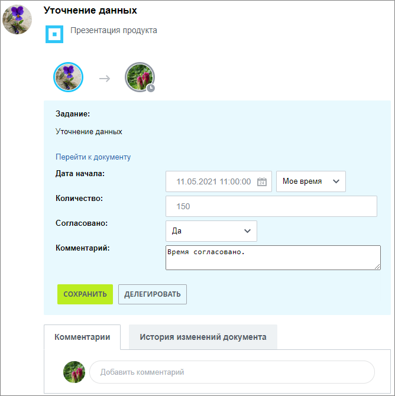
- Во вкладке **Мои процессы** отображается статус завершенного бизнес-процесса.
  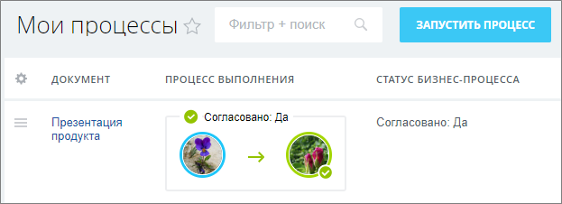
- Перейдем к просмотру
  			журнала исполнения процесса
                      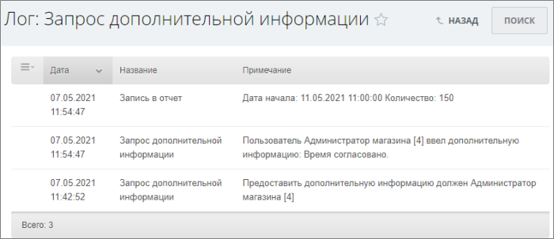
  		 и обнаружим там запись, содержащую значения переменных.

Получили такой шаблон:

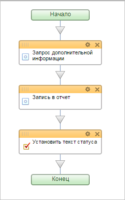
