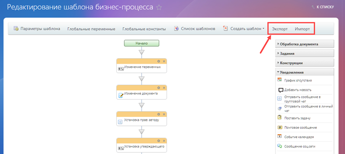

# Экспорт и импорт

**Навигация**
- [← Оглавление курса](index.md)
- [← Предыдущий: 3861 — Пример: организация обработки и доработки документа](lesson_3861.md)
- [Следующий: 24828 — Проверьте себя →](lesson_24828.md)

Официальная страница урока: https://dev.1c-bitrix.ru/learning/course/index.php?COURSE_ID=57&LESSON_ID=3858

Переносите шаблоны бизнес-процесс с одних проектов на другие с помощью инструмента Экспорта и Импорта.

### Как перенести шаблон

Процесс переноса шаблона с одного проекта на другой достаточно простой.  Для этого необходимо воспользоваться кнопками «Экспорт» и «Импорт» на контекстной панели

			дизайнера бизнес-процессов

                    Модуль **Дизайнер бизнес-процессов**, входящий в старшие редакции продуктов *«1С-Битрикс»*, предназначен для проектирования, создания и изменения бизнес-процессов.
[Подробнее](https://dev.1c-bitrix.ru/learning/course/index.php?COURSE_ID=57&CHAPTER_ID=05058)...

		.

**Примечание**: Перенос шаблона с одной установки на другую подразумевает наличие администраторских прав.

При нажатии на кнопку «Экспорт» скачивается файл формата **bpt**. Например: **bp-5.bpt**, где 5 это идентификатор шаблона бизнес-процесса. Этот файл вы затем можете импортировать на другой проект.

Перед этим, в проекте, куда импортируется шаблон, необходимо создать такой же тип документа (инфоблок/список/и т.д.), как и в проекте, откуда экспортируется шаблон. Например, если вы экспортировали шаблон БП универсального списка то и импорт нужно выполнять в универсальный список.

**Внимание!** Нельзя импортировать шаблон процесса одного типа документа в документ другого типа. К примеру, экспортировать шаблон из Сделок и импортировать его в шаблоны бизнес-процессов Списков, или из Смарт-процессов в Лиды.

Важный момент: в файл шаблона при экспорте добавляются поля сущности. Затем при импорте на основе этой информации могут быть созданы новые поля или обновлены существующие поля сущности, если совпадают их идентификаторы. Если же в документе уже будут поля, отличные от импортируемых, то они сохранятся, а к ним добавятся новые поля из импортируемого файла.

Проще всего выполнять импорт в «пустой» документ. Тогда вместе с шаблоном будут созданы все необходимые поля. В остальных случаях внимательно проверьте список полей, полученный после импорта шаблона.

> **Совет**. После импорта шаблона обязательно проверьте:
>
> - Получившийся список полей документа;
> - Упоминания этих полей в действиях шаблона, т.к. могли измениться идентификаторы.

### Особенности импорта шаблона списков

В связи с особенностью работы **модуля списков** импорт шаблона бизнес-процесса проводят с некоторыми условиями.

Наиболее простой вариант - это изначально создать и настроить список, поля и шаблон бизнес-процесса:

- Создать пользовательские поля в исходном списке не через интерфейс списков, а прямо через интерфейс конструктора бизнес-процессов;
- После экспорта шаблона из *исходного* списка в *новый* **обязательно** проверить все действия, где используются пользовательские поля.

Если же пользовательские поля исходного списка были уже ранее созданы через публичный интерфейс самих списков, то импорт нужно проводить по следующей схеме:

- Создать и настроить *новый* список также как и *исходный*;
- Создать и настроить через публичный интерфейс модуля списков такие же поля, как и в *исходном* списке;
- Задать для пользовательских полей и их значений (например, для полей типа список) такие же идентификаторы, как и в *исходном* списке через административную часть сайта;
- Импортировать шаблон бизнес-процесса;
- **Обязательно** проверить получившийся после импорта шаблон, особенно те действия, где используются пользовательские поля.

При несоблюдении указанных условий шаблон и пользовательские поля могут некорректно импортироваться.
