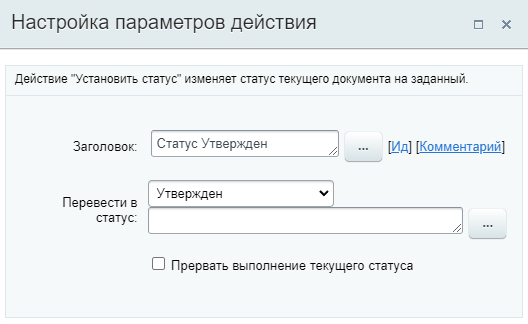

# Установить статус

**Навигация**
- [← Оглавление курса](index.md)
- [← Предыдущий: 3789 — Условие](lesson_3789.md)
- [Следующий: 3792 — Цикл →](lesson_3792.md)

Официальная страница урока: https://dev.1c-bitrix.ru/learning/course/index.php?COURSE_ID=57&LESSON_ID=3859

Действие изменяет статус текущего документа на заданный.

**Примечание:** Действие доступно **только** в шаблонах

			бизнес-процессов со статусами

                    **Бизнес-процесс со статусами** – бизнес-процесс, не имеющий начала и конца, в процессе работы которого происходит переход из одного состояния (статуса) в другое с разделением прав доступа.

[Подробнее](lesson_3467.md)...

		.

#### Описание параметров

- **Перевести в статус** – выберите из списка созданных статусов тот, в который нужно перевести бизнес-процесс (предварительно нужно создать все необходимые статусы и только затем настраивать переходы).
- **Прервать выполнение текущего статуса** – позволяет немедленно перейти к новому статусу, не дожидаясь полной отработки текущего.

#### Пример

Практический пример применения действия вы найдете в уроке [Пример: организация обработки и доработки документа](lesson_3861.md).
