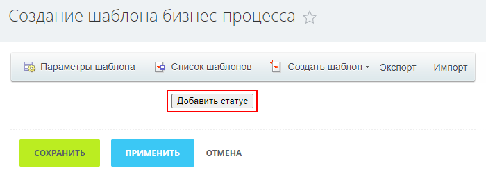
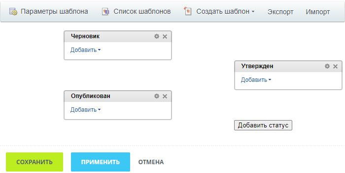
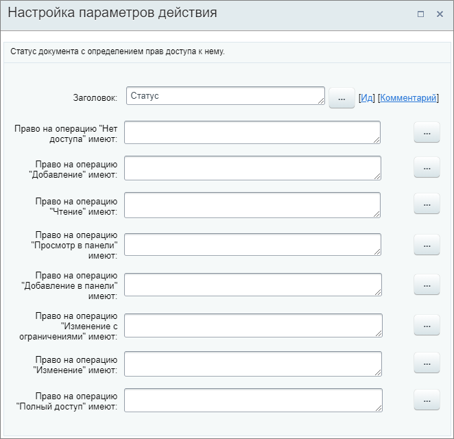
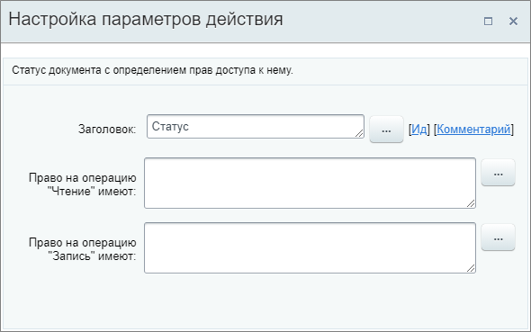
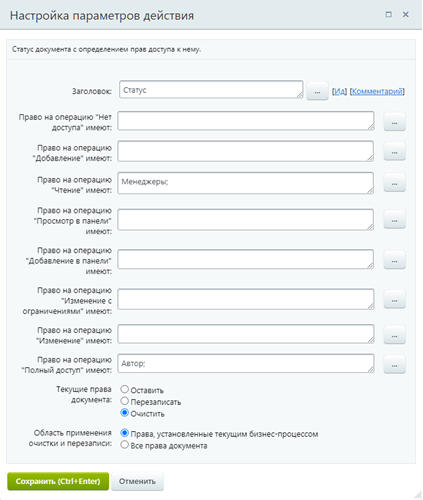
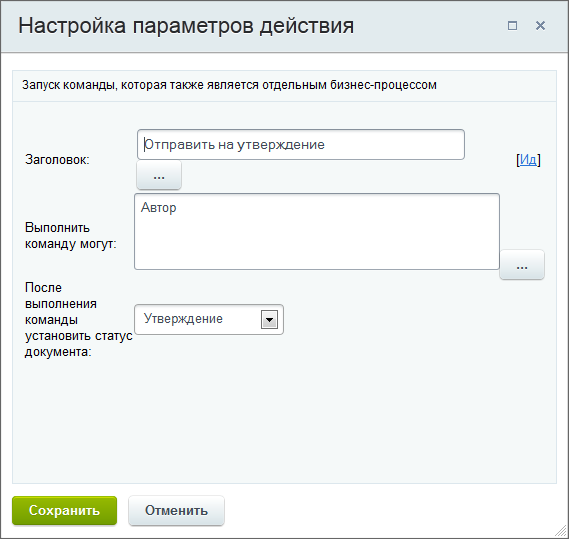
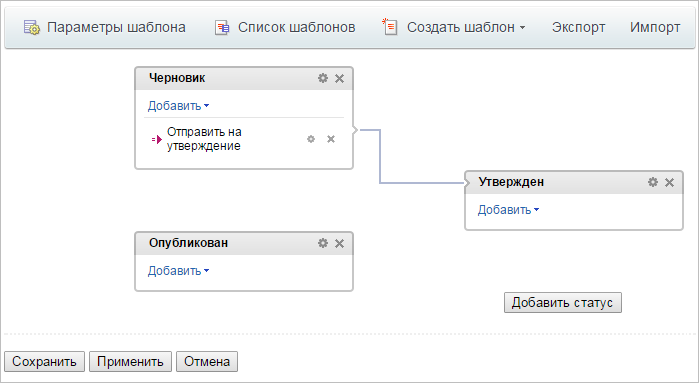
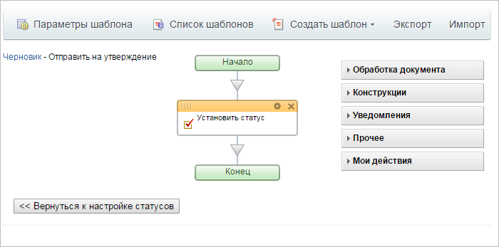
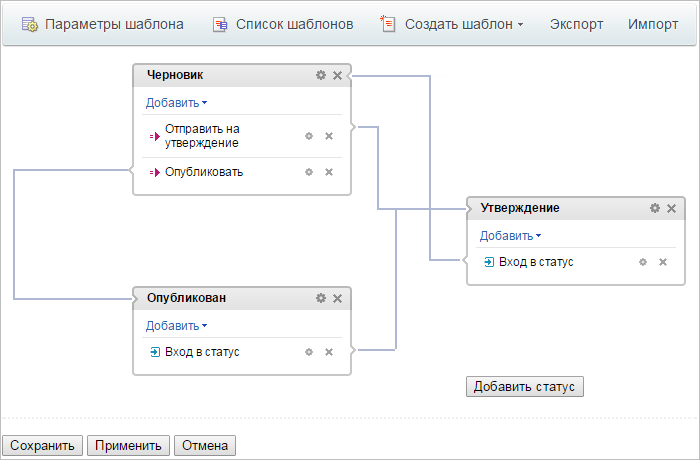

# Создание шаблона бизнес-процесса со статусами

**Навигация**
- [← Оглавление курса](index.md)
- [← Предыдущий: 3868 — Создание шаблона последовательного бизнес-процесса](lesson_3868.md)
- [Следующий: 3863 — Пример использования параметров шаблона →](lesson_3863.md)

Официальная страница урока: https://dev.1c-bitrix.ru/learning/course/index.php?COURSE_ID=57&LESSON_ID=3860

При проектировании шаблона

			бизнес-процесса со статусами

                    **Бизнес-процесс со статусами** – бизнес-процесс, не имеющий начала и конца, в процессе работы которого происходит переход из одного состояния (статуса) в другое с разделением прав доступа.

[Подробнее](lesson_3467.md)...

		, после

			настройки и сохранения его параметров

                    **Шаблон БП** представляет собой последовательность шагов (действий) от начального к конечному, которые выполняются один за другим. Необходимо таким образом и в таком порядке составить шаги (действия), чтобы реализовать нужный нам алгоритм и получить необходимый результат.

[Подробнее](lesson_3816.md)...

		 осуществляется переход к конструированию непосредственно самого шаблона в 3 этапа: создание статусов документа, настройка действий внутри каждого из них и связей между ними, а также настройка прав доступа для каждого статуса.

### Видеоуроки

Содержание видеоурока отличается от текущей версии продукта. Более актуальная информация содержится в тексте урока.

<!-- &lt;p&gt;
	 &lt;iframe title="Создание шаблона бизнес-процесса со статусами" src="//www.youtube.com/embed/ZFIE5DAj-7o?feature=oembed&rel=0" allowfullscreen="" width="853" height="480" frameborder="0"&gt;
	 
	&lt;/iframe&gt;
&lt;/p&gt; -->

### Создание статусов

Создание статусов выполняется на главной странице построения шаблона бизнес-процесса:

- Нажмите кнопку **Добавить статус**. Первый созданный статус станет **начальным**.
  > **Начальным статусом**, с которого начинает свою работу бизнес-процесс, считается тот, который расположен на первом месте (самый верхний левый). Начальный статус можно изменить при необходимости, поменяв его местами с другим статусом.
  
  ## Внимание: в версиях модуля до 21.400.0 смена начального статуса бизнес-процесса невозможна.
  До версии 21.400.0 модуля Бизнес-процессы работа со статусами была более строгой. Отсутствовала возможность менять статусы местами и изменять начальный статус.
  **Важно!** В БП со статусами до версии 21.400.0 бизнес-процесс всегда начинается с первого созданного статуса. Изменить статус, с которого начинается процесс, в последующем невозможно.
- В форме создания статуса укажите его название и права доступа к документу (элементу бизнес-процесса), если таковые имеются. Набор настроек прав доступа зависит от типа элемента.
  **Примечание:** Добавляйте пользователя или группу пользователей только к одному праву доступа (максимальному). Если добавите в несколько прав доступа – применится самое слабое (верхнее в списке) право.
- Сохраните изменения.

Аналогичным образом добавляются все необходимые статусы. Например, в шаблон могут быть добавлены такие статусы:

.

Все созданные статусы можно

			менять местами

                    Такая возможность стала доступна с версии **21.400.0** модуля Бизнес-процессы.

		 путем перетаскивания, как вам удобно для построения шаблона. При этом связи статусов сохраняются.

### Настройка действий и создание связей

После того, как все статусы созданы, следует настроить операции и действия (подпроцессы), которые выполняются в каждом из них, а также создать связи между статусами.

Для каждого статуса настраивается:

- Действие
  			Команда
                      Действие сходно по смыслу действию **Команда** для шаблона последовательных бизнес-процессов.
  		, которое позволяет пользователю вручную запускать подпроцесс. Внешний вид элемента управления, с помощью которого пользователем запускается команда, зависит от места запуска бизнес-процесса и типа документа. Команду используем, например, для определения того, как должен исполняться бизнес-процесс. Или как подпроцесс, который выполняется только при определенных условиях;
- Действие
  			Выполнение через заданное время
                      Действие сходно по смыслу действию **Пауза в выполнении** для шаблона последовательных бизнес-процессов.
  [Подробнее](lesson_3807.md)...
  		 – позволяет
  			отложить
                      Действие удобно использовать, например, если необходимо автоматически выполнить какие-то действия без участия сотрудников
  		 выполнение подпроцесса на заданное в обработчике время;
- **Обработчик входа в данный статус** – отдельный последовательный бизнес-процесс. Всегда выполняется автоматически при входе в данный статус;
- **Обработчик выхода из данного статуса** – отдельный последовательный бизнес-процесс. Всегда выполняется автоматически при
  			выходе
                      Например, можно отправлять информационное сообщение, что процесс вышел из текущего статуса.
  		 из данного статуса.

### Настройка прав доступа

По умолчанию бизнес-процесс использует права документа, но в каждом статусе есть возможность указать дополнительные права. Такие права добавляются к правам документа и действуют только в этом статусе. При выходе из статуса или прерывании бизнес-процесса действие таких дополнительных прав прекращается.

Набор прав доступа зависит от типа документа. Так для

			универсальных списков

                    

		 доступна настройка 8 типов, а для

			инфоблоков

                    

		 всего 2. Для сущностей CRM настройка дополнительных прав в статусе отсутствует.

С версии 23.200.0 добавлена возможность гибко настраивать права на статус. Теперь, аналогично действию

			Установка прав

                    Действие позволяет устанавливать права на доступ к документу.

[Подробнее](lesson_3811.md)...

		, доступно выбрать, что сделать с текущими правами документа, и определить область применения очистки или перезаписи прав.

Рассмотрим для чего нужна такая настройка прав доступа на простом примере организации проверки вновь добавленных элементов руководителем. Пусть сотрудники могут видеть и редактировать вновь добавленный ими элемент до тех пор, пока руководитель не утвердит его. После утверждения элемент сотруднику не доступен.

1. В настройках универсального списка укажем следующее право доступа: **Сотрудники** = **добавление**. После такой настройки прав сотрудник сможет добавлять элементы в список, но не сможет просматривать или изменять их.
2. Теперь в настройках прав доступа требуемого статуса бизнес-процесса укажем, что право на **Изменение** имеет **Автор**.
3. Право из бизнес-процесса добавится к правам на список. Произойдет сопоставление понятия **Автор** с конкретным пользователем в системе и его правами в списке. После такой настройки пользователь сможет изменять элемент до тех пор, пока он находится в текущем статусе бизнес-процесса. Как только руководитель утвердит документ и бизнес-процесс перейдет в другой статус, сотрудник больше не будет иметь доступа к элементу.

**Примечание:** Смысл в том, что права на список и права у бизнес-процесса – это разные права. И по правилам списков (инфоблоков) они "не знают" такой тип пользователя как **Автор** (т.е. пользователя, запустившего бизнес-процесс).

**Внимание**: В бизнес-процессах со статусами переход к другому статусу переписывает права доступа к документу, установленные действием [Установка прав](lesson_3811.md) в текущем статусе.

### Общая схема работы (Битрикс24)

При входе в статус первым всегда выполняется **Обработчик входа в данный статус**, если он задан. После выполнения всех внутренних действий статуса бизнес-процесс переходит в режим ожидания. Для дальнейшего продолжения процесса можно воспользоваться подпроцессами **Выполнение через заданное время** и **Команда**.

**Примечание**: если в **Обработчике входа в данный статус** уже добавлен переход к другому статусу, прерывающий выполнение текущего, то после него сразу будет выполняться **Обработчик выхода из данного статуса**. Подпроцессы  **Выполнение через заданное время** и **Команда** будут в таком случае пропущены.

Если статус не является конечным, то переход от одного статуса к другому (создание связей) выполняется с помощью действия

			Установить статус

                    Действие изменяет статус текущего документа на заданный.

[Подробнее](lesson_3859.md)...

		, которое должно располагаться внутри подпроцесса, предполагающего такой переход. При выходе из статуса автоматически будет выполнен подпроцесс **Обработчик выхода из данного статуса**, если он создан.

**Примечание**: если вы измените и сохраните существующий шаблон, он применится только к новым бизнес-процессам. Запущенные ранее бизнес-процессы продолжат работать по старому шаблону.

## Небольшой пример настройки статуса

Рассмотрим добавление команды для статуса **Черновик**:

- В выпадающем меню для данного статуса выберите пункт **Команда**. Откроется
  			форма настройки
                      
  		 основных параметров команды.
- Укажите название команды и пользователей, которые могут выполнить данную команду. Если документ должен сменить статус после выполнения команды, то выберите необходимый статус с помощью выпадающего списка. Список статусов формируется из статусов бизнес-процесса.
- Сохраните параметры команды.

В результате будет создано действие в статусе и

			связь

                    

		 между статусами.

Поскольку команда – это собственный последовательный бизнес-процесс, то процесс необходимо

			создать

                    **Примечание:** создание отдельного бизнес-процесса в каждом статусе выполняется аналогично созданию последовательного бизнес-процесса
[Подробнее](lesson_3868.md)...

		:

- Кликнете по названию команды. Откроется
  			визуальный конструктор
                      **Визуальный конструктор** – инструмент, входящий в состав модуля **Дизайнер бизнес-процессов**, который
  позволяет создавать и редактировать шаблоны бизнес-процессов.
  [Подробнее](lesson_3870.md)...
  
  		. В конструкторе уже содержится действие **Установить статус**, так как в ходе выполнения команды происходит смена статуса бизнес-процесса. В схему команды добавьте необходимые вам действия и выполните их настройку. Для возврата на главную страницу создания шаблона бизнес-процесса со статусами служит кнопка **Вернуться к настройке статусов**.
- Для настройки действий в каждом статусе повторите описанные выше шаги. Результат:
  
- По окончании выполнения необходимых настроек не забудьте сохранить шаблон с помощью кнопки **Сохранить**, доступной на главной странице со статусами бизнес-процесса.
