# Пример: организация обработки и доработки документа

**Навигация**
- [← Оглавление курса](index.md)
- [← Предыдущий: 3863 — Пример использования параметров шаблона](lesson_3863.md)
- [Следующий: 3858 — Экспорт и импорт →](lesson_3858.md)

Официальная страница урока: https://dev.1c-bitrix.ru/learning/course/index.php?COURSE_ID=57&LESSON_ID=3861

Рассмотрим

			пример

                    В данном примере мы будем рассматривать только принцип создания и использования статусов, опустив прочие настройки.

		: бизнес-процесс позволяет утверждать документ в цикле, запрашивать нужную информацию в случае доработки, а также отображает автору и проверяющему комментарии, которые они оставляют при выполнении заданий.

### Начальные действия

- Создадим 3 статуса:

  - **Рассмотрение документа**
  - **Доработка**
  - **Утвержден**
- В каждом добавим подпроцесс **Вход в статус**.
  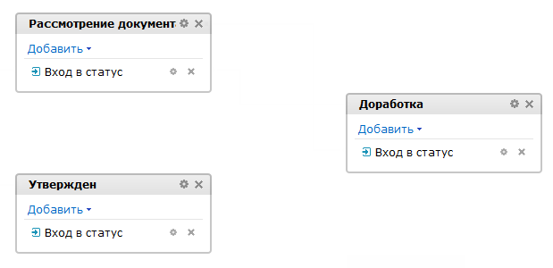

### Cтатус Рассмотрение документа

- Перейдем в статус и добавим действие
  			Утверждение документа
                      Действие позволяет произвести утверждение документа, для которого запущен бизнес-процесс.
  [Подробнее](lesson_3771.md)...
  		. В параметрах действия заполним
  			все обязательные поля
                      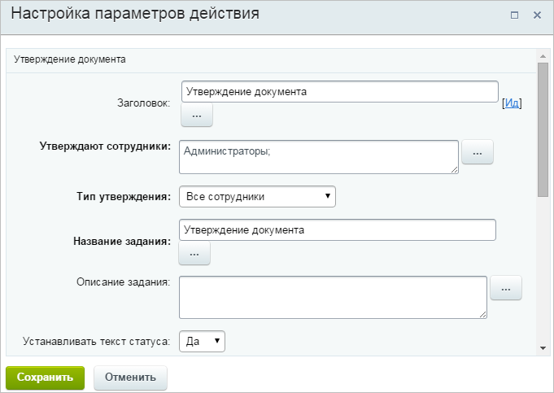
  		. Поле **Описание задания** пока оставим пустым, мы к нему вернемся позже;
- Добавим действие
  			Установить статус
                      Действие изменяет статус текущего документа на заданный.
  [Подробнее](lesson_3859.md)...
  		 в каждую ветку утверждения документа, после чего произведем их настройку для статусов
  			Утвержден
                      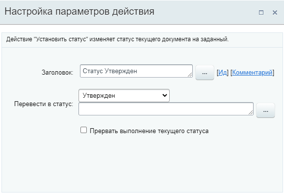
  		 и
  			Доработка
                      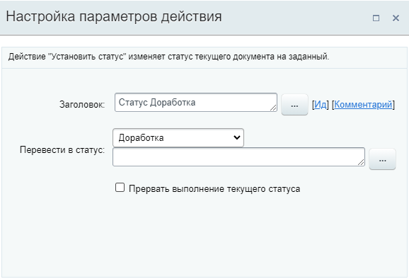
  		.

Получится такой процесс:

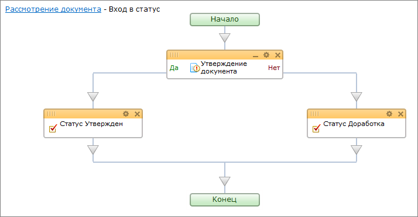

В случае если проверяющий сотрудник утвердит документ, то бизнес процесс перейдет в статус **Утвержден**, иначе - в статус **Доработка**.

### Статус Доработка

- Перейдем в статус и добавим действие
  			Запрос дополнительной информации
                      Действие создает задание, в ходе которого у пользователя будет запрошена дополнительная информация необходимая для выполнения бизнес-процесса.
  [Подробнее](lesson_3782.md)...
  		.  В Поле **Описание задания**, используя форму
  			Вставка значения
                      При работе с бизнес-процессом в параметрах действий, параметрах шаблона и настройках статуса есть возможность указывать как собственный текст (заданный вручную), так и использовать различные переменные значения (поля документа и прочие данные, которые могут меняться и поэтому не задаются вручную). Для подстановки таких переменных значений используется специальная форма **Вставка значения**.
  [Подробнее](lesson_12383.md)...
  		, добавим
  			комментарий
                      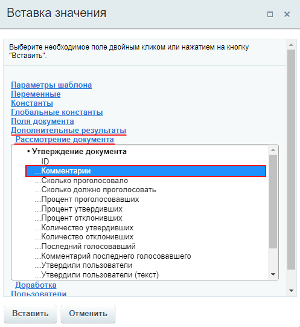
  		, который будет оставлен проверяющим после выполнения действия **Утверждение документа** (Утверждение документа &gt; Комментарий, группа **Дополнительные результаты**).
  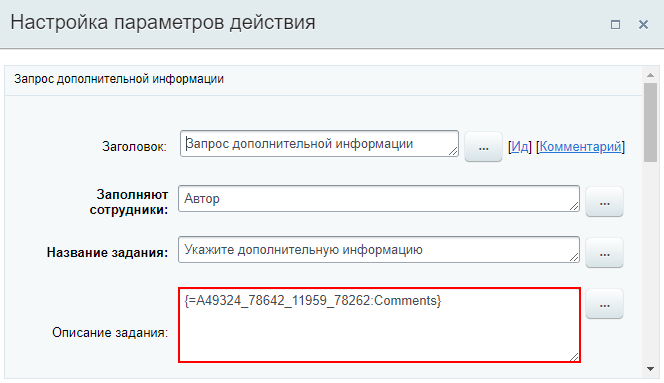
- Далее добавим действие **Установить статус** и произведем его настройку для возврата документа в статус **Рассмотрение** (для повторного рассмотрения после доработки):
  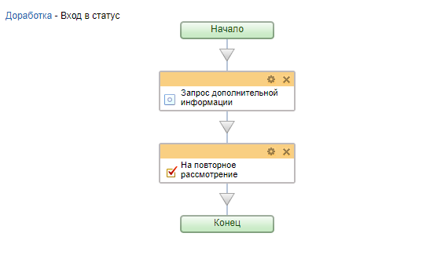
- Вернемся в статус **Рассмотрение документа** к настройке действия **Утверждение документа**. Аналогично предыдущему пункту, в поле **Описание задания**, используя форму
  			Вставка значения
                      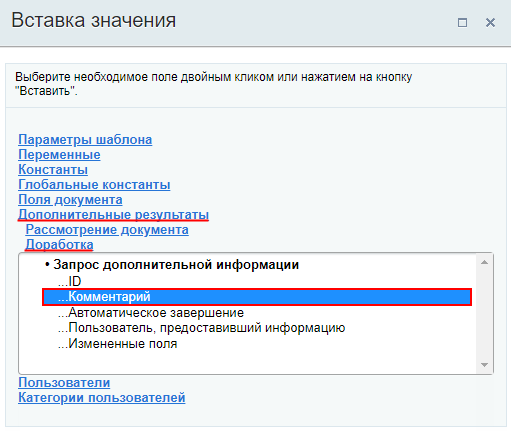
  		, добавим
  			комментарий
                      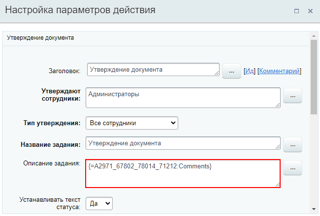
  		. Это будет комментарий, который оставит автор документа после выполнения действия **Запрос дополнительной информации** (из статуса **Доработка**).

В результате в этом статусе мы получим от автора нужные исправления/комментарии и отправим документ на повторное утверждение.

### Статус Утвержден

В этом статусе можно проинформировать автора документа об утверждении документа, например, с помощью действия

			Сообщение соц. сети

                    Действие отправляет уведомление модуля социальной сети.

[Подробнее](lesson_3804.md)...

		. А также добавим действие

			Прерывание процесса

                    Действие позволяет прекратить выполнение бизнес-процесса.

[Подробнее](lesson_3813.md)...

		, для завершения нашего бизнес-процесса после уведомления автора.

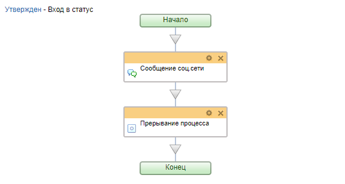

### Итоги и шаблон для ознакомления

В итоге, после всех настроек, наш бизнес процесс со статусами в общем виде выглядит так:

Шаблон для ознакомления: [Скачать](/images/admin_expert/bizproc/example/statuses_simple/statuses_simple.bpt). После загрузки шаблона его нужно [импортировать](lesson_3858.md) на вашу установку "1С-Битрикс: Управление сайтом" или "Битрикс24" и открыть его в ней.
