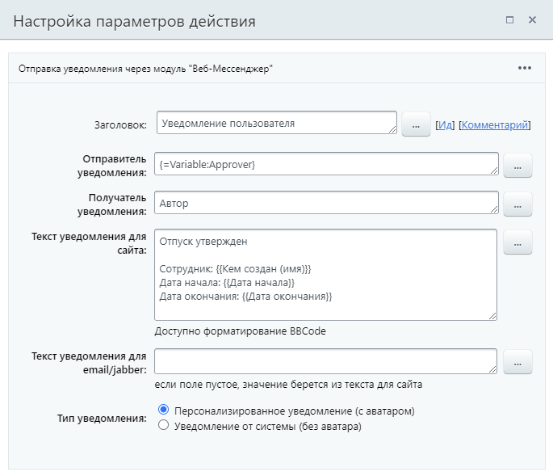

# Уведомление пользователя

**Навигация**
- [← Оглавление курса](index.md)
- [← Предыдущий: 8543 — Уведомить руководство](lesson_8543.md)
- [Следующий: 3803 — Установить текст статуса →](lesson_3803.md)

Официальная страница урока: https://dev.1c-bitrix.ru/learning/course/index.php?COURSE_ID=57&LESSON_ID=3862

Действие позволяет отправлять сообщения на сайт /

			XMPP

                    Если пользователь использует [XMPP](/learning/course/index.php?COURSE_ID=48&CHAPTER_ID=04651&LESSON_PATH=3918.4635.4651), то сообщение придет ему туда, иначе оно будет отправлено на сайт (если пользователь там авторизован). Если пользователь не авторизован на сайте, то дополнительно текст сообщения будет отправлен по электронной почте.

		/ e-mail.

#### Описание Параметров

- **Отправитель уведомления** – выбирается пользователь, от чьего имени будет проведена отправка (если в опции **Тип уведомления** выбран вариант **Персонализированное**).
- **Получатель уведомления** – выбирается получатель (пользователь или группа).
- **Текст уведомления для сайта** – задается текст сообщения, который будет отображаться на сайте, если пользователь не использует XMPP.
  Для текста доступно форматирование BBCode (`[b]`, `[i]`, `[s]`, `[u]`, `[url]`).
- **Текст уведомления для email/jabber** – задается текст сообщения для e-mail/XMPP, который будет отправлен, если пользователь не авторизован на сайте. Текст можно задать как отличный от текста для сайта, так и такой же, оставив для этого поле пустым.
- **Тип уведомления** – позволяет указать от кого придет сообщение:

  - **Персонализированное уведомление (с аватаром)** – т.е. от конкретного пользователя, указанного в **Отправитель**;
  - **Уведомление от системы (без аватара)** – отобразится как системное сообщение.

#### Пример

