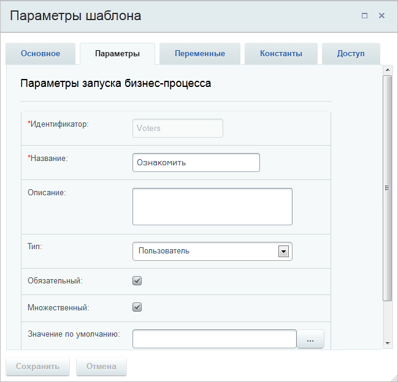
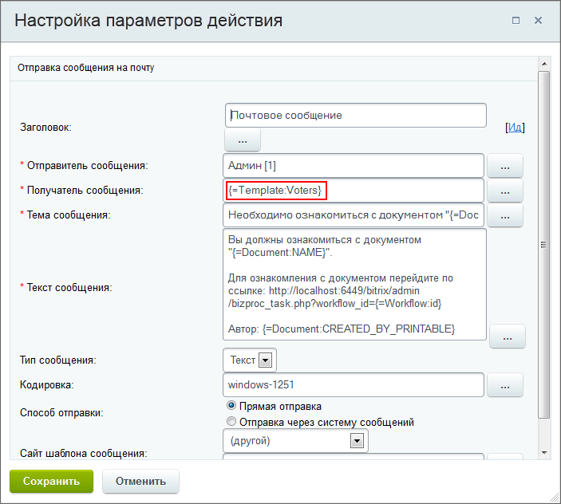
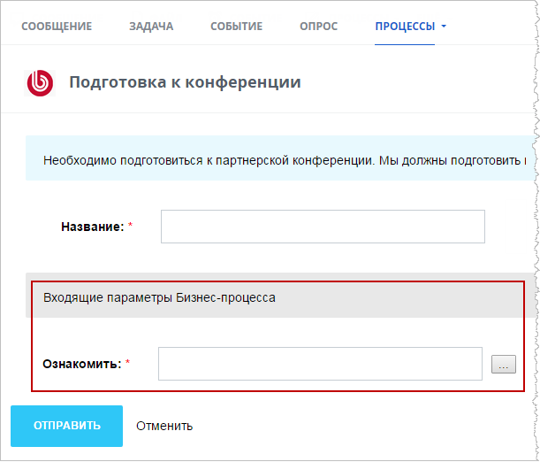

# Пример использования параметров шаблона

**Навигация**
- [← Оглавление курса](index.md)
- [← Предыдущий: 3860 — Создание шаблона бизнес-процесса со статусами](lesson_3860.md)
- [Следующий: 3861 — Пример: организация обработки и доработки документа →](lesson_3861.md)

Официальная страница урока: https://dev.1c-bitrix.ru/learning/course/index.php?COURSE_ID=57&LESSON_ID=3863

|  | ### Посмотрим, как использовать параметры шаблона |
| --- | --- |

Предположим, мы хотим, чтобы при запуске бизнес-процесса пользователь имел возможность явно указывать сотрудника, которому адресовано почтовое сообщение, отсылаемое в ходе выполнения процесса. Рассмотрим как это реализовать на примере штатного бизнес-процесса **Ознакомление с документом**.

#### Настройки

- В форме **Параметры шаблона** на закладке **Параметры** создан параметр
  			Ознакомить
                      
  		 типа **Пользователь**.
- В действии **Почтовое сообщение** созданный параметр указан в поле
  			Получатель
                      
  		 (с помощью формы
  			Вставка значения
                      При работе с бизнес-процессом в параметрах действий, параметрах шаблона и настройках статуса есть возможность указывать как собственный текст (заданный вручную), так и использовать различные переменные значения (поля документа и прочие данные, которые могут меняться и поэтому не задаются вручную). Для подстановки таких переменных значений используется специальная форма **Вставка значения**.
  [Подробнее](lesson_12383.md)...
  		, группа **Параметры шаблона**).

В результате при запуске бизнес процесса у пользователя запрашиваются дополнительные параметры:

