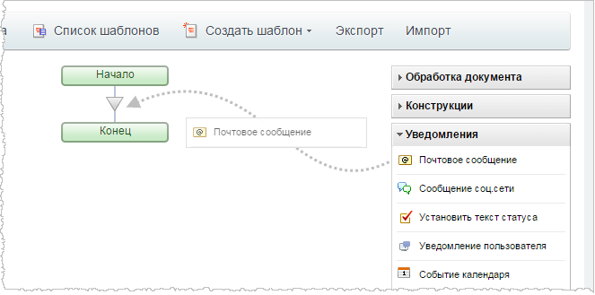
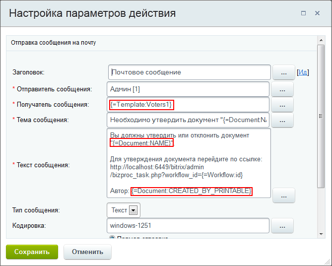

# Создание шаблона последовательного бизнес-процесса

**Навигация**
- [← Оглавление курса](index.md)
- [← Предыдущий: 3816 — Настройка параметров шаблона](lesson_3816.md)
- [Следующий: 3860 — Создание шаблона бизнес-процесса со статусами →](lesson_3860.md)

Официальная страница урока: https://dev.1c-bitrix.ru/learning/course/index.php?COURSE_ID=57&LESSON_ID=3868

Посмотрим видеоролик о создании шаблона

			последовательного бизнес-процесса

                    **Последовательный бизнес-процесс** – действия выполняются одно за другим от точки входа до точки выхода.

[Подробнее](lesson_3466.md)...

		. Узнаем как использовать визуальный конструктор и настраивать параметры действий.

### Видеоурок

<!-- &lt;p&gt;
	 &lt;iframe title="Создание шаблона последовательного бизнес-процесса" src="//www.youtube.com/embed/3x5pO0R0DFo?feature=oembed&rel=0" allowfullscreen="" width="853" height="480" frameborder="0"&gt;
	 
	&lt;/iframe&gt;
&lt;/p&gt; -->

### Создание шаблона последовательного БП

При проектировании шаблона **последовательного бизнес-процесса** после

			настройки и сохранения его параметров

                    **Шаблон БП** представляет собой последовательность шагов (действий) от начального к конечному, которые выполняются один за другим. Необходимо таким образом и в таком порядке составить шаги (действия), чтобы реализовать нужный нам алгоритм и получить необходимый результат.

[Подробнее](lesson_3816.md)...

		 сразу становится доступным **визуальный конструктор** для конструирования шаблона.

Конструирование шаблона выполняется путем

			добавления в рабочую область

                    

		 необходимых действий с последующей настройкой их параметров.

Настройка параметров каждого действия осуществляется в специальной форме, открываемой с помощью кнопки , причем набор параметров зависит от конкретного действия.

Заполните необходимые поля. Для упрощения процедуры заполнения полей служит кнопка , при нажатии которой открывается зависящая от типа поля форма

			Вставка значения

                    При работе с бизнес-процессом в параметрах действий, параметрах шаблона и настройках статуса есть возможность указывать как собственный текст (заданный вручную), так и использовать различные переменные значения (поля документа и прочие данные, которые могут меняться и поэтому не задаются вручную). Для подстановки таких переменных значений используется специальная форма **Вставка значения**.

[Подробнее](lesson_12383.md)...

		.

Для выбора значения откройте нужную группу, затем выберите необходимое значение и нажмите кнопку **Вставить** (либо дважды кликнете по выбранному значению). Для вставки нескольких значений необходимо повторно вызвать форму выбора значения. Значение или его код будут подставлены в настраиваемое поле (На иллюстрации выше такой код выделен красной рамочкой).

По окончании настройки параметров действия, сохраните его. Система вернется к созданию (редактированию) шаблона бизнес-процесса.

Когда в шаблон будут добавлены и настроены все необходимые действия, не забудьте сохранить его. Шаблон отобразится в списке всех шаблонов бизнес-процессов.

**Примечание**: если вы измените и сохраните существующий шаблон, он применится только к новым бизнес-процессам. Запущенные ранее бизнес-процессы продолжат работать по старому шаблону.
