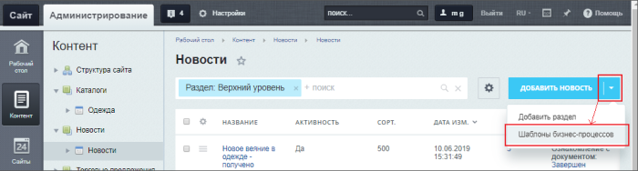
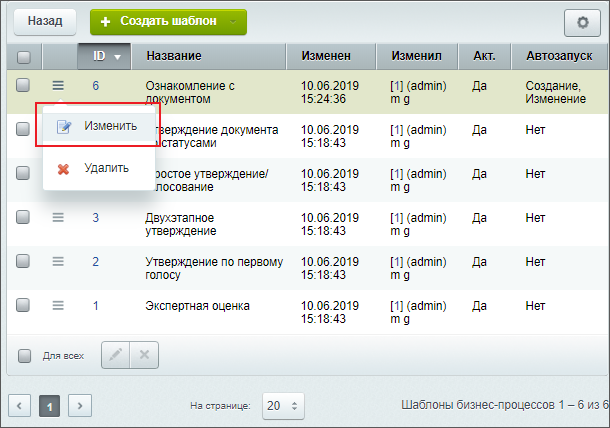
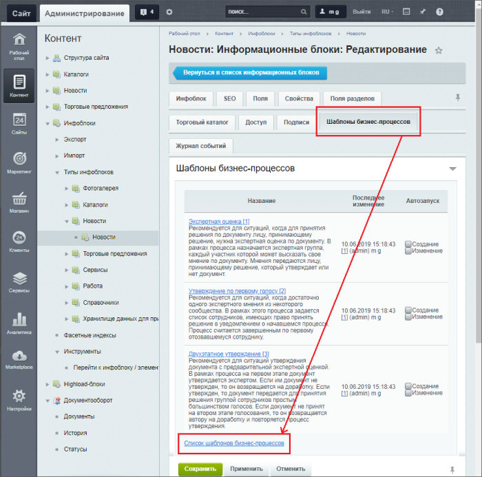
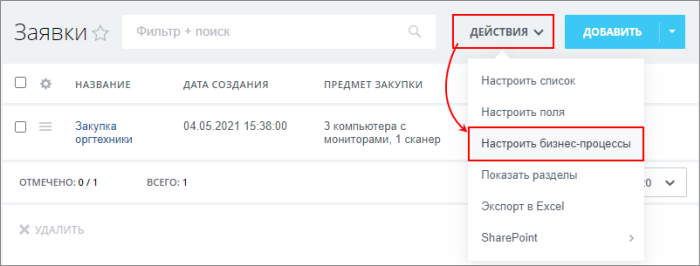
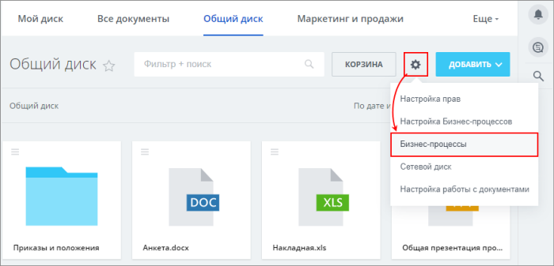
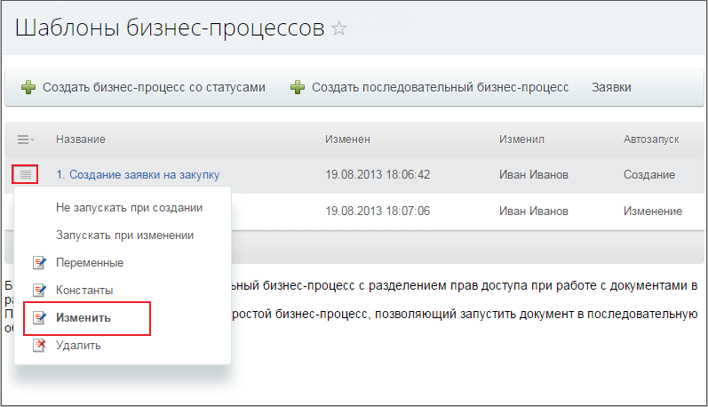

# Визуальный конструктор

**Навигация**
- [← Оглавление курса](index.md)
- [← Предыдущий: 12385 — Дизайнер бизнес-процессов](lesson_12385.md)
- [Следующий: 12409 — Из чего состоит визуальный конструктор →](lesson_12409.md)

Официальная страница урока: https://dev.1c-bitrix.ru/learning/course/index.php?COURSE_ID=57&LESSON_ID=3870

Как открыть визуальный конструктор?

> **Визуальный конструктор** – инструмент, входящий в состав модуля **Дизайнер бизнес-процессов**, который позволяет создавать и редактировать шаблоны бизнес-процессов.

### Административная часть

В административной части есть два способа открытия списка шаблонов бизнес-процессов. Рекомендуемый нами (более удобный) способ вызова визуального конструктора: перейдите к желаемому инфоблоку и нажмите на контекстной панели кнопку **Шаблоны бизнес-процессов**.

После чего используйте меню кнопки **Создать шаблон** на контекстной панели или команду меню действий

			Изменить

                    

		.

## Второй способ

Перейти к странице **Шаблоны бизнес-процессов** также возможно со страницы

			настройки свойств инфоблока

                    Для работы бизнес-процессов с инфоблоками необходимо выполнить следующие действия:
[Подробнее](lesson_3122.md#bizproc_template_edit_pic)...

		, используя ссылку Список шаблонов бизнес-процессов.

### Публичная часть

Переход к визуальному конструктору отличается для разных типов документов . Обычно это пункт меню с соответствующей подписью. Для универсальных списков это выглядит так:

А так для Диска:

Далее воспользуйтесь кнопками создания бизнес-процессов или отредактируйте существующий с помощью кнопки

			Изменить

                    

		 в меню действий.
