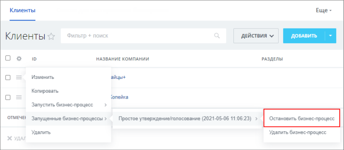
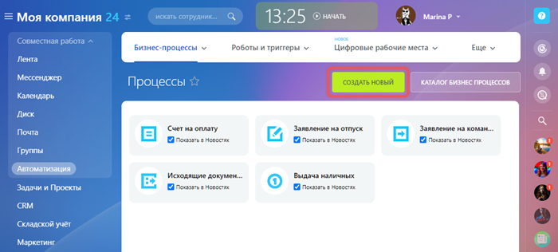
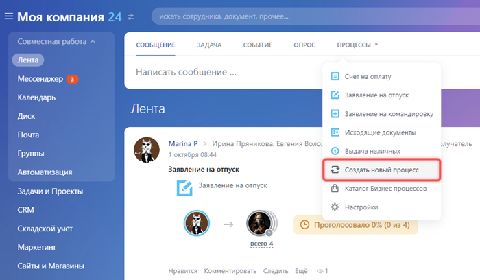
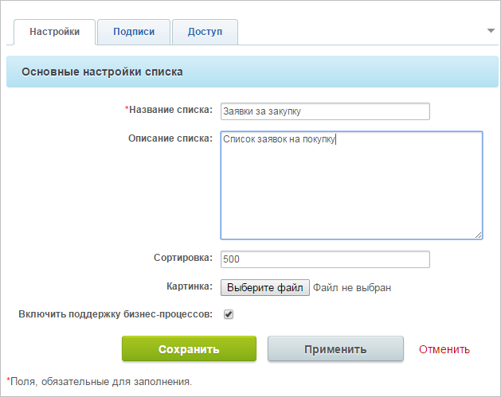
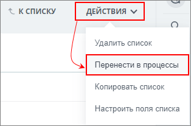
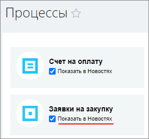
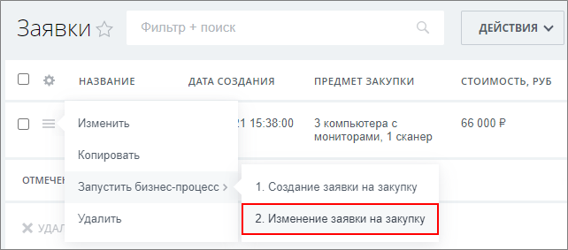

# Бизнес-процессы в Универсальных списках

**Навигация**
- [← Оглавление курса](index.md)
- [← Предыдущий: 3122 — Настройка инфоблоков на работу с бизнес-процессами](lesson_3122.md)
- [Следующий: 23662 — Бизнес-процессы в CRM →](lesson_23662.md)

Официальная страница урока: https://dev.1c-bitrix.ru/learning/course/index.php?COURSE_ID=57&LESSON_ID=4516

### Бизнес-процессы (БП) универсальных списков

Работать с бизнес-процессами Универсальных списков можно на странице *Сервисы &gt; Списки &gt; [Выбранный_список]* при просмотре элементов списка. В меню элемента есть возможность запустить БП по шаблону или обработать уже запущенный БП. Например, остановить выполнение БП:

### БП в ленте Новостей

С версии 25.200.0 запустить любой бизнес-процесс ленты новостей можно на странице *Автоматизация &gt; Бизнес-процессы &gt; Запуск процессов*.

Есть возможность добавлять в список [Бизнес-процессов в ленте Новостей](https://helpdesk.bitrix24.ru/open/1312890/) собственные бизнес-процессы (БП). Чтобы в общем списке появился ваш бизнес-процесс, нужно:

#### Первый вариант

Откройте форму создания бизнес-процесса кнопкой **Создать новый** на странице *Автоматизация &gt; Бизнес-процессы &gt; Процессы в ленте новостей*.

Или воспользуйтесь командой **Создать новый процесс** в списке бизнес-процессов в ленте новостей.

#### Второй вариант

1. [Создать и настроить](https://helpdesk.bitrix24.ru/open/5316091/) новый Универсальный список:
  
2. [Создать необходимый бизнес-процесс](lesson_5272.md) в списке:
  
3. Если бизнес-процесс создавался со страницы *Сервисы &gt; Списки*, то в настройках параметров созданного списка по команде
  			Перенести в процессы
                      
  		 добавьте его в список процессов ленты Новостей. **Кнопка видна только администратору.**
  Включить отображение БП в списке Новостей можно воспользовавшись флажком **Показать в Новостях** на странице *Бизнес-процессы &gt; Процессы в ленте*:
  
  После чего бизнес-процесс появится в списке Новостей.

### Особенности БП в ленте Новостей

В список процессов на странице ленты Новостей попадают только те, у которых стоит автоматический запуск **При добавлении**. Если шаблон настроен на ручной запуск или на запуск **При изменении**, то он не будет запускаться из ленты Новостей, а только со страницы *Автоматизация &gt; Бизнес-процессы &gt; Запуск процессов* или из списка элементов:

Если в Универсальном списке несколько бизнес-процессов с настройкой автоматического запуска **При добавлении**, то в списке бизнес-процессов ленты Новостей отображается тот, который создан позже. Например, надо создать список с двумя БП: по одному происходит уведомление какого-либо лица о запуске БП, а по другому БП должны начать выполняться какие-то действия. В этом случае надо сначала создать бизнес-процесс на уведомление, а только потом — БП на действия.
