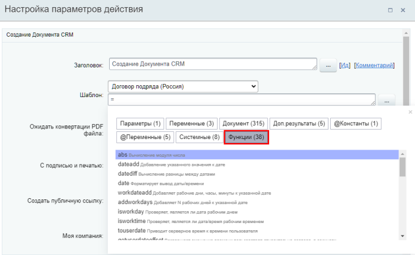

# Функции калькулятора выражений

**Навигация**
- [← Оглавление курса](index.md)
- [← Предыдущий: 12383 — Форма «Вставка значения»](lesson_12383.md)
- [Следующий: 3814 — Вычисление значений выражений в параметрах действий →](lesson_3814.md)

Официальная страница урока: https://dev.1c-bitrix.ru/learning/course/index.php?COURSE_ID=57&LESSON_ID=4912

При вычислении значений выражений в параметрах действий вы можете использовать различные операторы и функции.


### Операторы


Доступно использование следующих операторов для вычисления математических и логических выражений:


| \| Оператор \| Описание \|<br>\| --- \| --- \|<br>\| **+** \| Сложение \|<br>\| **-** \| Вычитание \|<br>\| ***** \| Умножение \|<br>\| **/** \| Деление \|<br>\| **=** \| Равно \|<br>\| **&lt;&gt;** \| Не равно \|<br>\| **&lt;** \| Меньше \|<br>\| **&gt;** \| Больше \|<br>\| **&lt;=** \| Меньше или равно \|<br>\| **&gt;=** \| Больше или равно \|<br>\| **()** \| Определяет порядок выполнения действий \|<br>\| **&** \| Оператор [конкатенации](http://www.php.net/manual/ru/language.operators.string.php), который возвращает строку, представляющую собой соединение левого и правого аргументов \|<br>\| **^** \| Возведение в степень \|<br>\| **%** \| Вычисление процентов \|<br>\| **true** \| Правда \|<br>\| **false** \| Ложь \|<br>\| **and** \| [Логический оператор И](http://www.php.net/manual/ru/language.operators.logical.php) \|<br>\| **or** \| [Логический оператор ИЛИ.](http://www.php.net/manual/ru/language.operators.logical.php)<br>Пример: <br>```<br>{{=if(or({=Variable:aaa}>2, {=Variable:bbb}<10), "yes", "no")}}<br>``` \|<br>\| **not** \| Отрицание \| |
| --- |


### Функции для вычислений


В действиях при проектировании бизнес-процесса есть возможность использовать функции. Их можно добавить двумя способами:

- Выбрать из списка. Для этого напишите в поле знак **=** и откроется список:
  [](jav * ascript:ShowImg('/images/admin_expert/bizproc/insert_value/bp_call_functions_list_3.png',916,567,'Список системных значений и функций'))
- Написать вручную или скопировать из примеров ниже, подставив свои значения.


#### Список функций с примерами:


| - [abs](#abs)<br>- [dateadd](#dateadd)<br>- [datediff](#datediff)<br>- [date](#date)<br>- [workdateadd](#workdateadd)<br>- [addworkdays](#addworkdays)<br>- [isworkday](#isworkday) | - [isworktime](#isworktime)<br>- [touserdate](#touserdate)<br>- [getuserdateoffset](#getuserdateoffset)<br>- [if](#if)<br>- [intval](#intval)<br>- [floatval](#floatval)<br>- [numberformat](#numberformat) | - [min](#min)<br>- [max](#max)<br>- [rand](#rand)<br>- [round](#round)<br>- [ceil](#ceil)<br>- [floor](#floor)<br>- [substr](#substr) | - [strpos](#strpos)<br>- [strlen](#strlen)<br>- [implode](#implode)<br>- [explode](#explode)<br>- [randstring](#randstring)<br>- [merge](#merge)<br>- [urlencode](#urlencode) | - [strtolower](#strtolower)<br>- [strtoupper](#strtoupper)<br>- [ucwords](#ucwords)<br>- [ucfirst](#ucfirst)<br>- [strtotime](#strtotime)<br>- [locdate](#locdate) | - [shuffle](#shuffle)<br>- [firstvalue](#firstvalue)<br>- [swirl](#swirl)<br>- [getdocumenturl](#getdocumenturl)<br>- [trim](#trim)<br>- [settime](#settime) |
| --- | --- | --- | --- | --- | --- |


| \| Функция \| Описание \|<br>\| --- \| --- \|<br>\| **abs** \| Вычисление [модуля](http://php.net/manual/ru/function.abs.php) числа.
<br>Пример:
<br>```<br>{{=abs(-5)}}
<br>// Результат: число 5<br>``` \|<br>\| **dateadd** \| Добавляет [заданное количество](http://www.php.net/manual/ru/datetime.add.php) дней, месяцев, лет, часов, минут и секунд к указанной дате.<br>
<br>	Синтаксис: `=dateadd([начальная_дата], [что_добавлять])`; <br>
<br>
<br>Слова для записи времени: y, year, years, m, month, months, d, day, days, h, hour, hours, i, min, minute, minutes, s, second, seconds. При написании можно использовать верхний или нижний регистр, а также знак минуса для вычитания времени.
<br>
<br>
<br>	 Примеры:
<br>```<br>// Вычтем 2 дня
<br>{{=dateadd({=Document:DATE_CREATE}, "-2d")}}
<br>// Прибавим 2 дня и 3 минуты
<br>{{=dateadd({=Document:DATE_CREATE}, "2 days 3 minutes")}}<br>```<br>
<br>
<br>В случае, если необходимое для добавления количество единиц времени содержится в поле, переменной и т.п., то необходимо использовать оператор конкатенации `&`. Например:<br>
<br>```<br>{{=dateAdd({=Document:DATE_CREATE}, {=Variable:WHAT2ADD} & "y 10h")}}<br>```<br>
<br>
<br>Если требуется вычесть время, то знак минуса тоже добавляется через & перед переменным значением:
<br>```<br>{{=dateAdd({=Document:DATE_CREATE}, "-" & {=Variable:WHAT2ADD} & "y 10h")}}<br>``` \|<br>\| **datediff** \| Позволяет [вычислить разницу](http://php.net/manual/en/datetime.diff.php) между двумя датами.
<br>Синтаксис:<br>`=datediff([первая дата], [вторая дата], [как выводить разницу])`;<br>
<br>Разницу можно выводить в [разных единицах](http://php.net/manual/en/dateinterval.format.php), в зависимости от решаемых вами задач.<br>
<br>Пример:<br>```<br>{{=datediff({=Variable:Variable1}, {=Variable:Variable2},'%m month, %d days')}}<br>```<br>
<br>Больше примеров работы с функцией в уроке [Примеры работы с датами](lesson_12840.md). \|<br>\| **date** \| Форматируется вывод даты/времени<br>Лучший вариант для выполнения этой задачи. Использование строковых функций типа **substr** и **strpos** не рекомендуется.<br>. Работает аналогично [функции Date в PHP](https://www.php.net/manual/ru/function.date.php).
<br>Синтаксис: `{{=date([формат даты], [дата])}}`. Дата — необязательный параметр, по умолчанию используется текущая дата по <br>времени сервера<br>Для облачных Битрикс24 в зоне RU — UTC+3:00 (Московское время), для коробочных версий — время сервера, на котором установлен продукт.<br>.<br>
<br>Пример: <br>```<br>{{=date('l, j F Y, H:i:s')}}
<br>// Результат: Tuesday, 9 November 2021, 12:06:16<br>``` \|<br>\| **workdateadd** \| Добавляет заданное количество рабочих дней, часов и минут к указанной дате.
<br>
<br>Синтаксис: `=workdateadd([начальная_дата], [что_добавлять], [пользователь])`. Указывать пользователя не обязательно. Параметр нужен для уточнения, на чьё рабочее время нужно ориентироваться. Доступен с версии 19.0.0 модуля bizproc.<br>
<br>Варианты указания времени: d, day, days, h, hour, hours, i, min, minute, minutes. Допустимо написание как в верхнем, так и в нижнем регистре.<br>
<br>Пример:<br>
<br>```<br>// Пусть в параметре содержится дата 28.04.2016.
<br>{{=workdateadd({=Template:Parameter1}, "2d", {=Document:ASSIGNED_BY_ID})}}
<br>// Результат — 02.05.2016 09:00:00, т.к. 30.04 и 1.05 — это выходные дни, то они будут пропущены.
<br>// 09:00:00 — начало рабочего дня. С помощью третьего параметра учитывается часовой пояс ответственного за сущность.<br>```<br>
<br>Список выходных дней и начало рабочего дня настраивается в [Настройках портала](https://helpdesk.bitrix24.ru/open/1408338/) \|<br>\| **addworkdays** \| Функция добавляет N рабочих дней к указанной дате. Рабочими система считает те дни, которые указаны в разделе Рабочие дни в году в [настройках календаря](https://helpdesk.bitrix24.ru/open/7397539/).
<br>Синтаксис: `=addworkdays([дата, к которой будут добавляться дни], [количество добавляемых рабочих дней])`.<br>
<br>Примеры:<br>```<br>1. {{=addworkdays('07.03.2016', 1)}}
<br>// результат: 09.03.2016 00:00:00, т.к. в настройках сайта 8 марта — выходной.
<br>2. {{=addworkdays('05.02.2016 16:14:00', 1)}}
<br>// т.к. 05.02.2016 — пятница, то результат: 08.02.2016 16:14:00 — понедельник.<br>``` \|<br>\| **isworkday** \| Функция проверяет, является ли дата рабочим днем по календарю (с версии 21.400.0 учитывает настройки рабочих дней календаря).
<br>Синтаксис:<br>`=if(isworkday([проверяемая дата], [пользователь]), [сообщение, если дата является рабочим днем], [сообщение, если не является])`. Указывать пользователя не обязательно. Параметр нужен для уточнения, на чьё рабочее время нужно ориентироваться. Доступен с версии 19.0.0 модуля bizproc.<br>
<br>
<br>Пример:<br>```<br>// Пусть в параметре содержится дата 28.04.2016.
<br>{{=if(isworkday({=Template:Parameter1}), 'Да', 'Нет')}}
<br>// Результат — Да, т.к. это рабочий день.<br>``` \|<br>\| **isworktime** \| Аналогична функции `isworkday`, но для типов данных **Дата/Время**.
<br>Синтаксис:<br>
<br>`=if(isworktime([проверяемая дата со временем], [пользователь]), [сообщение, если дата со временем являются рабочими], [сообщение, если не являются])`. Указывать пользователя не обязательно. Параметр нужен для уточнения, на чьё рабочее время нужно ориентироваться. Доступен с версии 19.0.0 модуля bizproc.<br>
<br>Пример:
<br>```<br>// Пусть в параметре содержится дата 27.04.2016 15:00:00.
<br>{{=if(isworktime({=Template:Parameter1}), 'Да', 'Нет')}}
<br>// Результат — Да, т.к. это рабочее время.<br>``` \|<br>\| **touserdate** \| Функция приводит серверное время к времени пользователя (в его часовой пояс). Например, если время сервера UTC +03:00, а время пользователя UTC +05:00, то итоговое время, которое вернет функция, будет на 2 часа больше.
<br>Синтаксис: `=touserdate([пользователь], [дата и время])`. Дата и время, указанные во втором параметре, будут восприниматься в часовом поясе сервера.
<br>
<br>Примеры:<br>
<br>
<br>```<br> // 1. Добавление пользователя через форму Вставка значения, где «Кем создан» это поле документа
<br>{{=touserdate({{Кем создан}})}}
<br>// 2. Запись пользователя в формате user_ID, которую нужно взять в кавычки
<br>{{=touserdate('user_1')}}
<br>// 3. Пользователь в формате user_ID, дата и время указываются в кавычках
<br>{{=touserdate('user_3', '18.07.2023 16:47:01')}}
<br>```<br>
<br>
<br>**Примечание**: Функция также может принять в параметре User число. Число определится как идентификатор <br>группы пользователей<br>Речь о группах пользователей, которые создаются в административном разделе коробочных продуктов на странице Настройки &gt; Пользователи &gt; Группы пользователей.<br>Подробнее в курсе [Администратор. Базовый](https://dev.1c-bitrix.ru/learning/course/index.php?COURSE_ID=35&LESSON_ID=7175)<br>. Для определения часового пояса будет взят первый сотрудник из этой группы.<br>
<br>
<br>Пример:
<br>```<br>// Группа Техподдержка имеет идентификатор 7
<br>{{=touserdate(7)}}
<br>// Первый пользователь в этой группе имеет часовой пояс (UTC -02:00). А значит время будет выведено в этом часовом поясе.
<br>``` \|<br>\| **getuserdateoffset** \| Функция возвращает смещение часовой зоны пользователя относительно <br>серверного времени<br>Для облачных Битрикс24 в зоне RU — UTC+3:00 (Московское время), для коробочных версий — время сервера, на котором установлен продукт.<br>в секундах.
<br>Синтаксис: `=getuserdateoffset([пользователь])`<br>
<br>
<br>Пример:<br>```<br>// Пусть время сервера UTC +03:00, а время пользователя (user_1) UTC +05:00. Тогда:
<br>{{=getuserdateoffset('user_1')}}
<br>// вернет 7200 (т.е. разница составляет 2 часа)<br>``` \|<br>\| **if** \| Условный оператор. <br>
<br>	Синтаксис:<br>`=if([условие], [результат_в_случае_выполнения_условия], [результат_в_случае_не_выполнения_условия])`; <br>
<br>
<br>	Примеры:<br>```<br>/* простой пример со строками в параметрах */
<br>1. {{=if ({=Variable:Variable1_printable}>0, "да", "нет")}}
<br>/* будьте внимательны, используя функции в параметрах.
<br>Фигурные скобки и символ равно для dateadd здесь не нужны. */
<br>2. {{=if ({=Template:Parameter1}=1, dateadd({=System:Now},"10d"), dateadd({=System:Now},"30d"))}}
<br>```<br>
<br>При сравнении значений переменных также возможно сравнивать переменные с разным типом данных. Однако сравниваемые переменные должны соответствовать [таблице преобразования типов](lesson_12407.md#table). \|<br>\| **intval** \| [Возвращает целое число](https://php.net/manual/ru/function.intval.php).
<br>
<br>	Пример:<br>```<br>{{=intval("234.34j4hv5jhv43v53jk4vt5hj4")}}
<br>//вернет 234<br>``` \|<br>\| **floatval** \| Возвращает [число](https://www.php.net/manual/ru/function.floatval) (с плавающей точкой).
<br>
<br>	Пример:<br>```<br>{{=floatval("234.34j4hv5jhv43v53jk4vt5hj4")}}
<br>//вернет 234.34<br>``` \|<br>\| **numberformat** \| Форматирует число с [разделением групп](https://www.php.net/manual/ru/function.number-format).<br>
<br>	Синтаксис:`=numberformat([число], [количество знаков после запятой], [разделитель дробной части], [разделитель тысяч])`
<br>
<br>	Пример:<br>```<br>{{=numberformat(1300500.5, 2, ',', ' ')}}
<br>//вернет 1 300 500,50<br>``` \|<br>\| **min** \| Возвращает [наименьшее число](https://php.net/manual/ru/function.min.php).
<br>
<br>	Пример:<br>```<br>{{=min(5, 6, 18, 3, 7)}}
<br>//вернет 3<br>``` \|<br>\| **max** \| Возвращает [наибольшее число](https://www.php.net/manual/ru/function.max.php).
<br>
<br>	Пример:<br>```<br>{{=max(5, 6, 18, 3, 7)}}
<br>//вернет 18<br>``` \|<br>\| **rand** \| Возвращает [случайное число](https://www.php.net/manual/ru/function.rand).
<br>
<br>	Синтаксис:`=rand([наименьшее значение], [наибольшее значение])`. Может быть вызвано без параметров, подробнее в документации по php (ссылка выше).
<br>
<br>	Пример:<br>```<br>{{=rand(5, 10)}}
<br>//вернет случайным образом число в диапазоне между 5 и 10. К примеру, 5 или 8.<br>``` \|<br>\| **round** \| [Округляет число](https://www.php.net/manual/ru/function.round).
<br>
<br>	Синтаксис:`=round([число], [количество десятичных знаков])`.
<br>
<br>	Пример:<br>```<br>{{=round(15.576, 2)}}
<br>//вернет 15.58.<br>``` \|<br>\| **ceil** \| Округляет дробь в [большую сторону](https://www.php.net/manual/ru/function.ceil).
<br>
<br>	Пример:<br>```<br>{{=ceil(15.57)}}
<br>//вернет 16.<br>``` \|<br>\| **floor** \| Округляет дробь в [меньшую сторону](https://www.php.net/manual/ru/function.floor).
<br>
<br>	Пример:<br>```<br>{{=floor(15.57)}}
<br>//вернет 15.<br>``` \|<br>\| **substr** \| Возвращает подстроку определенной длины, начиная с указанного символа. Данная функция аналогична существующей [substr](http://php.net/manual/ru/function.substr.php) в php.
<br>
<br>Синтаксис: `substr([входная строка], [с какого символа исходной строки начнется возвращаемая статья], [какой длины будет строка])`<br>
<br>
<br>Имейте ввиду, что строка начинается с символа под номером 0. Например, в строке 'abcdef', в позиции 0 находится символ 'a', в позиции 2 — символ 'c', и т.д.<br>
<br>
<br>Пример:<br>```<br>{{=substr("0123456789", 3, 4)}}
<br>// Вернет 3456.<br>```<br>
<br>
<br>**Внимание!** Если синтаксис выражения будет неправильным, то оно отобразится как текст. \|<br>\| **strpos** \| Возвращает позицию [первого вхождения подстроки](https://www.php.net/manual/ru/function.strpos).<br>
<br>Синтаксис: `strpos([cтрока, в которой производится поиск], [подстрока], [с какого символа начинать поиск])`<br>
<br>
<br>	Примеры:<br>```<br>1. {{=strpos('Тестовая строка', 'ст')}}
<br>// Вернет 2.
<br>2. {{=strpos('Тестовая строка', 'ст', 3)}}
<br>// Вернет 9.<br>``` \|<br>\| **strlen** \| Возвращает [длину строки](https://www.php.net/manual/ru/function.strlen).
<br>
<br>	Пример:<br>```<br>{{=strlen('Тестовая строка')}}
<br>//вернет 15.<br>``` \|<br>\| **implode** \| Объединяет множественные значения в строку. Функция полезна, когда нужно вывести в текст значения множественных переменных нестандартным разделителем. Аналог [implode](https://www.php.net/manual/ru/function.implode.php) в PHP.<br>
<br>Возвращает строку, содержащую строковое представление всех элементов массива в указанном порядке, с указанным разделителем между каждым элементом.
<br>
<br>Синтаксис: `=implode([разделитель], [массив значений])`<br>
<br>
<br>Примеры:<br>```<br>// Пусть переменная Variable1 множественная и содержит три значения: Один, Два, Три. Тогда:
<br>1. {{=implode(' - ', {=Variable:Variable1})}}
<br>// вернет строку Один - Два - Три.
<br>2. {{=implode('[br]', {=Variable:Variable1})}}
<br>// тег bb-code br перенесёт каждое значение переменной на новую строку
<br>3. {{=implode({=System:Eol}, {=Variable:Variable1})}}
<br>// системное значение конца строки {=System:Eol} сработает там, где не поддерживается тег br (например, в Заданиях)<br>``` \|<br>\| **explode** \| Функция разбивает строку с помощью разделителя. Полезна, когда нужно разбить строку, затем присвоить части как значение множественной переменной. Аналог [explode](https://www.php.net/manual/ru/function.explode.php) в PHP. <br>
<br>Возвращает массив строк, полученных разбиением строки с использованием указанного разделителя.
<br>
<br>Синтаксис: `=explode([разделитель], [строка])`<br>
<br>
<br>Пример:<br>```<br>// {{=explode(' - ', 'Один - Два - Три')}}
<br>// вернет массив из трёх строк: Один, Два, Три.<br>``` \|<br>\| **randstring** \| Возвращает случайную строку указанной длины.
<br>
<br>	Пример:<br>```<br>{{=randstring(10)}}
<br>// Вернет случайную строку длиной в 10 символов. Например: yWB6pMU4S4
<br>{{=randstring(16)}}
<br>// Вернет случайную строку длиной в 16 символов. Например: zRNTpQ4r4zyoJXt0<br>``` \|<br>\| **merge** \| Позволяет [объединять массивы](http://php.net/manual/ru/function.array-merge.php).
<br>Синтаксис:<br>`= merge({=массив_1}, {=массив_2})`;<br>
<br>
<br>Пример:<br>```<br>{{= merge({=Document:FILES}, {=Variable:file})}}<br>``` \|<br>\| **urlencode** \| URL-кодирование строки.
<br>
<br>	Пример:<br>```<br>{{=urlencode('Data123!@-_ +')}}
<br>// Вернет закодированную строку Data123%21%40-_+%2B<br>```<br>
<br>
<br>Подробнее о том, как кодируется строка и где применять функцию можно прочитать в [документации по PHP](https://www.php.net/manual/ru/function.urlencode). \|<br>\| **strtolower** \| Преобразует строку в [нижний регистр](https://www.php.net/manual/ru/function.strtolower). Функция доступна с версии 21.200.0.
<br>
<br>	Пример:<br>```<br>{{=strtolower('Тестовая строка')}}
<br>// Вернет тестовая строка<br>``` \|<br>\| **strtoupper** \| Преобразует строку в [верхний регистр](https://www.php.net/manual/ru/function.strtoupper). Функция доступна с версии 21.200.0.
<br>
<br>	Пример:<br>```<br>{{=strtoupper('Тестовая строка')}}
<br>// Вернет ТЕСТОВАЯ СТРОКА<br>``` \|<br>\| **ucwords** \| Преобразует в [верхний регистр первый символ каждого нового слова в строке](https://www.php.net/manual/ru/function.ucwords). Функция доступна с версии 21.200.0.
<br>
<br>	Пример:<br>```<br>{{=ucwords('тестовая строка')}}
<br>// Вернет Тестовая Строка<br>``` \|<br>\| **ucfirst** \| Преобразует [первый символ строки в верхний регистр](https://www.php.net/manual/ru/function.ucfirst). Функция доступна с версии 21.200.0.
<br>
<br>	Пример:<br>```<br>{{=ucfirst('тестовая строка')}}
<br>// Вернет Тестовая строка<br>``` \|<br>\| **strtotime** \| Преобразует текстовое написание даты на английском языке [во внутренний формат даты](https://www.php.net/manual/ru/function.strtotime.php). Использует часовой пояс сервера. Функция доступна с версии 21.300.0.
<br>
<br>Примеры:<br>```<br>// Пусть текущие дата и время 18.07.2024 16:47:01
<br>
<br>1. {{=strtotime("now")}} // Результат — 18.07.2024 16:47:01
<br>2. {{=strtotime("next day")}} // Результат — 19.07.2024 16:47:01
<br>3. {{=strtotime("+1 week")}} // Результат — 25.07.2024 16:47:01
<br>4. {{=strtotime("next Thursday")}} // Результат — 20.07.2024 00:00:00
<br>5. {{=strtotime("first day of January")}} // Результат — 01.01.2024 00:00:00, то есть учтен текущий год
<br>6. {{=strtotime("10 September 2000")}} // Результат — 10.09.2000 00:00:00, указанная дата без времени во внутреннем формате
<br>7. {{=strtotime("+1 week 2 days 4 hours 2 seconds")}} // Результат — 27.07.2024 20:47:03
<br>``` \|<br>\| **locdate** \| Форматирует вывод даты / времени на языке сайта (портала). Функция доступна с версии 21.300.0.
<br>Работает аналогично функции **date** ([date в PHP](https://www.php.net/manual/ru/function.date.php)), но при форматировании учитывает язык.<br>
<br>Синтаксис: `{{=locdate([формат даты], [дата])}}`. Дата — необязательный параметр, по умолчанию используется текущая дата.<br>
<br>Пример для сайта на русском языке: <br>```<br>{{=locdate('l, j F Y, H:i:s')}}
<br>Результат: Вторник, 9 Ноября 2021, 12:06:16<br>``` \|<br>\| **shuffle** \| [Перемешивает](https://www.php.net/manual/ru/function.shuffle.php) значения множественного поля. Функция доступна с версии 21.500.0.
<br>
<br>Пример:
<br>```<br>// Пусть есть переменная Variable1 типа Число с множественным значением: 1, 2, 3, 4, 5, 6. Тогда:
<br>{{=shuffle({=Variable:Variable1})}}
<br>// Вернет случайный порядок этих чисел. Например: 1, 4, 6, 5, 3, 2.<br>``` \|<br>\| **firstvalue** \| Возвращает первое значение множественного поля. Функция доступна с версии 21.500.0.
<br>Пример:
<br>```<br>// 1. Пусть есть переменная Variable1 типа Число с множественным значением: 1, 2, 3, 4, 5, 6. Тогда:
<br>{{=firstvalue({=Variable:Variable1})}}
<br>// Вернет число: 1.
<br>2. // В качестве параметра функции firstvalue используется функция explode
<br>{{=firstvalue(explode(',' , {{Строка}}))}}<br>``` \|<br>\| **swirl** \| Перемещает первое значение множественного поля в конец. Функция доступна с версии 21.500.0.
<br>Пример:
<br>```<br>// Пусть есть переменная Variable1 типа Число с множественным значением: 1, 2, 3, 4, 5, 6. Тогда:
<br>{{=swirl({=Variable:Variable1})}}
<br>// Вернет: 2, 3, 4, 5, 6, 1, то есть число 1 стало последним.<br>``` \|<br>\| **getdocumenturl** \| Возвращает ссылку на текущий документ (для которого запущен бизнес-процесс). Функция доступна с версии 22.200.0.
<br>Синтаксис: `{{=getdocumenturl([Форматирование ссылки], [Полная ссылка]}}`<br>
<br>- Форматирование ссылки. Возможные значения:<br>- Полная ссылка. Возможные значения 0/1 или false()/true(). Если установлено 1 или true(), то к ссылке будет добавлен URL сайта (например, https://mysite.ru)<br>
<br>
<br>Примеры:<br>```<br>// 1. Ссылка с форматированием bb-code:
<br>{{=getdocumenturl('bb')}}
<br>// 2. Полная ссылка с доменом сайта и html форматированием:
<br>{{=getdocumenturl('html', true())}}<br>``` \|<br>\| **trim** \| Удаляет пробелы из начала и конца строки. Функция доступна с версии 22.300.0.
<br>Синтаксис: `{{=trim([строка])}}`<br>
<br>
<br>Пример:<br>```<br>// Пусть есть переменная Variable1 типа Строка, в которой записано значение с пробелом в начале и в конце  123 .
<br>// Используем функцию trim для записи значения переменной в отчет без пробелов:
<br>{{=trim({=Variable:Variable1})}}
<br>// В результате в отчет будет записано 123 без пробелов.<br>``` \|<br>\| **settime** \| Устанавливает конкретное время для указанной даты у полей типа **Дата** и **Дата/Время**. Функция доступна с версии 22.500.0. Имеет 3 параметра: дата, часы, минуты.
<br>
<br>Синтаксис: `{{=settime([Дата], [Часы], [Минуты])}}`<br>
<br>
<br>Примеры:<br>```<br>// Пусть есть переменная Variable1 типа Дата, в которой записана дата 13.03.2023.
<br>// Используем функцию settime для установки времени:
<br>1. {{=settime({=Variable:Variable1}, 15, 55)}}
<br>// результат — 13.03.2023 15:55:00
<br>2. {{=settime({=Variable:Variable1}, 21, 79)}}
<br>// результат — 13.03.2023 22:19:00 (т.к. количество минут больше 60, был добавлен час и остаток записан в минуты)
<br>``` \| |
| --- |


### Вложенные выражения


Для сложных вычислений можно использовать вложенные выражения, то есть одну функцию внутри другой.


1. **Изменение переменной или поля.** Внутреннее выражение указывайте без фигурных скобок `{{}}` и знака равно `=`.
  ```
  // В dateadd используем touserdate без {{}} и =
  =dateadd(touserdate('user_6', {{Дата/Время}}), "+1d")
  ```
2. **Вставка в текст.** Чтобы подставить результат выражения в текст, оберните его в фигурные скобки `{{}}`.
  ```
  {{=dateadd(touserdate('user_6', {{Дата/Время}}), "+1d")}}
  ```
