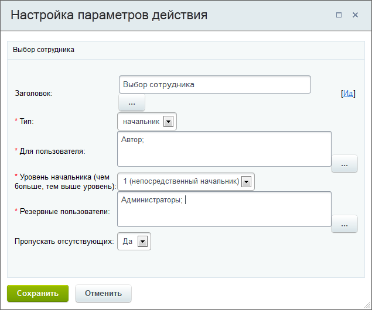
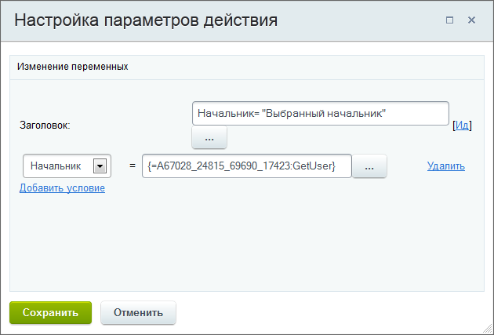
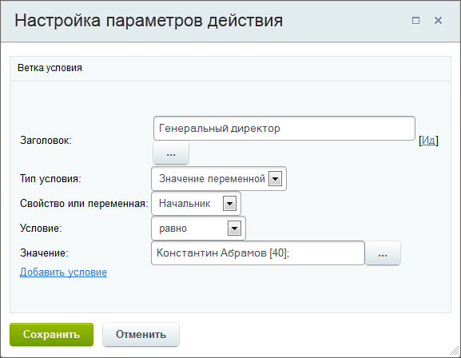
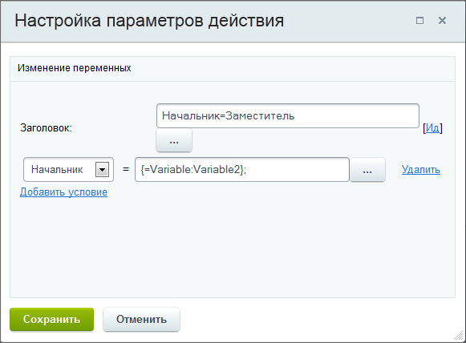
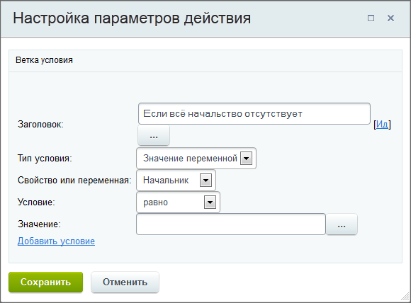
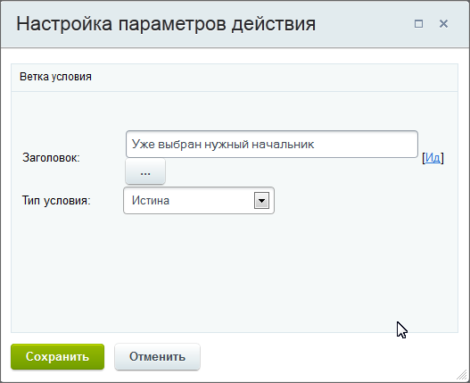
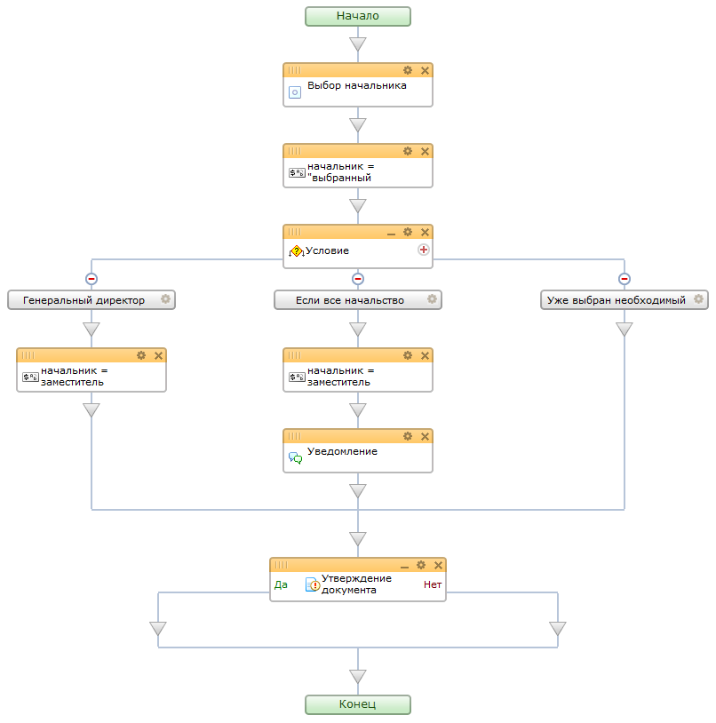

# Пример использования действия "Выбор сотрудника"

**Навигация**
- [← Оглавление курса](index.md)
- [← Предыдущий: 3845 — Пример работы с переменными и дополнительными результатами действий](lesson_3845.md)
- [Следующий: 3383 — Ручной переход по действиям процесса с помощью "Ознакомления с документом" →](lesson_3383.md)

Официальная страница урока: https://dev.1c-bitrix.ru/learning/course/index.php?COURSE_ID=57&LESSON_ID=5060

|  | ### Пример: начальник в отпуске |
| --- | --- |

Рассмотрим небольшой пример использования действия

			Выбор сотрудника

                    Действие позволяет в автоматическом режиме выбрать сотрудника для дальнейшего использования его в процессе.
[Подробнее](lesson_3809.md)...

		. Используем его для выбора начальника, который утверждает документ. Если начальник находится в отпуске, то выбирается вышестоящий начальник и так далее. Когда действие, таким образом, дойдет до генерального директора, или начальник не выбран вообще (в случае отсутствия всего начальства), то назначается заместитель начальника.

#### Порядок действий

- Создадим новый шаблон, а в нем 2 переменные типа **Пользователь**:

  - переменная **Начальник**, которая меняется по ходу процесса;
  - переменная **Заместитель**, которая практически постоянна, и меняется вручную в случае ухода в отпуск заместителя. Укажем для нее сотрудника по умолчанию, который утвердит документ в случае отсутствия начальства.

- Первым добавим действие **Выбор сотрудника**. В параметрах
  			укажем
                      
  		, что производим выбор непосредственного начальника для **Автора** с пропуском отсутствующих.
- Добавим действие
  			Изменение переменных
                      Действие позволяет изменить значения переменных, заданных в настройках шаблона.
  [Подробнее](lesson_3812.md)...
  		. В параметрах
  			укажем
                      
  		, что значение переменной **Начальник** равно сотруднику, который был выбран действием **Выбор сотрудника** (форма Вставка значения – Дополнительные результаты – Выбор сотрудника – Выбранный сотрудник).
- Добавим конструкцию
  			Условие
                      Конструкция позволяет направить бизнес-процесс по разным сценариям в зависимости от заданных условий.
  [Подробнее](lesson_3789.md)...
  		 и создадим в ней 3 ветви. Нумерация условий в действии такая же, как и порядок их выполнения действием: слева направо.

  1. В первой ветке определим условие, при котором, в случае выбора генерального директора, ответственным назначается заместитель. Для этого в самом условии укажем
    			генерального директора
                        
    		, а после добавим действие **Изменение переменной**. В нем
    			укажем
                        
    		, что значение переменной **Начальник** равно значению переменной **Заместитель**.
  2. Во второй ветке определим условие, при котором заместитель утверждает документ, в случае отсутствия всего начальства. Для этого в самом условии
    			укажем
                        .
    		, что значение переменной **Начальник** должно быть
    			пустым
                        Это связанно с особенностью работы действия **Выбор сотрудника**, которое возвращает пустое значение выбранного сотрудника, если ни один начальник не был выбран (например, все начальство отсутствует).
    		. Теперь добавим действие **Изменение переменной**, которое настраивается аналогично предыдущей ветке. После, например для заместителя, добавим уведомление о том, что все начальство отсутствует.
  3. В последней ветке условия мы не меняем сотрудников, в результате у нас значение переменной **Начальник**
    			останется равно
                        
    		 результату работы действия **Выбор сотрудника**.

В результате шаблон выглядит так:

