# Подготовка списка и его настройка

**Навигация**
- [← Оглавление курса](index.md)
- [← Предыдущий: 12305 — Техническое задание](lesson_12305.md)
- [Следующий: 5271 — Настройка внешнего вида и доступа для списка →](lesson_5271.md)

Официальная страница урока: https://dev.1c-bitrix.ru/learning/course/index.php?COURSE_ID=57&LESSON_ID=5270

|  | ### Подготавливаем и настраиваем список |
| --- | --- |

Согласно условиям ТЗ наиболее подходящим под нашу задачу будет функционал

			Универсальные списки

                    **Универсальные списки** – инструмент для удобного хранения и работы с любой структурированной информацией.
 Подробнее в курсе [Администратор сервиса Битрикс24 (коробочная версия)](http://dev.1c-bitrix.ru/learning/course/index.php?COURSE_ID=48&CHAPTER_ID=04656)

		.

#### Подготовка списка и его настройка

В нашем примере мы будем работать со списками продукта *«Битрикс24 в коробке»* (Сервисы &gt; Списки).

- Создадим новый список с
  			поддержкой бизнес-процессов
                      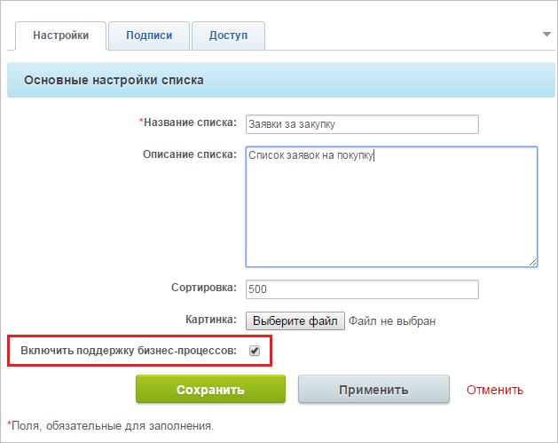
  		 и произведем настройку подписей. Разделы мы использовать не будем, поэтому оставляем их как есть.
  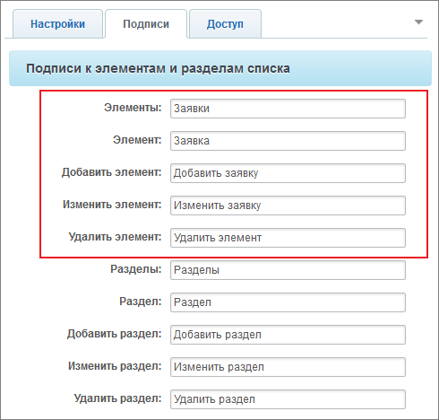
- Добавим поля согласно ТЗ: во вкладке **Действия** выбираем
  			Настроить поля
                      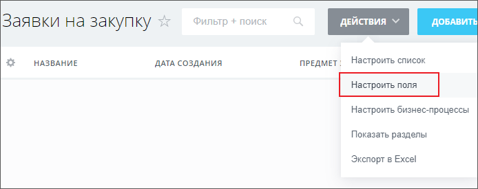
  		. В открывшемся окне – . Не забудем отметить нужные поля, как обязательные к заполнению.

## Примеры настройки поля типа список

Поле **Тип закупки**.

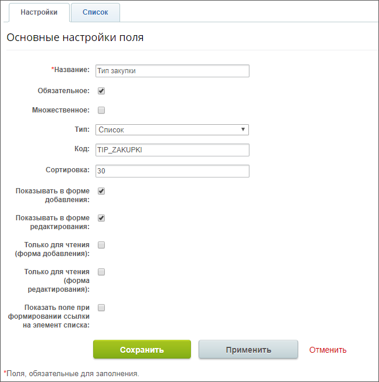

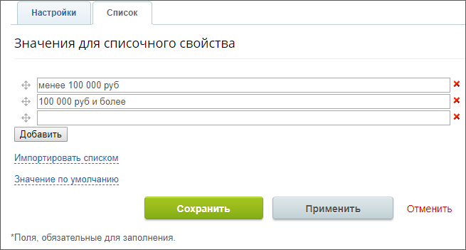

Поле **Статус закупки**.

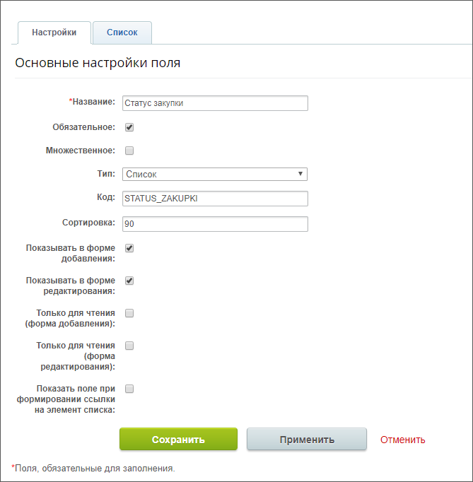

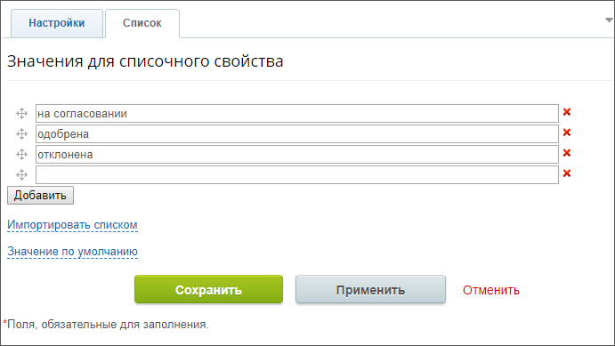

В обязательных полях, которые будут заполняться автоматически, установим в поле **Значение по умолчанию** текст-пояснение:

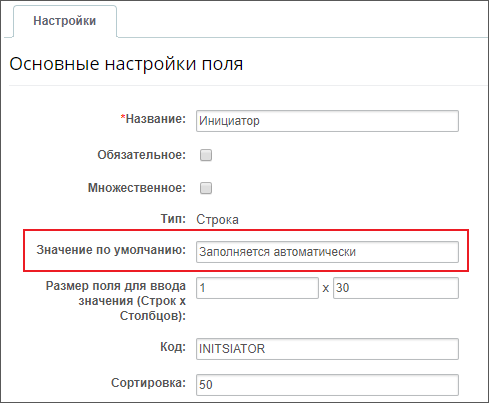

**Примечание:** Такими полями будут **Инициатор**, **Непосредственный руководитель**, **Главный бухгалтер**, **Финансовый директор**.

## Пример настройки поля с автоматическим значением по умолчанию, равному дате и времени создания заявки

По ТЗ не требуется выбор пользователей системы, поэтому укажем требуемых сотрудников текстом с использованием поля типа **Cписок**:

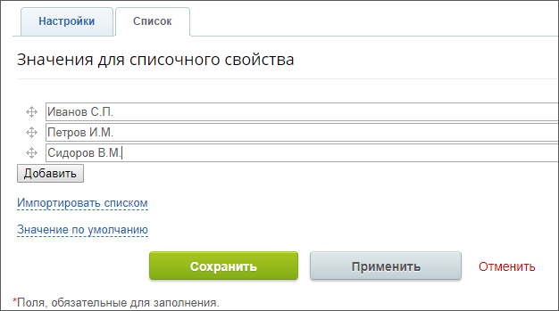

**Примечание:** Такими полями будут **Бюджетный контролер**, **Юрист**.

Результат создания нами полей, согласно ТЗ, мы увидим в виде

			списка

                    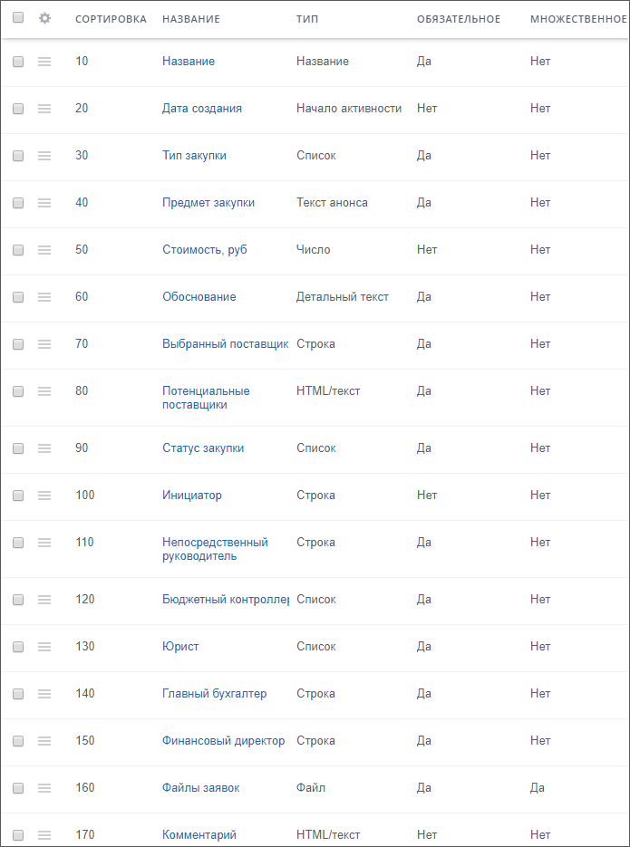

		.

Теперь форма создания

			новой заявки

                    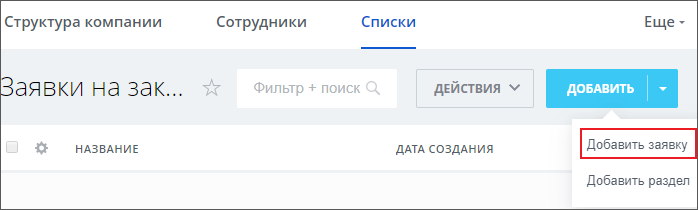

		 будет иметь вид:

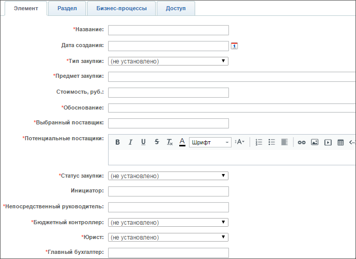
