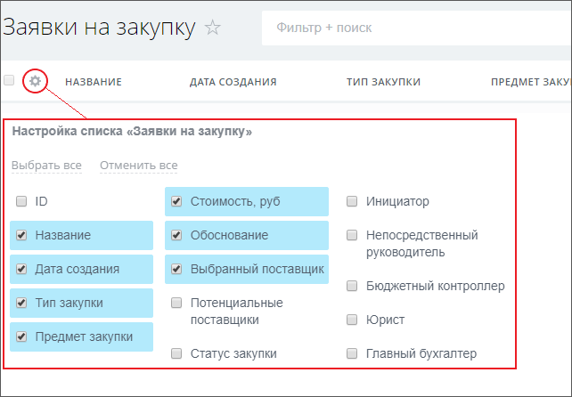
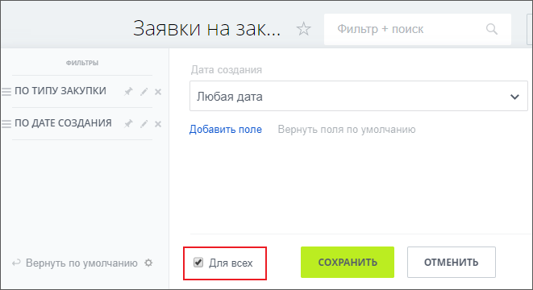
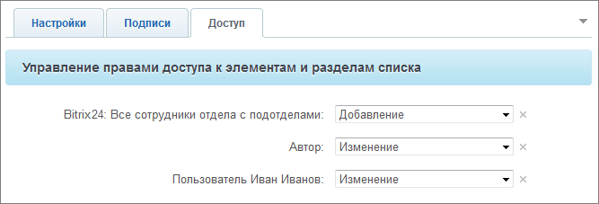

# Настройка внешнего вида и доступа для списка

**Навигация**
- [← Оглавление курса](index.md)
- [← Предыдущий: 5270 — Подготовка списка и его настройка](lesson_5270.md)
- [Следующий: 5272 — Создание бизнес-процессов →](lesson_5272.md)

Официальная страница урока: https://dev.1c-bitrix.ru/learning/course/index.php?COURSE_ID=57&LESSON_ID=5271

|  | ### Настраиваем список |
| --- | --- |

Теперь настроим внешний вид отображения области просмотра заявок в соответствии с техническим заданием, а также установим права доступа к списку.

#### Настройка внешнего вида списка и фильтра

- С помощью кнопки  настроим внешний вид списка заявок в соответствии с требованиями ТЗ:
  
- В нашем примере интерфейс должен предоставлять фильтрацию по значению полей заявок. При помощи кнопки  настроим фильтр и отметим
  			Для всех
                      
  		, чтобы наши настройки отображались для всех пользователей.

#### Настройка прав доступа к списку

Перейдем опять к настройке списка на закладку **Доступ** и укажем права доступа

			следующим образом:

                    

- *Bitrix24: Все сотрудники отдела с подотделами* – **Добавление** (только сотрудники требуемой группы смогут добавлять заявки);
- *Автор* – **Изменение** (право на просмотр/изменение своих заявок будет у автора, разные авторы смогут видеть и редактировать только свои заявки);
- *Ответственный сотрудник* – **Изменение** (читать и изменять **любые заявки** сможет сотрудник, ответственный за сервис).
