# Создание бизнес-процессов

**Навигация**
- [← Оглавление курса](index.md)
- [← Предыдущий: 5271 — Настройка внешнего вида и доступа для списка](lesson_5271.md)
- [Следующий: 12293 — Техническое задание →](lesson_12293.md)

Официальная страница урока: https://dev.1c-bitrix.ru/learning/course/index.php?COURSE_ID=57&LESSON_ID=5272

Для работы с заявками мы создадим

			2 шаблона

                    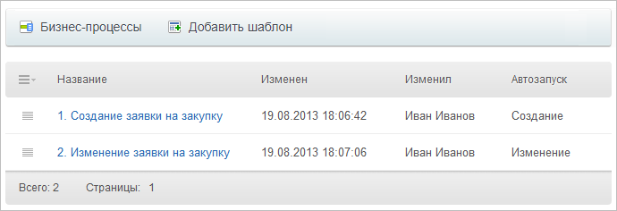

		 последовательных бизнес-процессов (Автоматизация &gt; Бизнес-процессы &gt; Процессы в ленте новостей, кнопка **Создать новый**). Один будет запускаться при создании заявки, а второй – при ее изменении.

### БП для создания заявки на закупку

 <!-- Создадим БП который будет запускаться при создании заявки, будет заполнять требуемые поля и т.д. -->

Произведем настройку параметров первого шаблона:

- На вкладке **Основное** укажем название и отметим опцию
  			автоматически запускать при добавлении
                      
  		;
- На вкладке **Переменные** создадим новые **обязательные**
  			переменные
                      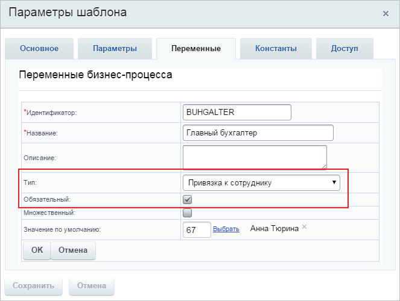
  		 типа **Привязка к сотруднику** («Главный бухгалтер», «Финансовый директор»,
  			«Проверяющий»
                      Сотрудник ответственный за сервис заявок
  		). Эти сотрудники в ходе процесса будут
  			автоматически
                      **Важно!** Вынесение сотрудников в переменные позволяет централизованно произвести их замену сразу по всему шаблону, например в случае ухода в отпуск или смены сотрудника.
  		 подставляться в карточку заявок;
- Там же создадим еще пару переменных типа **Привязка к сотруднику** для дальнейшей автоматизации, но уже не обязательные для заполнения и без значений по умолчанию: «Инициатор», «Непосредственный руководитель».

Перейдем к непосредственному созданию шаблона бизнес-процесса:

- В основную область конструктора бизнес-процессов добавим действие
  			Выбор сотрудника
                      Действие позволяет в автоматическом режиме выбрать сотрудника для дальнейшего использования его в процессе.
  [Подробнее](lesson_3809.md)...
  		 для вычисления начальника для автора, чтоб в будущем записать его имя в заявку автоматически.
  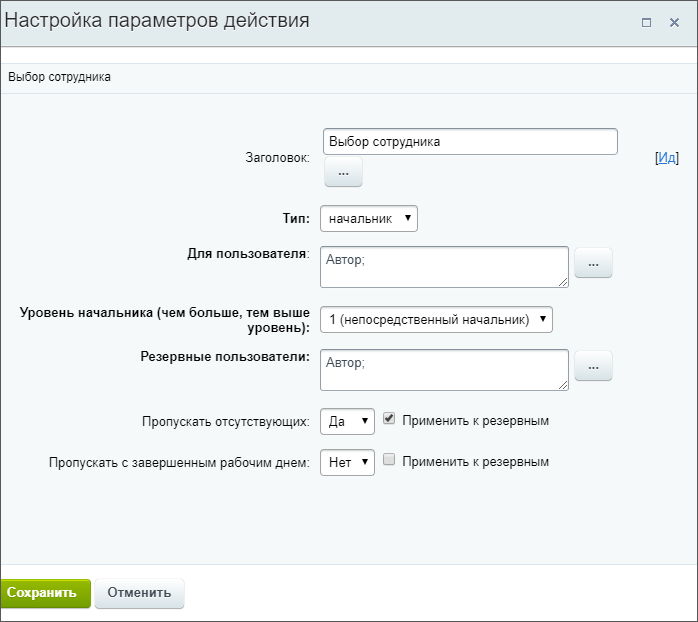
- Добавим
  			действие
                      **Команда** – действие, выполнение которого зависит от пользователей. Для них будет создан соответствующий элемент управления.
  [Подробнее](lesson_3788.md)...
  		 **Изменение документа**, которое будет
  			записывать
                      После выполнения этого действия в заявку будут автоматически внесены требуемые пользователи и статус, не зависимо от того, что было указано при ее заполнении.
  		 нужные поля в карточке заявки. Заполним
  			форму
                      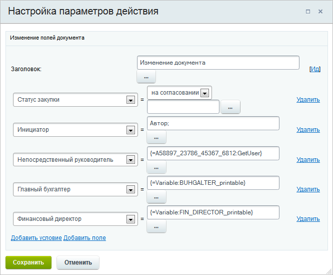
  		.

  - **Статус закупки** – указываем **на согласовании**. Это поможет избежать ошибки, если сотрудник при заполнении заявки укажет иной статус.
  - **Инициатор** – с помощью формы «Вставка значения» в секции «Пользователи» выберем **Автор**.
  - **Непосредственный руководитель** – с помощью формы «Вставка значения» в секции «Дополнительные результаты» выберем результат
    			Выбранный сотрудник
                        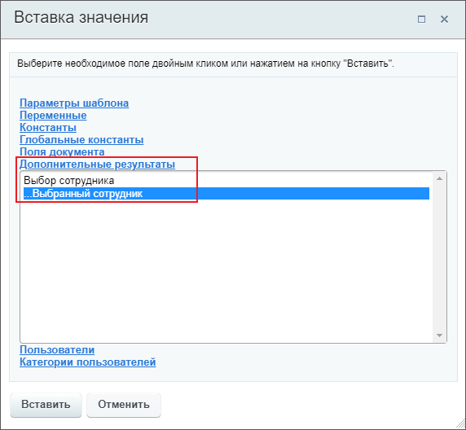
    		 действия **Выбор начальника**.
  - Для полей **Главный бухгалтер** и **Финансовый директор** с помощью формы «Вставка значения» укажем соответствующие им переменные.
- Добавим действие
  			Сообщение соц.сети
                      Действие отправляет уведомление модуля социальной сети.
  [Подробнее](lesson_3804.md)...
  		, которое будет отправлять уведомление сотруднику, ответственному за сервис заявок о том, что создана новая заявка. Также в сообщении будут указаны значения всех полей заявки.
  

В итоге получим такую схему шаблона бизнес-процесса:

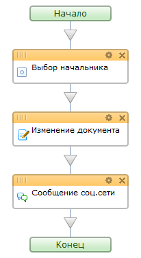

### БП для изменения заявки на закупку

Сначала настроим **параметры шаблона**:

- На вкладке **Основное** укажем **название** и отметим опцию
  			автоматически запускать при изменении
                      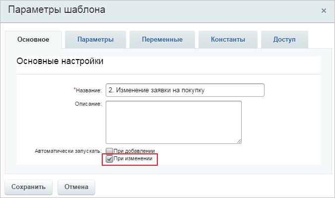
  		;
- На вкладке **Переменные** создадим новую **обязательную** переменную типа **Привязка к сотруднику**, в которой явно зададим
  			Проверяющего
                      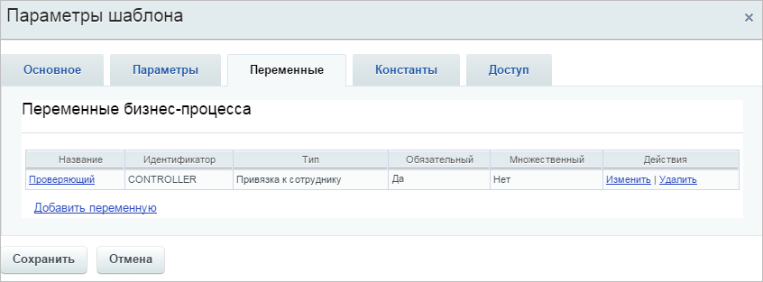
  		 (сотрудника ответственного за сервис заявок).

Теперь перейдем к созданию шаблона бизнес-процесса:

- В основную область конструктора бизнес-процессов добавим действие «Сообщение соц.сети», которое отправит уведомление сотруднику, ответственному за заявки, о том, что заявка изменена. Также в сообщении будут указаны новые значения всех полей заявки;
  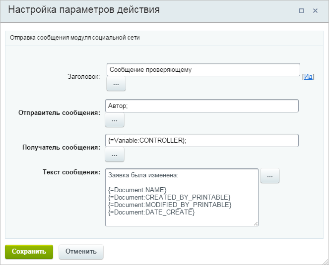
- Добавим конструкцию
  			Условие
                      Конструкция позволяет направить бизнес-процесс по разным сценариям в зависимости от заданного типа условия.
  [Подробнее](lesson_3789.md)...
  		 и создадим 3 ветки условия: **Одобрена**, **На согласовании**, **Отклонена**. Это позволит отправлять автору разные сообщения о статусе его заявки;
- Настроим условие
  			Одобрена
                      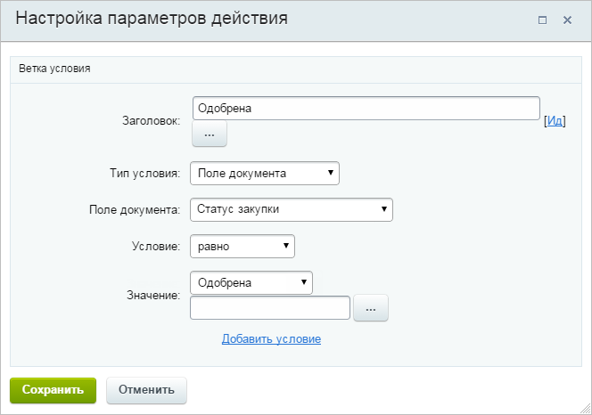
  		. Для этого в поле **Поле документа** укажем, что условие будет выполняться, если **статус закупки** будет равен **одобрена**;
- Аналогичным образом настроим условия для остальных вариантов статуса закупки;
- Настроим действие «Сообщение соц.сети» для ветки условия **Одобрена**:
  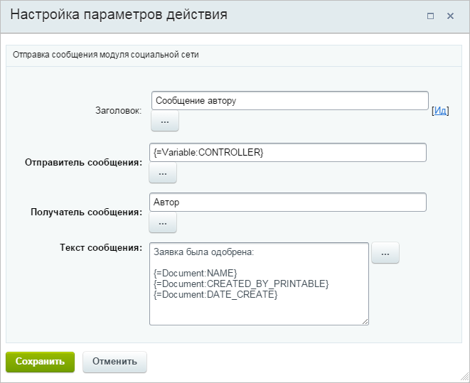
- Аналогично настроим действие и для ветки условия **Отклонена**, изменив лишь часть текста сообщения.

В итоге наша схема шаблона бизнес-процесса выглядит так:

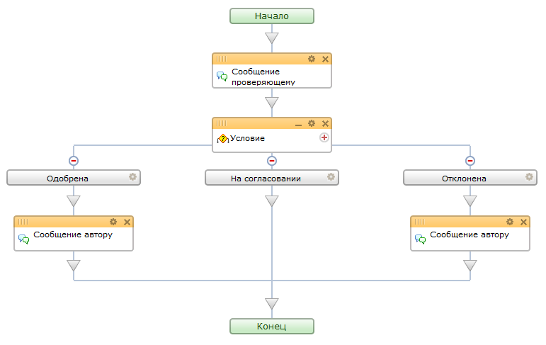
