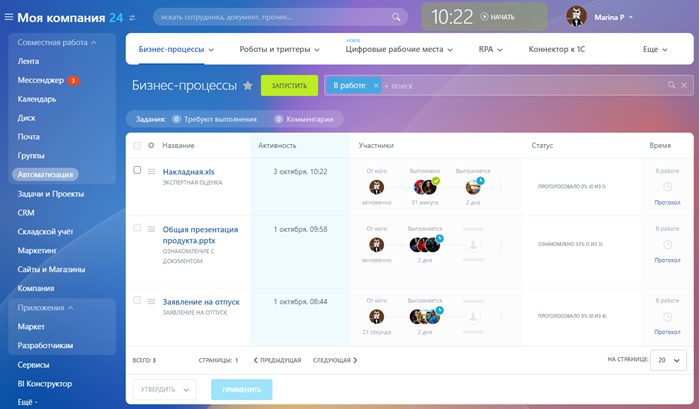
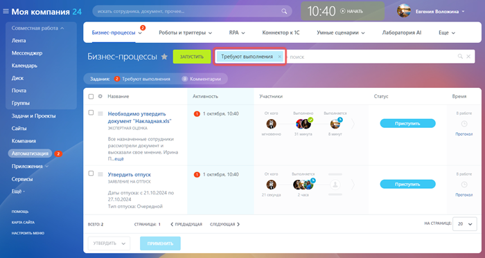
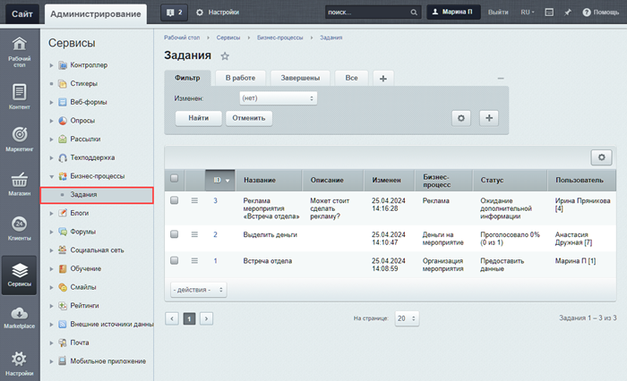

# Задания бизнес-процессов

**Навигация**
- [← Оглавление курса](index.md)
- [← Предыдущий: 3837 — Журнал выполнения бизнес-процесса](lesson_3837.md)
- [Следующий: 2750 — Настройка библиотек документов на работу с бизнес-процессами →](lesson_2750.md)

Официальная страница урока: https://dev.1c-bitrix.ru/learning/course/index.php?COURSE_ID=57&LESSON_ID=5276

Бизнес-процессы могут ставить [задания](https://dev.1c-bitrix.ru/learning/course/index.php?COURSE_ID=57&CHAPTER_ID=07837) пользователям, группам пользователей и отделам компании. Задания дают возможность:

- получить информацию от сотрудников,
- утвердить документ,
- ознакомить сотрудников с документом,
- выполнить [команду](lesson_3788.md) (с версии 24.900.0).

Список заданий есть как в публичной, так и в

			административной части

                    В коробочных продуктах.

		:

- в публичной части Битрикс24 перейдите в раздел Автоматизация. Откроется страница Бизнес-процессы &gt; Процессы. Здесь собраны запущенные вами процессы и задания, которые вам нужно выполнить.
  
  С помощью фильтра можно менять список процессов. По умолчанию установлен фильтр «В работе». Чтобы посмотреть только список заданий — установите фильтр «Требуют выполнения».
  
- в административной части сайта «коробочной версии Битрикс24» и «1С-Битрикс: Управление сайтом» по пути Сервисы &gt; Бизнес-процессы &gt; Задания
  
  Администратор обладает расширенными правами доступа, что позволяет ему не только управлять своими заданиями, но и выполнять задания других пользователей. Это особенно полезно, когда необходимо оперативно решить задачу вместо отсутствующего сотрудника.

**Примечание**. Система автоматически удаляет задания бизнес-процессов при удалении документа, для которого они были запущены.

|  | #### Документация по теме: |
| --- | --- |

- [Задания](https://dev.1c-bitrix.ru/user_help/service/bizproc/bizproc_task_list.php)
- [Просмотр задания](https://dev.1c-bitrix.ru/user_help/service/bizproc/bizproc_task.php)
- [Бизнес-процессы: новый интерфейс и возможности](https://helpdesk.bitrix24.ru/open/21290220/)
