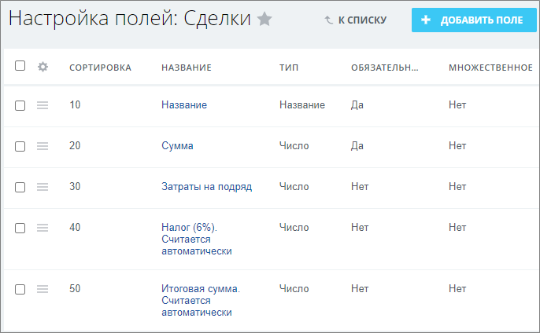
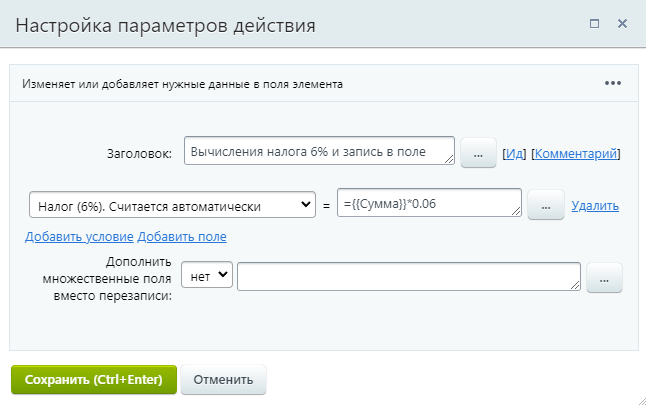
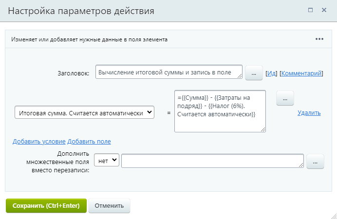

# Вычисляем числовые значения с записью в поля документа

**Навигация**
- [← Оглавление курса](index.md)
- [← Предыдущий: 12840 — Примеры работы с датами](lesson_12840.md)
- [Следующий: 24830 — Проверьте себя →](lesson_24830.md)

Официальная страница урока: https://dev.1c-bitrix.ru/learning/course/index.php?COURSE_ID=57&LESSON_ID=5359

|  | #### Пример вычисления числовых значений |
| --- | --- |

Рассмотрим небольшой пример работы с полями документа и

			вычислением их значений

                    В системе имеется возможность вычислять значения выражений в параметрах действий.
[Подробнее](lesson_3814.md)...

		. Для простоты воспользуемся функционалом списков (Сервисы &gt; Списки). Описанные ниже действия применимы и к другим типам документов, например, к сущностям CRM. За основу примера возьмем сообщение с форума:

«Доброго времени суток, может кто сталкивался с такой задачей, нужно чтоб во время оформления сделки высчитывалась чистая прибыль, т.е. от заложенной суммы сделки вычитался налог

			УСН

                    Упрощенная система налогообложения.

		 (6%), вычитались затраты на подряд (если они есть) и все это потом записывалось в отчет менеджера по проведенной сделке.»

#### Порядок действий

- Создадим новый список, а в нем набор полей типа
  			число
                      **Примечание:** В зависимости от настроек PHP, значения полей типа **число** могут отображаться в [Экспоненциальной форме записи](https://ru.wikipedia.org/wiki/%D0%AD%D0%BA%D1%81%D0%BF%D0%BE%D0%BD%D0%B5%D0%BD%D1%86%D0%B8%D0%B0%D0%BB%D1%8C%D0%BD%D0%B0%D1%8F_%D0%B7%D0%B0%D0%BF%D0%B8%D1%81%D1%8C).
  		:
  

  - Сумма;
  - Затраты на подряд
                        Поле **Затраты на подряд** будет не обязательным к заполнению. Если оно будет содержать значения, то они будут учитываться в расчетах, в противном случае – не будут.
    		;
  - Налог (6%). Считается автоматически;
  - Итоговая сумма. Считается автоматически.
- Создадим шаблон
  			последовательного бизнес-процесса
                      **Последовательный бизнес-процесс** – действия выполняются одно за другим от точки входа до точки выхода.
  [Подробнее](lesson_3466.md)...
  		 и настроим его на запуск при добавлении нового элемента.
- Добавим и настроим первое действие
  			Изменение документа
                      Действие изменяет указанные поля документа.
  [Подробнее](lesson_3785.md)...
  		, которое вычислит
  			налог от общей суммы
                      
  		:

  - **Поле:** Налог (6%). Считается автоматически
  - **Значение:** `={{Сумма}}*0.06`
- Добавим и настроим второе действие «Изменение документа», которое вычислит
  			итоговую сумму
                      
  		 с учетом всех вычетов:

  - **Поле:** Итоговая сумма. Считается автоматически
  - **Значение:** `={{Сумма}} - {{Затраты на подряд}} - {{Налог (6%). Считается автоматически}}`

Обратите внимание, что хоть и

			рекомендуется

                    Бизнес процессы – важнейший инструмент, который позволяет автоматизировать рабочие процессы компании. Однако их использование требует определенного навыка и осторожности. В противном случае бизнес-процессы создадут значительную нагрузку на проект.

[Подробнее](lesson_8445.md)...

		 менять значение полей одним действием, здесь мы использовали «Изменение документа» дважды. Всё потому, что во втором действии используется значение, которое вычисляется в первом. Если бы мы записали все изменения в одном месте, то на момент расчётов итоговой суммы, значение расчёта налога ещё не было бы сохранено, а значит и итоговая сумма посчиталась бы неверно.

#### Дополнительно

Шаблон для ознакомления

                    **Примечание:** Перед импортом шаблона ознакомьтесь с материалом урока [Экспорт и импорт](lesson_3858.md).

		: [Скачать](/images/admin_expert/bizproc/example/calculate/calculate.bpt)
