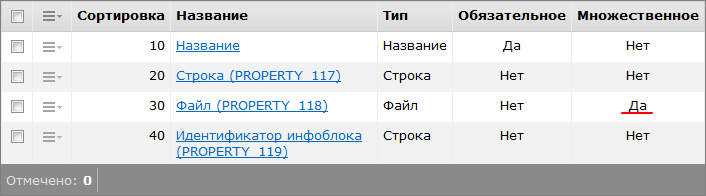
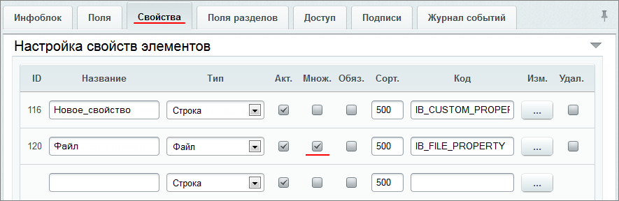
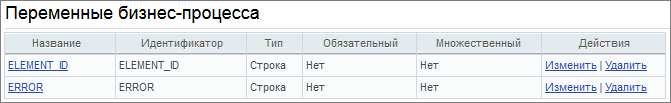

# Добавление информации в инфоблок из бизнес-процесса

**Навигация**
- [← Оглавление курса](index.md)
- [← Предыдущий: 5384 — Создание бизнес-процесса](lesson_5384.md)
- [Следующий: 7993 — Пример изменения процесса Выдача наличных →](lesson_7993.md)

Официальная страница урока: https://dev.1c-bitrix.ru/learning/course/index.php?COURSE_ID=57&LESSON_ID=5368

|  | ### Как добавить информацию из Бизнес-процесса |
| --- | --- |


Рассмотрим пример, в котором значения из пользовательских полей списка с помощью бизнес-процесса будут записываться в пользовательские свойства инфоблока.


После заполнения полей списка **Название**, **Строка** и **Файл** (несколько файлов) и последующего сохранения, необходимо создать новый элемент в нужном инфоблоке. В пользовательские свойства этого элемента вносятся значения, указанных выше, полей списка. Название этого элемента будет соответствовать названию создаваемого элемента списка.


- Для начала создадим в списке дополнительные поля:
  
  Значения из этих полей с помощью бизнес-процесса будут записываться в пользовательские свойства инфоблока.
  Для поля **Идентификатор инфоблока** зададим значение по умолчанию , чтоб каждый раз не заполнять его при создании нового элемента списка. В примере это будет инфоблок с идентификатором `=1`. Это поле создано лишь
  			для наглядности
                      Идентификатор инфоблока можно также прописать прямо в коде (см. ниже) или переменной бизнес-процесса.
  		.
- Перейдем к инфоблоку. На странице настроек инфоблока, закладка
  			**Свойства**
                      
  		 (Контент &gt; Инфоблоки &gt; Типы инфоблоков &gt; требуемый_инфоблок), создадим новые пользовательские свойства, в которые у нас и будут записываться значения из полей списка.


Перейдем к самому бизнес-процессу. Создадим шаблон последовательного бизнес-процесса.


- Создадим
  			2 переменные
                      
  		, которые будут использоваться в отладочных целях:

  - `ELEMENT_ID` - переменная бизнес процесса, в которую будет записан ИД созданного элемента инфоблока в случае удачи,
  - `ERROR` - переменная бизнес процесса, в которую будет записан текст ошибки в случае неудачи создания элемента инфоблока.
- Возьмем код из примера АПИ-вызова  [CIBlockElement::Add](http://dev.1c-bitrix.ru/api_help/iblock/classes/ciblockelement/add.php)
  ## Исходный код
  ```
  <?
  $el = new CIBlockElement;
  $PROP = array();
  $PROP[12] = "Белый";  // свойству с кодом 12 присваиваем значение "Белый"
  $PROP[3] = 38;        // свойству с кодом 3 присваиваем значение 38
  $arLoadProductArray = Array(
    "MODIFIED_BY"    => $USER->GetID(), // элемент изменен текущим пользователем
    "IBLOCK_SECTION_ID" => false,          // элемент лежит в корне раздела
    "IBLOCK_ID"      => 18,
    "PROPERTY_VALUES"=> $PROP,
    "NAME"           => "Элемент",
    "ACTIVE"         => "Y",            // активен
    "PREVIEW_TEXT"   => "текст для списка элементов",
    "DETAIL_TEXT"    => "текст для детального просмотра",
    "DETAIL_PICTURE" => CFile::MakeFileArray($_SERVER["DOCUMENT_ROOT"]."/image.gif")
    );
  if($PRODUCT_ID = $el->Add($arLoadProductArray))
    echo "New ID: ".$PRODUCT_ID;
  else
    echo "Error: ".$el->LAST_ERROR;
  ?>
  ```
  и модифицируем его:
  ```
  <?
  CModule::IncludeModule("iblock"); //подключаем модуль инфоблоков
  $el = new CIBlockElement;
  $PROP = array();
  $PROP[IB_CUSTOM_PROPERTY] = {=Document:PROPERTY_117};
  // задаем для свойства инфоблока "IB_CUSTOM_PROPERTY" типа "строка" значение из поля документа "PROPERTY_117"
  $files = explode(', ',"{=Document:PROPERTY_118}");
  foreach($files as $key=>$value)
   {
    $PROP[IB_FILE_PROPERTY]['n'.$key]=array('VALUE'=> CFile::MakeFileArray($value), 'DESCRIPTION' => '');
   }
  // задаем для свойства инфоблока "IB_FILE_PROPERTY" типа "файл" (множественное) значение из поля документа "PROPERTY_118"
  $arLoadProductArray = Array(
    "IBLOCK_ID" = >{=Document:PROPERTY_119},
  // задаем  Идентификатор инфоблока, в котором будет создан элемент, из поля документа "PROPERTY_119" типа "строка"
    "NAME" => {=Document:NAME},
  // задаем Название создаваемого элемента инфоблока из поля документа "Название"
   "PROPERTY_VALUES"	=> $PROP,
  );
  $ELEMENT_ID = $el->Add($arLoadProductArray);
  if($ELEMENT_ID > 0)
   $this->SetVariable('ELEMENT_ID', $ELEMENT_ID);
  // задаем для переменной бизнес-процесса "ELEMENT_ID" значение, содержащее номер созданного элемента инфоблока, в случае, если он будет создан
  else
   $this->SetVariable('ERROR', $el->LAST_ERROR);
  // задаем для переменной бизнес-процесса "ERROR" значение, содержащее текст ошибки, в случае, если  элемент инфоблока не будет создан
  ?>
  ```
  Этот код будет, с помощью АПИ-методов, создавать новый элемент инфоблока, в котором пользовательские свойства `IB_CUSTOM_PROPERTY`, `IB_FILE_PROPERTY`, а также **название** элемента инфоблока будут содержать значения пользовательских полей `PROPERTY_117`, `PROPERTY_118`, `PROPERTY_119` и значение поля **название** элемента списка.
  После чего добавим в шаблон действие **PHP-код**, в котором укажем наш измененный код.
- Добавим в шаблон действие **Запись в отчет**, в котором укажем следующий текст:
  ```
  {=Variable:ELEMENT_ID_printable}, {=Variable:ERROR_printable}
  ```
  Этим самым мы запишем в отчет по выполнению бизнес-процесса значение отладочных переменных для анализа в случае ошибок.


|  | #### Документация по теме: |
| --- | --- |


- [Действие "PHP код"](lesson_3806.md)
- [АПИ-метод "CIBlockElement::Add"](http://dev.1c-bitrix.ru/api_help/iblock/classes/ciblockelement/add.php)
- [Произвольный PHP код в бизнес-процессе](/learning/course/index.php?COURSE_ID=57&CHAPTER_ID=04795)
