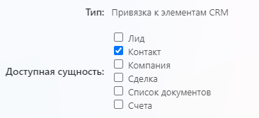
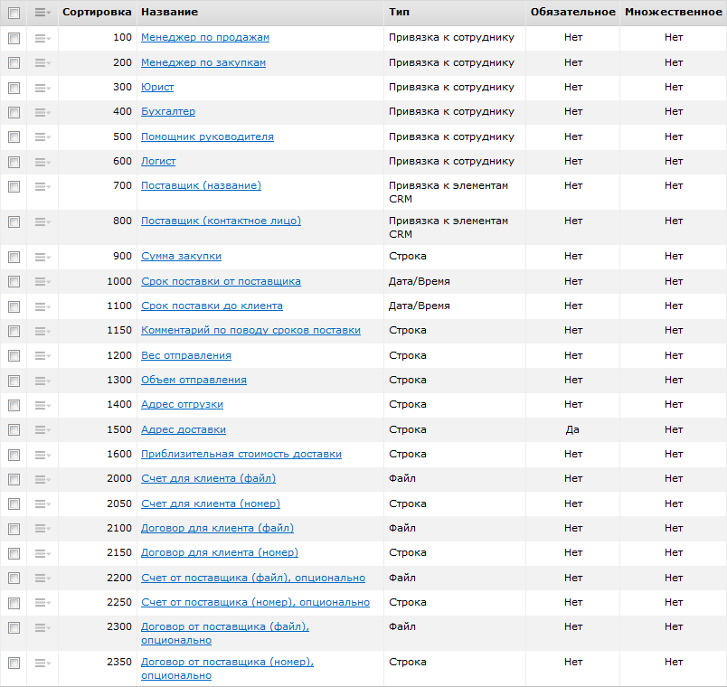
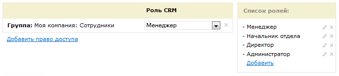

# Настройки CRM

**Навигация**
- [← Оглавление курса](index.md)
- [← Предыдущий: 12293 — Техническое задание](lesson_12293.md)
- [Следующий: 5384 — Создание бизнес-процесса →](lesson_5384.md)

Официальная страница урока: https://dev.1c-bitrix.ru/learning/course/index.php?COURSE_ID=57&LESSON_ID=5383

Сначала выполним настройки в CRM.

### Нюансы шаблона при импорте

После импорта шаблона на портале появится:

- Шаблон бизнес-процесса со статусами;
- Пользовательские поля сделок.

Новые пользовательский поля мы будем использовать в карточке сделки и они будут задействованы в бизнес-процессе.

У полей типа **Привязка к элементам CRM** потребуется изменить настройку

			Доступная сущность

                    После импорта шаблона эта настройка сбрасывается к варианту по умолчанию (**Лид**).

		. Для правильной работы бизнес-процесса внесите изменения в поля:

- **Поставщик (название)** - отметьте доступной сущностью
  			Компанию
                      
  		;
- **Поставщик (контактное лицо)** - отметьте доступной сущностью
  			Контакт
                      
  		.

### Пользовательские поля

В качестве основы будем использовать такую сущность CRM, как

			Сделка

                    **Сделка** - один из основных элементов CRM, это процесс продажи товара или услуги клиенту.

Подробнее на [helpdesk.bitrix24.ru](https://helpdesk.bitrix24.ru/open/5493461/).

		. Поэтому первым делом мы создадим и настроим пользовательские поля для карточки сделки согласно ТЗ (CRM &gt; Настройки &gt; Настройки CRM &gt; Настройки форм и отчетов &gt; Пользовательские поля &gt; Сделка &gt; Список полей).

Помогут в этом материалы из статей поддержки24:

- [Пользовательские поля в CRM](https://helpdesk.bitrix24.ru/open/5488795/).

Пользовательских полей в нашем примере много, поэтому для экономии места, результат скрыт под спойлером:

## Результат настройки пользовательских полей в CRM

Обязательным будет всего 1 поле: **Адрес доставки** (помимо стандартного названия сделки). Его нужно будет сразу при создании сделки. Остальные поля буду заполнены автоматически или при выполнении заданий разными участниками процесса.

**Примечание.** Перечисленные пользовательские поля не нужно создавать, если вы выполнили импорт готового шаблона.

### Настраиваем права доступа

Чтобы все участники могли работать с процессом, в соответствии с ТЗ, важно корректно настроить права доступа. Делается это на странице **Права доступа** по пути CRM &gt; Настройки &gt; Права доступа &gt; CRM)

Для удобства тестирования бизнес-процесса в нашем примере используем только группу **Моя компания: Сотрудники**. Это позволит выбирать любого сотрудника компании при создании нового шаблона.

**Внимание!** В описании и шаблоне-примере для всех сотрудников в процессе задан по умолчанию сотрудник с идентификатором **1** (Администратор портала). Это позволит сразу ознакомиться со всем процессом и проверить его работу, не создавая и не настраивая других пользователей.

### Настройка карточки сделки

Осталось настроить карточку Сделки, добавив в неё созданные пользовательские поля. Перейдем в список сделок (CRM &gt; Сделки), создадим новую и произведем настройку карточки согласно ТЗ.

Помогут в этом материалы из статей поддержки24:

- [Карточка CRM](https://helpdesk.bitrix24.ru/open/6560471/).

Результат настройки карточки скрыт под спойлером:

## Как выглядит итоговая карточка сделки

После всех настроек карточка имеет следующий вид:

