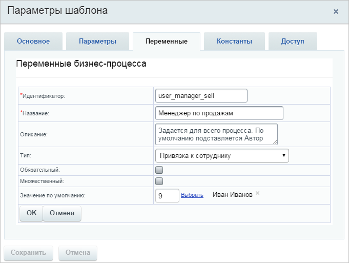
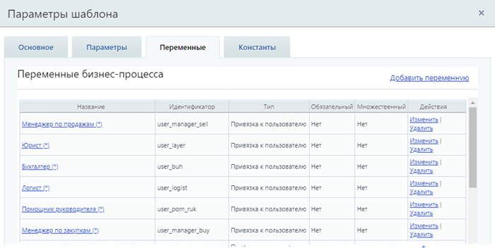
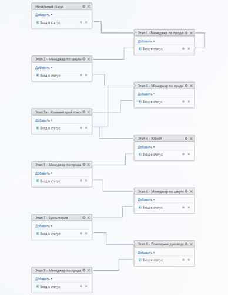

# Создание бизнес-процесса

**Навигация**
- [← Оглавление курса](index.md)
- [← Предыдущий: 5383 — Настройки CRM](lesson_5383.md)
- [Следующий: 5368 — Добавление информации в инфоблок из бизнес-процесса →](lesson_5368.md)

Официальная страница урока: https://dev.1c-bitrix.ru/learning/course/index.php?COURSE_ID=57&LESSON_ID=5384

Создадим новый шаблон бизнес-процесса со статусами для **сделки** (CRM &gt; Настройки &gt; Роботы и бизнес-процессы &gt; Бизнес-процессы) и настроим его параметры.


### Начальные настройки


- Укажем в **параметрах шаблона**, что процесс будет автоматически запускаться **при добавлении** новой сделки.
- Создадим новые
  			переменные
                      Эти переменные будут использоваться для автоматического внесения требуемых сотрудников в карточку сделки, а так же позволят заменять сразу по всему бизнес-процессу отсутствующих сотрудников, например, ушедшего в отпуск юриста.
  		 типа
  			Привязка к пользователю
                      
  		:
  Для всех укажем сотрудников по умолчанию (в нашем примере мы упрощаем, поэтому везде ставим пользователя с идентификатором **1**).

  - **Менеджер по продажам (*)**,
  - **Менеджер по закупкам (*)**,
  - **Юрист (*)**,
  - **Бухгалтер (*)**,
  - **Логист (*)**,
  - **Помощник руководителя (*)**.


В результате получим список переменных:





Остальные переменные будут созданы далее, по мере необходимости. Но некоторые особенности отметим заранее:


- Это будут переменные для хранения значений полей действия
  			Запрос дополнительной информации
                      Действие создает задание, в ходе которого у пользователя будет запрошена дополнительная информация необходимая для выполнения бизнес-процесса.
  [Подробнее](lesson_3782.md)...
  		;
- Названия этих переменных пронумерованы согласно этапу, на котором в них заносятся значения.


**Примечание.** При импорте готового шаблона все необходимые переменные уже будут созданы.


### Шаблон БП


Шаблон бизнес-процесса состоит из 11 статусов, выполняющихся

			последовательно

                    Небольшие исключения есть для статусов Этап 1 и Этап 3а. Подробности в следующем табе урока.

		. Первый статус – начальный, остальные названы по номерам этапов.





- Начальный статус
- Этап 1 – Менеджер по продажам;
- Этап 2 – Менеджер по закупкам;
- Этап 3 – Менеджер по продажам;
- Этап 3а – Комментарий относительно сроков доставки;
- Этап 4 – Юрист;
- Этап 5 – Менеджер по продажам;
- Этап 6 – Менеджер по закупкам;
- Этап 7 – Бухгалтерия;
- Этап 8 – Помощник руководителя;
- Этап 9 – Менеджер по продажам.


В каждом статусе выполняется подпроцесс (вход в статус), реализующий определенную логику.


**Примечание.** При импорте готового шаблона все необходимые статусы с подпроцессами уже будут созданы.


### Описание статусов


Здесь описана логика работы бизнес-процесса в каждом статусе. Вы можете реализовать эту логику самостоятельно. Либо изучить готовый шаблон бизнес-процесса, используя пояснения ниже.


#### Начальный статус


Подпроцесс первого статуса начинается с **Блока действий**, который используется для группировки однотипных действий:

- Сначала проверяется, указаны ли требуемые ответственные сотрудники в полях сделки;
- Если поле пустое, то автоматически в него записывается пользователь из соответствующей переменной (**Менеджер по продажам (*)**, Менеджер по закупкам (*) и т.д.).


Таким образом статус

			автоматизирует

                    Например, если **Юрист** в сделке тот же, что и всегда, то менеджеру не нужно будет заполнять это поле в форме сделки. Оно будет заполнено автоматически из бизнес-процесса. Если же **Юрист** должен отличаться от заданного по умолчанию, то менеджер вручную заполняет соответствующее поле, и тогда автоматической записи из переменной происходить не будет.

		 заполнение формы.


Далее выполняется переход к следующему статусу.


#### Этап 1 – Менеджер по продажам


Этап проходит по следующему алгоритму:


1. Проверяется заполнение требуемых от менеджера по продажам полей «Клиент» и «Сумма» в карточке сделки:

  - Менеджер проверяет и заполняет поля, после чего нажимает кнопку Продолжить;
  - Если поле осталось не заполненным, то задание вновь возвращается менеджеру (к началу этапа).
2. Как только перечисленные поля будут заполнены, меняется стадия сделки и выполняется переход ко второму этапу.


#### Этап 2 – Менеджер по закупкам


На этом этапе менеджеру приходит задание по заполнению требуемых полей согласно ТЗ. Для этого используется действие

			Запрос дополнительной информации

                    Действие создает задание, в ходе которого у пользователя будет запрошена дополнительная информация необходимая для выполнения бизнес-процесса.

[Подробнее](lesson_3782.md)...

		 и дополнительные поля (переменные) в этом действии. После заполнения, значения этих переменных запишутся в соответствующие поля **Сделки**.


Менеджер по продажам будет уведомлен через модуль **Веб-Мессенджер** о том, что поля заполнены. В сообщении будут указаны значения этих полей, ссылки на **Поставщика** и приложенные файлы.


## Рассмотрим эти ссылки поподробнее

- Для автоматического формирования ссылки на карточку просмотра поставщика используется выражение:
  ```
  [url]{=System:HostUrl}/crm/company/details/{=Variable:b_sup_company}/[/url]
  ```
  	где `{=System:HostUrl}` – системное значение для подстановки **Адреса портала**, а `{=Variable:b_sup_company}` – **идентификатор** компании поставщика.
- А для просмотра карточки контакта поставщика:
  ```
  [url]{=System:HostUrl}/crm/contact/details/{=Variable:b_sup_name}/[/url]
  ```
  	где `{=System:HostUrl}` – системное значение для подстановки **Адреса портала**, а `{=Variable:b_sup_name}` – **идентификатор** контакта от компании поставщика.
  Ссылки отличаются друг от друга разделом CRM company / contact и переменной, которая подставляет числовой идентификатор в ссылку.


#### Этап 3 – Менеджер по продажам


На третьем этапе менеджер по продажам, получив информацию от менеджера по закупкам, указывает срок поставки заказа до клиента. Эта информация записывается в сделку.


#### Этап 3а – Комментарий относительно сроков доставки


Этап 3а – промежуточный. На нем сверяются срок поставки от поставщика и срок поставки клиенту. Если разница между ними равна или больше срока поставки поставщика +5 дней, то процесс переходит на следующий этап 4. Иначе менеджеру по продажам выставляется задание действием

			Запрос доп. информации с отклонением

                    Действие создаст задание, в ходе которого у пользователя (или пользователей) запрашивается дополнительная информация, необходимая для выполнения бизнес-процесса. В отличие от стандартного действия Запрос дополнительной информации , пользователь имеет возможность отклонить ввод информации.

[Подробнее](lesson_7839.md)...

		, в котором он должен проверить указанный срок и выбрать один из вариантов действий:

- **Изменить срок** – в этом случае выполнится возврат на 3 этап для указания другого срока;
- **Подтвердить** – оставить указанный срок, но в этом случае потребуется добавить причину в поле Комментарий, которая затем будет записана в сделку.


## Проверка осуществляется следующим образом

Если значение поля документа **Срок поставки до клиента** не меньше чем [вычисленное выражение](lesson_3814.md) `=Dateadd({{Срок поставки от поставщика}}, "5d")` (где `{{Срок поставки от поставщика}}}` – поле сделки **Срок поставки от поставщика**), то никаких действий выполняться не будет. Во всех остальных случаях менеджеру по продажам будет выставлено задание.


#### Этапы 4 – 8


Подпроцессы перечисленных статусов аналогичны 3-му этапу. Запрос информации отправляется сотруднику указанному в названии статуса с пояснением его задачи. Этот сотрудник выполняет задание и заполняет поля в соответствии с ТЗ.


#### Этап 9 – Менеджер по продажам


Это финальный статус процесса. В этом статусе собирается вся информация о сделке, полученная за этапы процесса, и менеджер по продажам выносит решение. В зависимости от решения выставляется одна из

			финальных

                    В любую стадию, из тех, что настроены в качестве финальных в воронке продаж. В канбане отображаются внизу при перетаскивании сделки. Подробнее о финальных стадиях рассказывается в статье Поддежки24 на [helpdesk.bitrix24.ru](https://helpdesk.bitrix24.ru/open/10621898/).

		 стадий сделки (кроме варианта «Обработка приостановлена»).
