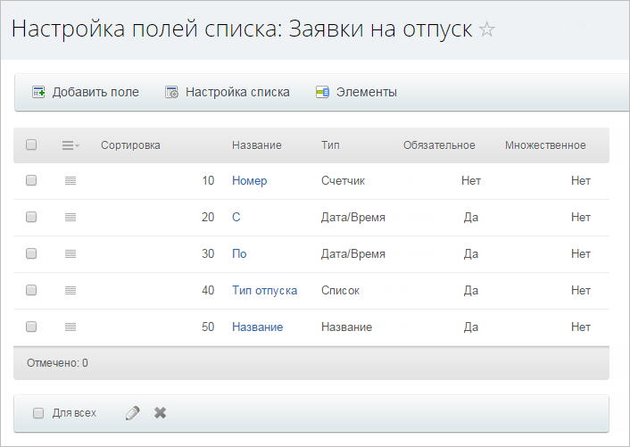
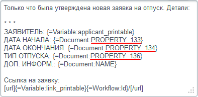
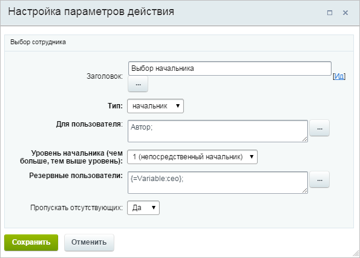
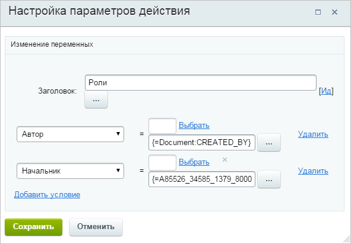
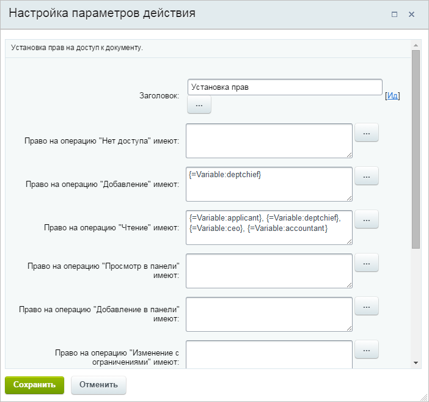
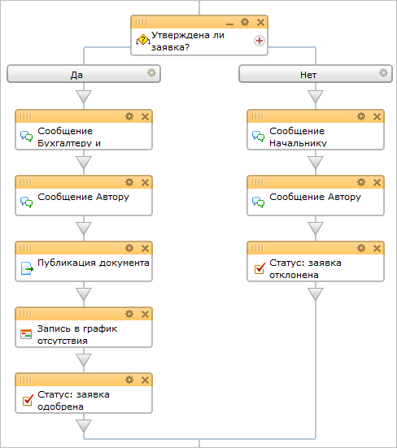

# Пример бизнес-процесса для подачи заявки на отпуск

**Навигация**
- [← Оглавление курса](index.md)
- [← Предыдущий: 8411 — Создание задачи с приоритетом с помощью PHP-кода](lesson_8411.md)
- [Следующий: 7107 — Пример бизнес-процесса для обслуживания заявок клиентов →](lesson_7107.md)

Официальная страница урока: https://dev.1c-bitrix.ru/learning/course/index.php?COURSE_ID=57&LESSON_ID=5518

В данном уроке рассмотрен пример создания сервиса по работе с *заявками на отпуск*, который основан на базе [Универсальных списков](https://dev.1c-bitrix.ru/learning/course/index.php?COURSE_ID=48&CHAPTER_ID=02953).

### Краткий алгоритм работы

После того как сотрудник заполнит данные заявки, она автоматически направляется на утверждение его начальнику.

Если начальником является директор компании, то заявка утверждается или отклоняется им. Если же начальником не является директор компании, то сначала заявка будет утверждаться непосредственным начальником сотрудника, а затем и директором компании.

В процессе утверждения бухгалтеру, директору и начальнику высылаются оповещения с указанием информации касательно заявки на отпуск (используются данные из полей самой заявки).

После утверждения/отклонения заявки для соответствующей переменной устанавливается/не устанавливается нужное значение, на основе которого потом будут произведены действия по оповещению требуемых сотрудников, установке соответствующих статусов для заявки и записи в график отсутствия.

**Примечание.** Процесс подразумевает, что в компании используется структура с несколькими уровнями начальства и одним главным директором.

**Шаблон для ознакомления:** [Скачать](/images/admin_expert/bizproc/example/vacation/bp_vacation.bpt)

### Настройка списка

Необходимо создать следующие поля списка:

- **Номер** – типа **Счетчик**;
- **С** – типа **Дата/Время** (обязательное);
- **По** – типа **Дата/Время** (обязательное);
- **Тип отпуска** – типа **Список** (обязательное), со значениями: **Очередной**, **За свой счет**, **Учебный**;
- **Доп.инф.** –  типа **Название** (обязательное). Данное поле создано потому, что тип *Название* обязательный и удалить его невозможно.
  	Значение по умолчанию: `нет`.

### Используемые переменные

- Автор	(`applicant`) типа **Пользователь** – используется для указания автора заявки на отпуск;
  	Значение по умолчанию: `Автор`.
- Начальник	(`deptchief`) типа **Пользователь** – используется для хранения начальника, который будет выбран для автора в ходе выполнения бизнес-процесса;
- Директор (`ceo`) типа **Пользователь** – используется для указания директора компании;
  	Значение по умолчанию: `указывается_соответствующий_сотрудник_компании`.
- Бухгалтер (`accountant`) типа **Пользователь** – используется для указания бухгалтера компании;
  	Значение по умолчанию: `указывается_соответствующий_сотрудник_компании`.
- Утверждено? (`approved`) типа **Да/Нет** – используется в качестве флага, отображающего статус заявки. На его основе производится  выбор дальних действий над заявкой после ее утверждения;
  	Значение по умолчанию: `Нет`.
- Кем отклонено (`rejectedby`) типа **Пользователь** – используется для хранения пользователя, отклонившего заявку на отпуск;
- Ссылка (`link`) типа **Строка** – используется формирования ссылки для перехода к просмотру заявки на отпуск. Эта ссылка будет использоваться в тексте оповещения сотрудников, участвующих в процессе.
  	Значение по умолчанию: `http://адрес_портала/company/personal/bizproc/`.

### Настройка шаблона

- Необходимо проставить [свои поля](#fields) (взамен тех, что будут после импорта шаблона) во всех действиях шаблона (через форму
  			«Вставка значения»
                      При работе с бизнес-процессом в параметрах действий, параметрах шаблона и настройках статуса есть возможность указывать как собственный текст (заданный вручную), так и использовать различные переменные значения (поля документа и прочие данные, которые могут меняться и поэтому не задаются вручную). Для подстановки таких переменных значений используется специальная форма **Вставка значения**.
  [Подробнее](lesson_12383.md)...
  		);
  Также замену полей необходимо произвести и в тексте сообщений:
  
- Необходимо задать для [переменных](#var) **Директор**, **Бухгалтер** и **Ссылка** свои **Значения по умолчанию**.

### Общая схема работы бизнес-процесса

- Первым делом идет действие по выбору начальника для автора.
  
  В случае если непосредственный начальник отсутствует, то будет выбран вышестоящий начальник, для этого в параметрах действия для опции **пропускать отсутствующих** выбрано значение **да**.
- Следующее действие (**Роли**) производит запись в переменные следующих пользователей:
  

  - **Автор** – сотрудник, который создал заявку на отпуск. Указывается с помощью выражения `{=Document:CREATED_BY}`;
  - **Начальник** – сотрудник, который был выбран предыдущим действием (**выбор начальника**).  Указывается с помощью формы **Вставка значения** (Дополнительные результаты – Выбор начальника – Выбранный начальник).
- Далее следует действие по установке прав. В нем для основных сотрудников разрешается доступ на чтение к заявке на отпуск.
  
- Следующим идет условие (**Выбранный начальник?**), по которому, в зависимости от того, какой именно начальник был выбран (действие **выбор начальника**), будут выполняться различные ветви последовательности действий.
- Следующей конструкцией будет опять условие.
  В этот раз выбор ветки с действиями будет производиться в зависимости от значения переменной **Утверждено?**, которое по умолчанию равно **нет**, но может быть изменено на **да** в ходе выполнения предыдущего условия.
  

  - В случае если значение переменной **Утверждено?** равно **да**, то тогда **Бухгалтеру**, **Начальнику** и **Автору** будут отправлены сообщения, оповещающие о том, что заявка на отпуск была одобрена.
    Затем заявка будет опубликована в списке заявок со статусом "одобрена".
    После в график отсутствия будет занесена соответствующая запись и установлен соответствующий статус для заявки, на чем и завершится процесс.
  - В случае если значение переменной **Утверждено?** равно **нет**, то тогда **Начальнику** и **Автору** будут отправлены сообщения, оповещающие о том, что заявка на отпуск была отклонена.
    После чего будет установлен соответствующий статус для заявки, на чем и завершится процесс.
