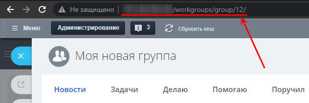
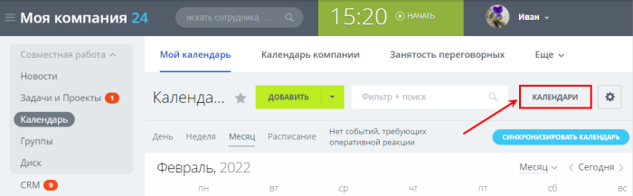
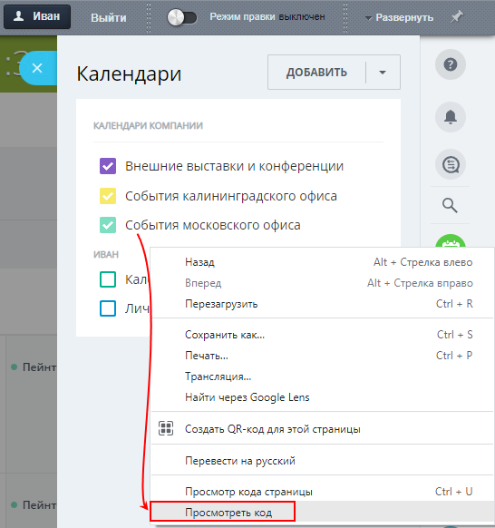
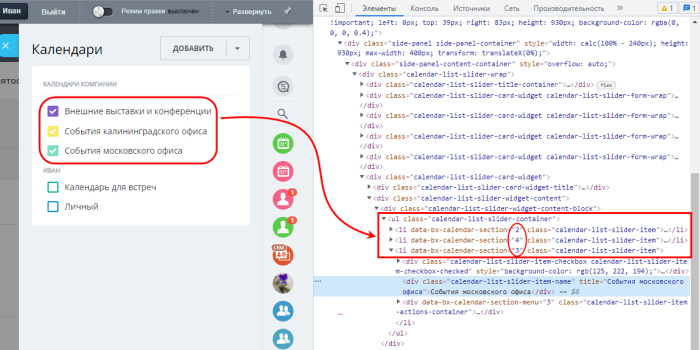
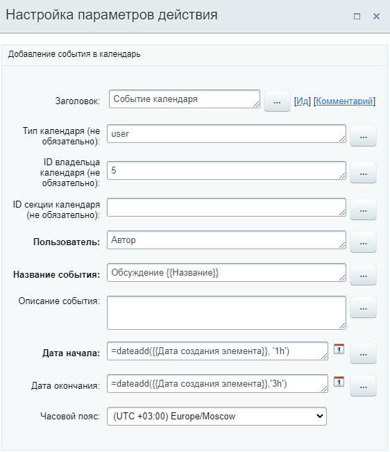
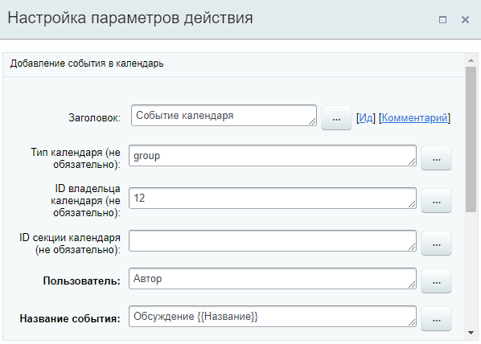

# Событие календаря

**Навигация**
- [← Оглавление курса](index.md)
- [← Предыдущий: 3802 — Почтовое сообщение](lesson_3802.md)
- [Следующий: 3032 — Совершить звонок →](lesson_3032.md)

Официальная страница урока: https://dev.1c-bitrix.ru/learning/course/index.php?COURSE_ID=57&LESSON_ID=5796

Действие добавляет событие в календарь. Требуется
 установленный модуль

			Календарь событий

                    Модуль позволяет просматривать прошедшие и запланированные события. Также он дает возможность управления событиями и их экспорта.

Подробнее в курсе [Администратор сервиса Битрикс24 (коробочная версия)](https://dev.1c-bitrix.ru/learning/course/index.php?COURSE_ID=48&CHAPTER_ID=04954).

		.

### Описание параметров

- **Тип календаря** – тип календаря, в котором будет создано событие.
  Доступные типы можно посмотреть в настройках модуля *Настройки &gt; Настройки продукта &gt; Настройки модулей &gt; Календарь событий*, вкладка "Типы календарей"). По умолчанию в продукте есть следующие типы:
   Если поле не заполнено, то по умолчанию событие будет создано в *личном календаре пользователя* (тип **user**).

  - Календари компании [**company_calendar**];
  - Календари групп [**group**];
  - Календари пользователей [**user**].
- **ID владельца календаря** – числовой идентификатор ID владельца. Что нужно вводить – зависит от типа:

  - **user** –  в параметре указывается ID пользователя, в личном календаре которого будет создано событие;
  - **group** – в поле указывается идентификатор
    			ID
                        Идентификатор легко и быстро посмотреть в ссылке на группу. Например, ссылка имеет
    вид https://[домен]/workgroups/group/12/. В этой ссылке число **12** - идентификатор группы.
    
    		 группы.
  - **company_calendar** – поле заполнять не нужно.
- **ID секции календаря** – впишите числовой идентификатор нужной
  			секции календаря
  
  		. У любого календаря всегда есть хотя бы одна секция. Если секция одна, укажите в поле ее идентификатор.
  **Внимание:** Получить значение **ID секции календаря** можно из базы данных, из исходного кода страницы или из анализа
  			AJAX
                      AJAX (Asynchronous Javascript and XML) – технология, позволяющая взаимодействовать с сервером без перезагрузки страницы. Например, получать или передавать какие-нибудь данные.
  		 запроса.
  ## Как узнать ID секции календаря из исходного кода страницы
  Перейдите к нужному календарю (личному или компании). Нажмите на кнопку **Календари**. Откроется слайдер, в котором будут видны созданные для этого типа календари (это и есть секции, ID которых мы хотим узнать).
  Откроем исходный код страницы. Например в браузере Chrome правой кнопкой мыши нажмем на список календарей:
  
  Откроется инструмент разработчика в браузере, в котором видны идентификаторы списка календарей:
  
  Таким образом получаем идентификаторы:
  - Календарь Внешние выставки и конференции имеет ID = **2**;
  - Календарь События калининградского офиса имеет ID = **4**;
  - Календарь События московского офиса имеет ID = **3**.
- **Пользователь** – добавьте пользователя, который будет организатором события. Обязательный параметр. В параметре может быть указан как один пользователь, так и несколько пользователей и групп. Как это сработает:

  - Если тип календаря **user** и владелец не указан, то для
    			каждого
                        Например, в параметре добавлены три пользователя: Иван, Елена и Ирина. В результате выполнения действия в личном календаре каждого из этих трех пользователей будет создано событие и этот пользователь станет организатором события. Таким образом, всего создастся три события.
    		 пользователя из добавленных будет создано событие, в котором он будет организатором;
  - Если тип календаря – календарь компании / группы или пользовательский с указанием владельца, то будет создана одна встреча в календаре, организатором которой будет первый пользователь указанный в параметре.
- **Название события** – укажите название создаваемого события. Обязательный параметр.
- **Описание события** – укажите произвольное текстовое описание события;
- **Дата начала** – установите дату и время начала события. Обязательный параметр. Формат: `15.02.2022 15:00:00`;
- **Дата окончания** – задайте дату и время окончания события. Если дата и время окончания не установлены, то длительность встречи по умолчанию будет равна **1 часу**;
- **Часовой пояс** – укажите часовой пояс, в котором устанавливаются даты.

**Примечание:** На текущий момент действие не позволяет:

- привязать элемент CRM;
- указать участников встречи;
- получить id созданного события или ссылку на событие в дополнительных результатах.

### Примеры

**Событие в календаре пользователя**

Заполним параметры действия следующим образом:

В результате выполнения действия в календаре пользователя с **ID = 5** создастся событие, организатором которого будет пользователь, запустивший бизнес-процесс (Автор). В название события подставится названием элемента, для которого запущен БП. Функция **dateadd** вычислит дату и время начала и окончания события, основываясь на времени создания элемента.

**Событие в календаре группы**

Для создания события в группе (которая, например, имеет адрес https://[домен]/workgroups/group/12/), помимо обязательных полей, необходимо заполнить поля следующим образом:

- **Тип календаря (не обязательно)**: `group`;
- **ID владельца календаря (не обязательно)**: `12` (идентификатор группы).
