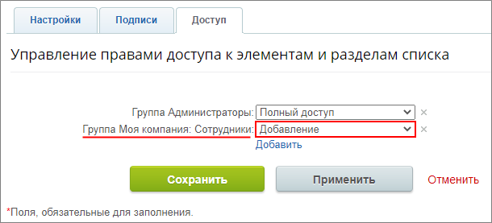
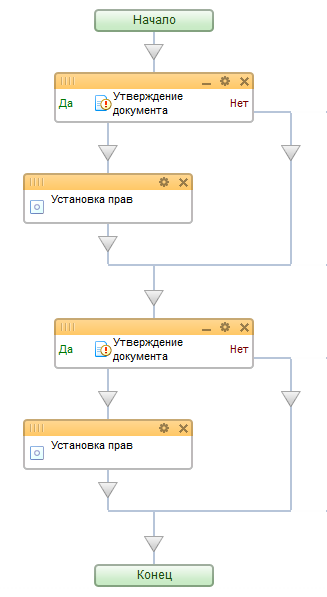
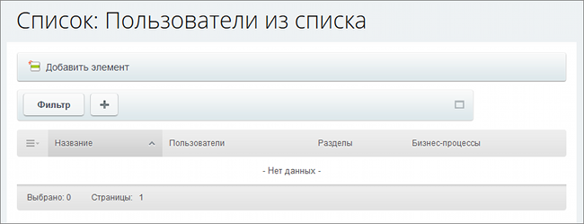
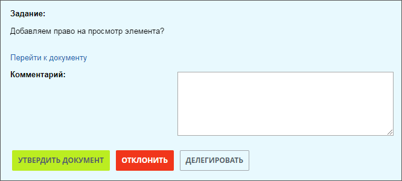
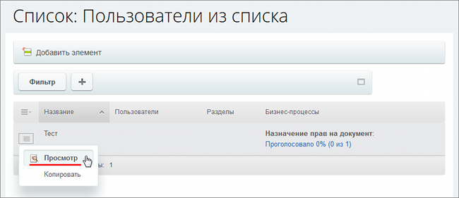
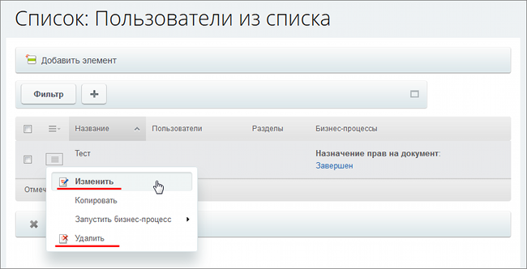

# Пример динамического назначения прав на документ

**Навигация**
- [← Оглавление курса](index.md)
- [← Предыдущий: 2790 — Проверка работы](lesson_2790.md)
- [Следующий: 6850 — Использование пользователя в бизнес-процессе →](lesson_6850.md)

Официальная страница урока: https://dev.1c-bitrix.ru/learning/course/index.php?COURSE_ID=57&LESSON_ID=6844

Рассмотрим пример **динамического** изменения прав на документ по мере выполнения бизнес-процесса на базе списков (Сервисы &gt; Списки).

### О правах

Поначалу, конкретный пользователь будет иметь один уровень прав, который задается на весь список. При создании нового элемента списка будет запущен бизнес-процесс. В ходе выполнения бизнес-процесса права на элемент для пользователя будут поэтапно изменяться.

#### Особенности назначения прав в системе

Если для документа используется

			упрощенная

                    Простой режим настройки прав доступа к инфоблоку - это режим, когда опция **Расширенное управление правами** отключена, а в секции **Доступ для групп пользователей** перечислены все имеющиеся у вас в системе группы пользователей.
[Подробнее](https://dev.1c-bitrix.ru/learning/course/index.php?COURSE_ID=35&LESSON_ID=9411&LESSON_PATH=3906.4493.4504.9411#simply_mode)...

		 (**старая**) версия прав, то они устанавливаются жестко извне (настройки доступа к инфоблокам/спискам/и т.д.). Единственный вариант, позволяющий устанавливать права прямо из бизнес-процесса - это установка для документа права **бизнес-процессы** извне (права на сам документ). В этом случае с помощью закладки **Доступ** или действия **Установка прав** можно менять права по ходу выполнения процесса.

			 Если используются

			расширенные права

                    **Расширенный режим** позволяет настроить права доступа не только целиком ко всему инфоблоку, но и гибко задать права на отдельные его разделы и элементы.
[Подробнее](https://dev.1c-bitrix.ru/learning/course/index.php?COURSE_ID=35&LESSON_ID=9411&LESSON_PATH=3906.4493.4504.9411#advanced_mode)...

		 доступа, то из бизнес-процесса можно только добавлять новые права на документ, которые будут оставаться у документа даже после выполнения процесса. Переопределить права, которые были установлены извне, внутри бизнес-процесса нельзя.

### Пример БП

Создадим простой пример бизнес-процесса:

- По умолчанию, укажем в настройках списка для определенной группы пользователей, в которую входит необходимый нам сотрудник, право на
  			Добавление
                      Это право подразумевает, что пользователь из этой группы может **создать** новый элемент списка,
   но не может **просматривать** или **редактировать** его. Поэтому сразу после создания такого
   элемента, он даже не будет отображаться в общем списке.
  
  		;
- Создадим простой
  			последовательный шаблон
                      **Последовательный бизнес-процесс** – действия выполняются одно за другим от точки входа до точки выхода.
  [Подробнее](lesson_3466.md)...
  		 бизнес-процесса (в списке выбираем Действия &gt; Настроить бизнес-процессы), который будет запускаться при создании элемента списка.

В результате получится такая схема:

### Работа БП

#### Как работает наш бизнес процесс

Требуемый пользователь создает элемент списка, который не будет для него сразу отображаться:

После будет создано первое задание бизнес-процесса по утверждению документа:

В случае утверждения, пользователь получит права на чтение. В списке появится элемент и соответствующие элементы управления для него:

После этого будет создано второе задание бизнес-процесса по утверждению документа. Форма выглядит аналогично первой. В случае утверждения, пользователь получит права на изменение, о чем будет свидетельствовать появление соответствующих элементов управления:

**Примечание:** Если в первый раз отклонить утверждение, то пользователь не будет обладать правом на чтение и не сможет увидеть в списке созданный им элемент. Запрос на утверждение придет во второй раз. Если утверждение выполнено, то пользователь сразу сможет читать и изменять документ, так как он будет обладать правом полный доступ.

### Документация по теме

- [Действие "Установка прав"](lesson_3811.md)
- [Действие "Утверждение документа"](lesson_3771.md)
