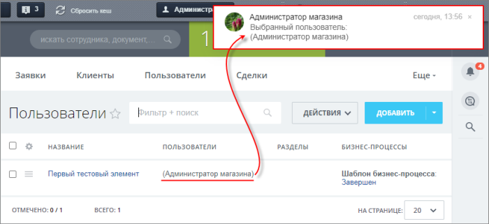
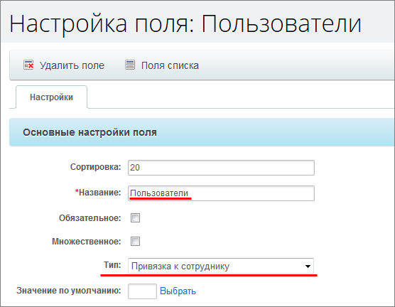
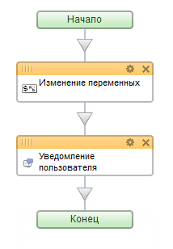

# Использование пользователя в бизнес-процессе

**Навигация**
- [← Оглавление курса](index.md)
- [← Предыдущий: 6844 — Пример динамического назначения прав на документ](lesson_6844.md)
- [Следующий: 6851 — Утверждение документа с учетом времени →](lesson_6851.md)

Официальная страница урока: https://dev.1c-bitrix.ru/learning/course/index.php?COURSE_ID=57&LESSON_ID=6850

|  | ### Выбираем пользователя |
| --- | --- |

Рассмотрим пример на основе списков (Сервисы &gt; Списки):

- При создании нового элемента списка мы указываем пользователя в соответствующем поле. Этот пользователь будет использован в бизнес-процессе.
- После запуска бизнес-процесса пользователь из этого поля будет передан в переменную. Затем от его имени будет отправлено
  			уведомление автору
                      
  		.

Для этого:

- Создадим в списке новое поле
  			Пользователи
                      
  		 типа **привязка к сотруднику**. Поле **множественное** не отмечаем;
- Создадим простой
  			последовательный шаблон
                      **Последовательный бизнес-процесс** – действия выполняются одно за другим от точки входа до точки выхода.
  [Подробнее](lesson_3466.md)...
  		 бизнес-процесса, который будет запускаться при создании элемента списка.

В результате получится такой простой шаблон:

