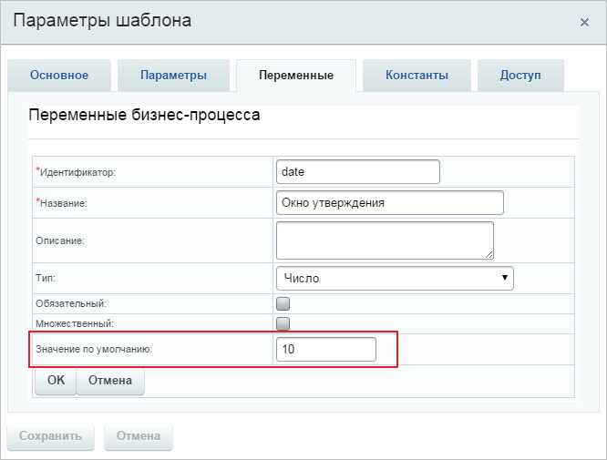
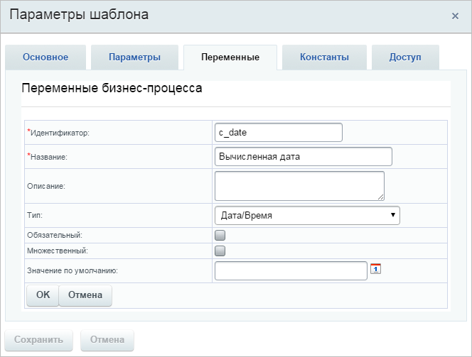
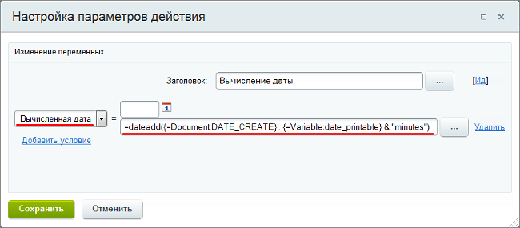
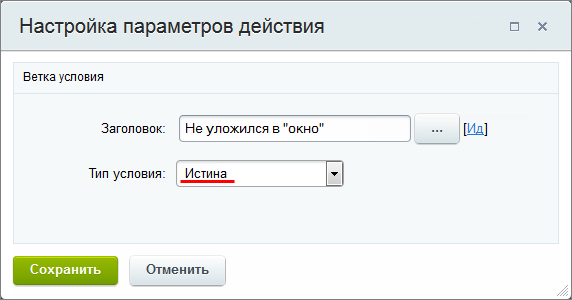
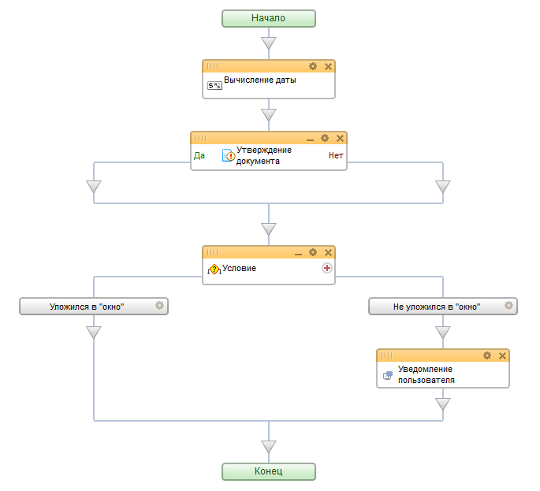

# Утверждение документа с учетом времени

**Навигация**
- [← Оглавление курса](index.md)
- [← Предыдущий: 6850 — Использование пользователя в бизнес-процессе](lesson_6850.md)
- [Следующий: 22098 — Установка времени клиента в документе CRM →](lesson_22098.md)

Официальная страница урока: https://dev.1c-bitrix.ru/learning/course/index.php?COURSE_ID=57&LESSON_ID=6851

|  | ### Пример: утверждение документа |
| --- | --- |


Рассмотрим простой пример, когда на утверждение документа отводится определенное время. Если документ не утвержден за указанное время (например, 10 минут с момента создания), то после выполнения задания пользователю будет выслано соответствующее уведомление.


**Важно**! Бизнес процесс выполняется на

			хитах

                     Под термином **хит** понимается одна загрузка страницы. Переход по ссылке на сайте и загрузка страницы приводит к генерации хита. Перезагрузка страницы с помощью F5 или Ctrl+F5 генерирует хит. Обращение к несуществующей странице (404 ошибка) также генерирует хит.
[Подробнее](https://ru.wikipedia.org/wiki/Хит_(информационные_технологии))...

		, поэтому для точности выполнения процесса по времени на портале обязательно должны быть хиты.


Пример посмотрим на базе списков (Сервисы &gt; Списки) для одного единственного пользователя:


- Создадим простой
  			последовательный шаблон
                      **Последовательный бизнес-процесс** – действия выполняются одно за другим от точки входа до точки выхода.
  [Подробнее](lesson_3466.md)...
  		 бизнес-процесса (в списке выбираем Действия &gt; Настроить бизнес-процессы), который будет запускаться при создании элемента списка;
- В **Параметрах шаблона** создадим первую
  			переменную
                      **Переменные** используются для временного хранения данных, необходимых для выполняемого процесса. Значения переменных хранятся до тех пор, пока выполняется бизнес-процесс. После его завершения они все стираются.
  [Подробнее](lesson_3816.md#variables)...
  		 с названием **Окно утверждения** (идентификатор укажем `date`) типа **число**. В поле **Значение по умолчанию** укажем
  			количество минут
                      
  		 (в нашем случае 10) на утверждение документа;
- Там же создадим вторую переменную
  			Вычисленная дата
                      
  		 (название идентификатора `c_date`) типа **Дата/Время**. В эту переменную будет сохранена крайняя дата/время, относительно даты создания документа. После этого срока считается, что утверждение документа выполнено не вовремя;
- Добавим первое действие
  			Изменение переменных
                      Действие позволяет изменить значения переменных, заданных в настройках шаблона.
  [Подробнее](lesson_3812.md)...
  		, в котором для переменной **Вычисленная дата** произведем расчет крайней даты/времени по
  			формуле
                      При вычислении значений выражений в параметрах действий вы можете использовать различные операторы и функции.
  [Подробнее](lesson_4912.md)...
  		:
  ```
  =dateadd({=Document:DATE_CREATE}, {=Variable:date_printable} & "minutes")
  ```
  ## Подробнее про dateadd
  
  К **Дате создания** документа (`{=Document:DATE_CREATE}`) будет прибавлено требуемое количество **минут** (`"minutes"`) из переменной **Окно утверждения** (`{=Variable:date_printable}`) .
- Следующим добавим действие
  			Утверждение документа
                      Действие позволяет произвести утверждение документа, для которого запущен бизнес-процесс.
   [Подробнее](lesson_3771.md)...
  		. В поле **Утверждают сотрудники** укажем
  			Автор
                      В нашем простом примере автор-создатель элемента списка и будет утверждать документ.
  		;
- После **утверждения документа** добавим конструкцию
  			Условие
                      Конструкция позволяет направить бизнес-процесс по разным сценариям в зависимости от заданного типа условия.
  [Подробнее](lesson_3789.md)...
  		:
  Ветки условия выполняются **слева направо**, поэтому в первую очередь будет проверено, что утверждение уложилось в указанные временные рамки, в остальных же случаях (**Истина**) утверждение будет считаться не уложившимся.

  - Левую ветку условия мы настроим так, чтобы значение переменной **Вычисленная дата** было больше чем `{=System:Now}`;
  - Правую ветку условия мы настроим так, чтобы в поле **Тип условия** было указано значение
    			Истина
                        
    		, т.е. ветка условий будет выполняться
    			всегда
                        В нашем случае это используется для того, чтобы процесс продолжил свое выполнение дальше, если условие левой ветки не выполнится.
    		;
  - После условия в правой ветке идет действие **Уведомление пользователя**. Оно будет оповещать **Автора** о том, что он не уложился с утверждением документа в срок.


В результате получится такая схема шаблона:





|  | #### Документация по теме: |
| --- | --- |


- [Форма "Вставка значения"](http://dev.1c-bitrix.ru/learning/course/index.php?COURSE_ID=57&CHAPTER_ID=05059)
- [Вычисление значений выражений в параметрах действий](lesson_3814.md)
