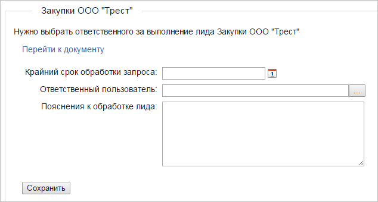
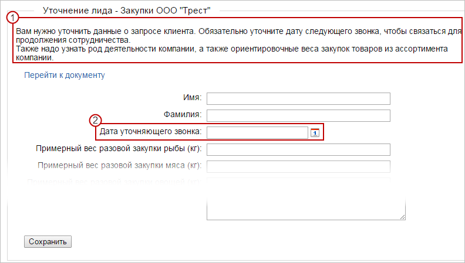
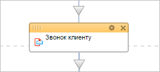
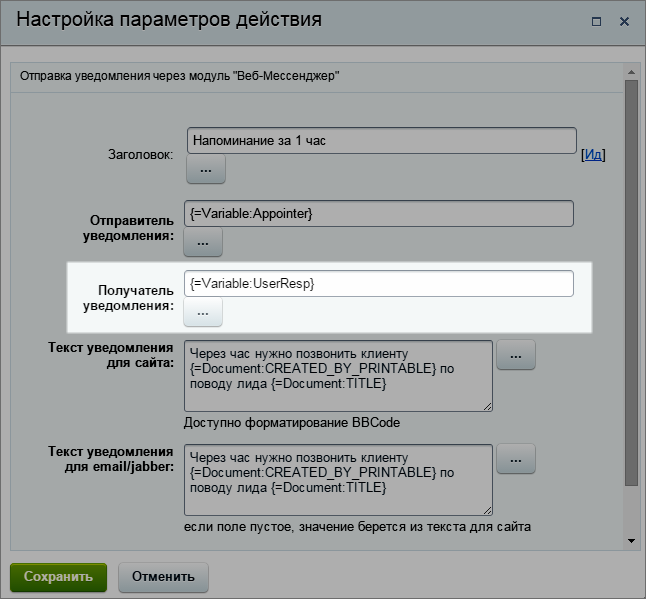
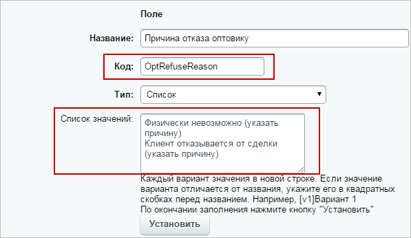
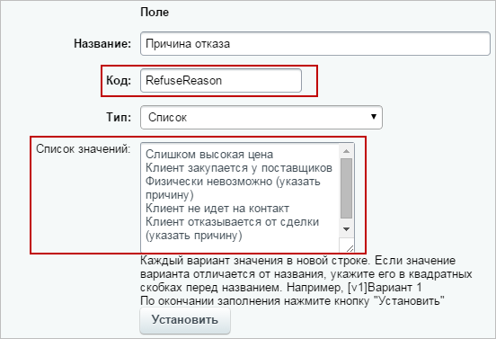

# Пример бизнес-процесса для обслуживания заявок клиентов

**Навигация**
- [← Оглавление курса](index.md)
- [← Предыдущий: 5518 — Пример бизнес-процесса для подачи заявки на отпуск](lesson_5518.md)
- [Следующий: 5519 — Примеры использования бизнес-процессов совместно с другим функционалом системы (ссылки) →](lesson_5519.md)

Официальная страница урока: https://dev.1c-bitrix.ru/learning/course/index.php?COURSE_ID=57&LESSON_ID=7107

В данном примере будет рассмотрен бизнес-процесс обслуживания заявок клиентов по приобретению продуктов питания. Шаблон можно скачать [здесь](/images/admin_expert/bizproc/example/crm_bp/25_03_2015.bpt). Вы также имеете возможность [импортировать](lesson_3858.md) шаблон и отредактировать его под ваши потребности с помощью [дизайнера бизнес-процессов](/learning/course/index.php?COURSE_ID=57&CHAPTER_ID=05058).

### Алгоритм работы

Клиент оставляет на сайте заявку, которая появляется на портале в виде нового [лида](https://helpdesk.bitrix24.ru/open/1357950/).

О появившемся лиде сразу сообщается сотруднику, который принимает решение о назначении ответственного за его обслуживание . Он должен зайти на сайт и назначить того, кто будет работать с данным лидом в дальнейшем, а так же поставить соответствующую задачу, содержащую крайние сроки и комментарии.

Ответственный пользователь (далее **ОП** по тексту) получает уведомление о том, что нужно связаться с клиентом и получить у него дополнительные сведения относительно его заявки. Обязательным условием продолжения работы является назначение даты повторного звонка, чтобы уточнить, готов ли клиент заключить сделку.

По повторному звонку принимается решение о дальнейшем обслуживании лида:

- Если клиент готов сделать заказ, то создается новая [сделка](https://helpdesk.bitrix24.ru/open/5493461/), в которую заносятся данные из лида.
- Если клиент еще не принял решения о продолжении сотрудничества, то ОП должен договориться о дате следующего звонка.
- Если клиент отказывается заключать сделку, то ОП должен выяснить почему. Возможны следующие причины отказа:

  - Сделка физически невозможна – ОП указывает причину. Процесс заканчивается.
  - Клиент хочет закупаться у поставщиков – ОП уведомляет сотрудника-оптовика о том, что тому нужно связаться с клиентом и договориться о поставках. Сам оптовик теперь становится ответственным. Важным является то, что сотрудник-оптовик после звонка должен сразу выяснить: будет клиент осуществлять закупку или нет.
  - Клиента не устраивает цена – ОП уведомляет главу отдела продаж об этом. Глава отдела продаж принимает решение о том, какие скидки и бонусы можно предоставить клиенту. В зависимости от этого отсылается один из пяти содержащих скидки прайс-листов, назначается дата нового звонка. Если не один из прайсов не подошел клиенту, то с ним должен связаться сотрудник-оптовик.
  - Клиент не идет на контакт – необъяснимая невозможность договориться (личная несовместимость, конфликтная ситуация) или связаться с клиентом. В данном случае ОП уведомляет назначающего сотрудника о том, что нужно сменить ответственного.
  - Другое – причина указывается в комментарии.

Данную задачу будет удобно разделить на несколько основных этапов, каждый из которых будет рассмотрен отдельно.

### Ответственный

Когда в системе появится новый лид, у сотрудника, назначающего ответственного, высветится следующее сообщение.

Ему нужно выбрать ОП, а также установить условия для задачи, которая будет для него поставлена.

### Уточнение заявки

ОП звонит клиенту и уточняет данные, необходимые для закупки.

**Примечание**:

**1** – содержит подсказки для ОП при звонке клиенту

**2** – единственное обязательное поле – без него выполнение бизнес-процесса не продолжается

Поля формы заполняются уточненными у клиента данными и записываются в лид после нажатия кнопки **Сохранить**.

## Создание напоминания пользователю

В бизнес-процессе предусмотрена функция напоминания ОП о предстоящем звонке клиенту.

Он получит уведомление за час до наступления времени звонка.

Также напоминание появится за минуту до указанного времени.

Для того, чтобы задать время напоминания, используется действие **Пауза**, в котором с помощью функции

			dateadd

                    При вычислении значений выражений в параметрах действий вы можете использовать различные операторы и функции.

[Подробнее](lesson_4912.md)...

		 можно установить нужное время.

### Повторный звонок клиенту

После повторного звонка клиенту ОП должен определить степень готовности клиента к заключении сделки. Клиент либо:

1. Готов сразу и сделка заключается
2. Не готов, но ему требуется еще время на принятие решения
3. Клиент не хочет заключать сделку и мы должны либо предоставить ему улучшенные условия сделки, либо указать почему он не хочет ее заключать

Отработку этой стадии бизнес-процесса можно посмотреть в следующем видео.

Последовательность действий и их параметров достаточно понятны из шаблона, поэтому подробно описывать их мы не будем. Однако стоит коснуться некоторых важных деталей:

- В данной части бизнес-процесса предусмотрено несколько ситуаций, при которых нужно будет заново выполнить последовательность действий (повторный звонок клиенту, назначение нового ответственного). Поэтому обязательно присутствие цикла, повторяющегося пока не наступит какое-либо из условий выхода из него.
  
- В случае, если ОП становится другой сотрудник, нужно обязательно назначить его ответственным с помощью действия
  			Изменение переменных
                      Действие позволяет изменить значения переменных, заданных в настройках шаблона.
  [Подробнее](lesson_3812.md)...
  		.
  Это необходимо делать для того, чтобы ответственный сотрудник всегда был один и данные о нем хранились в одной единственной переменной, которая будет указываться в параметрах действий бизнес-процесса.
  В нашем примере используется переменная `UserResp`, описание которой можно найти в параметрах шаблона.
  
  И она используется в очень многих действиях нашего бизнес-процесса, где нужно указать конкретного пользователя.
  
- Сотрудник-оптовик ограничен в решениях, которые он может принять. Он либо указывает, что клиент готов заключить сделку, либо указывает причину, по которой не готов. Причины отказа хранятся отдельных переменных в виде списков.
  **Сотрудник-оптовик**
  
  **Обычный сотрудник**
  
  В данной ситуации мы не можем использовать одну и ту же переменную для хранения двух списков, хотя они и содержат общие элементы. Дело в том, что каждая ветка условия срабатывает при конкретных значениях переменных, но бизнес-процесс будет работать только с общими элементами обоих списков. Значит, каждая ветка условия, не содержащая их, не будет отрабатываться.
  Так если обычный сотрудник выберет вариант, допустим, **Слишком высокая цена**, которая недоступна оптовику, то бизнес-процесс не будет знать, что ему делать, потому что для него такой причины отказа в общем списке нет.
