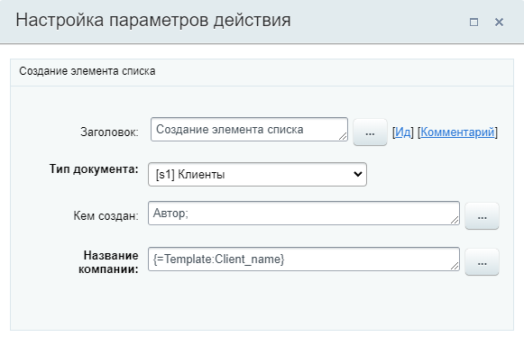
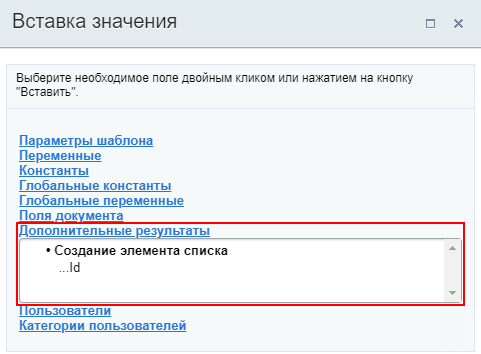

# Создать элемент списка

**Навигация**
- [← Оглавление курса](index.md)
- [← Предыдущий: 3777 — Создание нового документа](lesson_3777.md)
- [Следующий: 3784 — Сохранение истории →](lesson_3784.md)

Официальная страница урока: https://dev.1c-bitrix.ru/learning/course/index.php?COURSE_ID=57&LESSON_ID=7122

Действие добавляет элемент в один из уже созданных списков.

#### Описание параметров

- **Тип документа** – выберите для какого списка создать новый элемент.

Остальные параметры различаются в зависимости от выбранного списка и соответствуют полям списка. К спискам относятся [Универсальные списки](https://helpdesk.bitrix24.ru/open/5316091/) (Сервисы &gt; Списки) и [Процессы в ленте новостей](lesson_4516.md#timeline) (Автоматизация &gt; Бизнес-процессы &gt; Процессы в ленте новостей), а также [списки групп и проектов](https://helpdesk.bitrix24.ru/open/1428438/).

#### Пример

В примере выбран универсальный список **Клиенты**. После выбора типа документа появляются два параметра для заполнения. В качестве создателя элемента указан **Автор** (пользователь, запустивший бизнес-процесс), а в название подставляется значение

			параметра шаблона

                    Параметры используются для явного указания каких-либо значений во время исполнения бизнес-процесса и задаются пользователем, запустившим бизнес-процесс. Значения параметров запрашиваются непосредственно при запуске бизнес-процесса. И не могут быть изменены бизнес-процессом, в отличие от переменных.

[Подробнее](lesson_3816.md#params)...

		 бизнес-процесса.

#### Результаты выполнения действия

Результаты выполнения этого действия можно получить с помощью формы **Вставка значения** - **Дополнительные результаты**.

Доступно:

- Id
                      Идентификатор ID созданного элемента списка.

