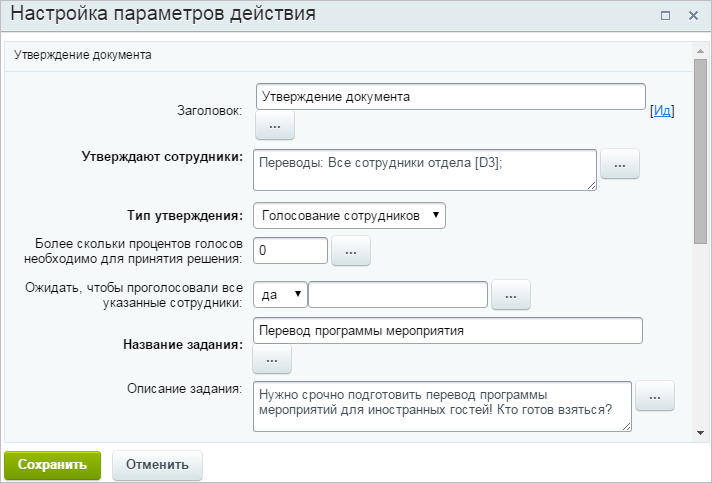
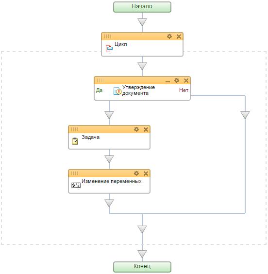

# Пример использования действия "Утверждение документа"

**Навигация**
- [← Оглавление курса](index.md)
- [← Предыдущий: 3383 — Ручной переход по действиям процесса с помощью "Ознакомления с документом"](lesson_3383.md)
- [Следующий: 13044 — Практические задания →](lesson_13044.md)

Официальная страница урока: https://dev.1c-bitrix.ru/learning/course/index.php?COURSE_ID=57&LESSON_ID=7143

|  | ### Утверждаем документ |
| --- | --- |

Действие

			Утверждение документа

                    Действие позволяет произвести утверждение документа , для которого запущен бизнес-процесс. В зависимости от результата (утвержден документ или нет) возможны 2 варианта развития дальнейших действий.
[Подробнее](lesson_3771.md)...

		 удобно использовать для автоматизации процесса распределения работ. Например, у нас есть задача: необходимо уведомить нескольких сотрудников о наличии работы, которую нужно выполнить. Работа назначается первому сотруднику, который возьмется за ее выполнение. Как только кто-то один берет на себя эту работу, другим она уже не предлагается. В случае, если никто не согласился, процесс повторяется.

#### Порядок действий:

- В данном шаблоне используем
  			Цикл
                      Конструкция выполняет свои поддействия до тех пор, пока выполняется заданное условие.
  [Подробнее](lesson_3792.md)...
  		. Голосование повторится до тех пор, пока кто-либо из сотрудников не возьмет на себя работу.
- Остановимся на настройках действия **Утверждение документа**
  			подробнее
                      
  		:

  - В поле **Утверждают сотрудники** укажем тех сотрудников, которым высылается уведомление.
  - **Тип утверждения** -  выберем
    			Голосование сотрудников
                        Можно воспользоваться стандартной функцией и в данном поле указать **Любой**. Но это крайне непрактично т.к. в нашем примере используется цикл, который вновь и вновь запрашивает действие сотрудника, если тот не утвердит документ. Поэтому сначала надо дать возможность принять решение всем сотрудникам, после чего, при необходимости, повторить утверждение.
    		.
  - **Более скольки процентов голосов необходимо для принятия решения** - в данном поле укажем **0**. Как только любой пользователь из указанных утвердит документ, а в нашем случае согласится взять на себя работу, то голосование прекратится.
  - **Ожидать, чтобы проголосовали все указанные сотрудники** - укажем **Да**, таким образом,  цикл голосования повториться только после того, как все проголосуют.
- После того, как сотрудник утвердил документ, ему поставлена **Задача**. Сотрудника, утвердившего документ, возможно указать используя **Дополнительные результаты** предыдущего действия с помощью формы **Вставка значения**.
- Действие
  			Изменение переменных
                      Действие позволяет изменить значения переменных, заданных в настройках шаблона.
  [Подробнее](lesson_3812.md)...
  		 используется только для того, чтобы контролировать выход из цикла.

Шаблон полученного процесса:

