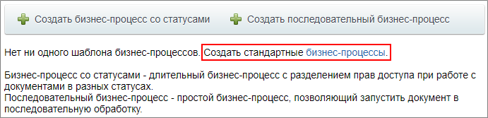
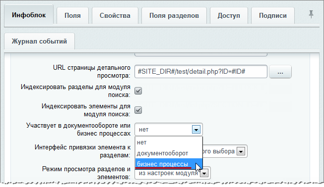
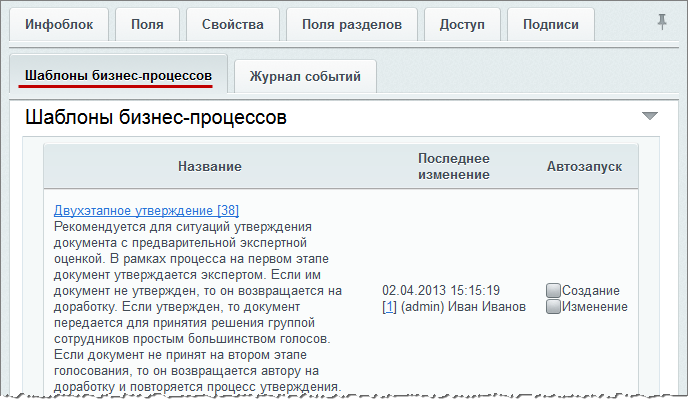
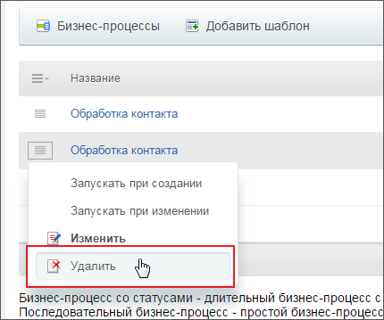

# Создание шаблонов типовых бизнес-процессов

**Навигация**
- [← Оглавление курса](index.md)
- [← Предыдущий: 12399 — Список типовых бизнес-процессов](lesson_12399.md)
- [Следующий: 2362 — Бизнес-процессы документов →](lesson_2362.md)

Официальная страница урока: https://dev.1c-bitrix.ru/learning/course/index.php?COURSE_ID=57&LESSON_ID=7290

Типовые

			шаблоны бизнес-процессов

                    **Шаблон бизнес-процесса** представляет собой последовательность шагов (действий) от начального к конечному, которые выполняются один за другим. Необходимо таким образом и в таком порядке составить шаги (действия), чтобы реализовать нужный нам алгоритм и получить необходимый результат.

[Подробнее](lesson_3816.md)...

		 создаются автоматически при установке продуктов *«1C-Битрикс»*. Посмотрим, каким образом создать их, если по каким-либо причинам типовые процессы не были созданы при установке.

### Действия по созданию шаблонов

- **Универсальные списки** (публичная часть сайта)

  - перейти к желаемому списку на соответствующей странице **Списки** (Сервисы &gt; Списки);
  - перейти к списку шаблонов бизнес-процессов с помощью кнопки
    			Бизнес-процессы
                        
    		, расположенной на странице просмотра списка;
  - воспользоваться соответствующей
    			ссылкой
                        
    		 для создания шаблонов бизнес-процессов.
- **Общий диск**

  - перейти на страницу **Общий диск** (Диск &gt; Общий диск);
  - перейти к списку шаблонов бизнес-процессов с помощью пункта
    			Бизнес процессы
                        
    		 в меню настроек;
    **Примечание:** Если в меню настроек нет пункта **Бизнес-процессы**, то нужно
    			включить поддержку
                        **Примечание:** Для персональных документов в разделе **Мой диск** бизнес-процессы включить нельзя.
    		 бизнес-процессов для библиотеки, выбрав в том же меню настроек пункт **Настройка бизнес-процессов**, и в открывшейся форме включив опцию
    			Активировать бизнес-процессы
                        
    		.
  - воспользоваться соответствующей ссылкой для создания шаблонов.
- **Инфоблоки** (административная часть сайта)

  - перейти на страницу редактирования инфоблока (Контент &gt; Инфоблоки &gt; Типы инфоблоков &gt; [требуемый_инфоблок]);
  - включить поддержку бизнес-процессов, установив для опции **Участвует в документообороте или бизнес-процессах** значение
    			бизнес-процессы
                         
    		;
  - на закладке **Шаблоны бизнес-процессов**
    			отобразятся
                        
    		 типовые шаблоны.
- **Бизнес процессы организаций** (публичная часть сайта, *«Битрикс24 в коробке»*)
  Типовые шаблоны устанавливаются автоматически с установкой модуля **Бизнес-процессы**.

### Удаление шаблонов типовых бизнес-процессов

Для удаления шаблона используйте пункт меню действий **Удалить**.

**Важно:** Удалить шаблон незавершенного бизнес-процесса нельзя.
