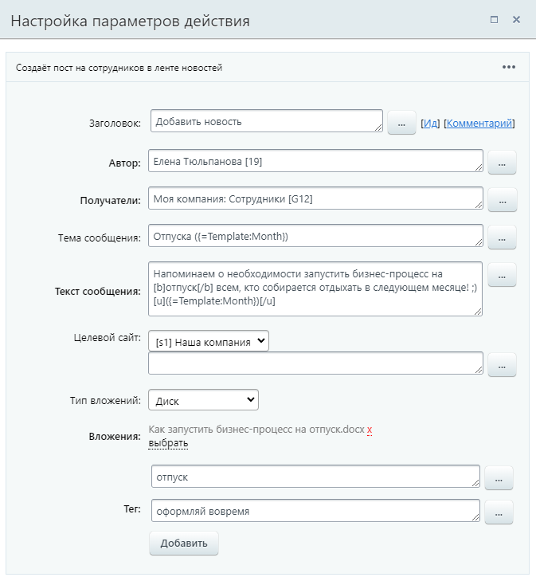
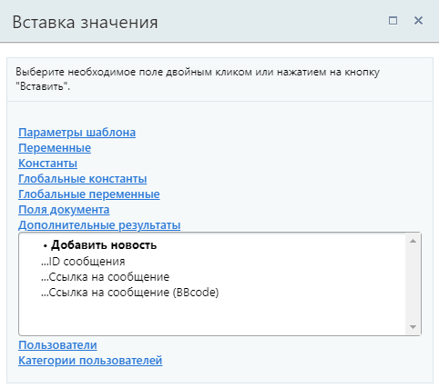

# Добавить новость

**Навигация**
- [← Оглавление курса](index.md)
- [← Предыдущий: 3800 — График отсутствия](lesson_3800.md)
- [Следующий: 26982 — Отправить сообщение в групповой чат →](lesson_26982.md)

Официальная страница урока: https://dev.1c-bitrix.ru/learning/course/index.php?COURSE_ID=57&LESSON_ID=7395

Действие создаёт пост на сотрудников в

			ленте новостей

                    Лента Новостей необходима для общения сотрудников внутри компании. Ежедневно люди делятся новостями, обсуждают события, происходящие в мире и внутри компании, решают задачи, а также развлекают друг друга забавными мемами, чтобы рабочий процесс не был беспроглядной рутиной :)

Подробнее на [helpdesk.bitrix24.ru](https://helpdesk.bitrix24.ru/open/1315100/).

		.

### Параметры

- **Автор** – пользователь, от имени которого будет размещена запись в ленте новостей. Если в этом поле окажется несколько пользователей, автором записи будет тот, кто указан первым;
- **Получатели** – пользователи, группы пользователей или подразделения компании, в чьих лентах новостей отобразится пост;
- **Тема сообщения** – заголовок поста. Размещается в начале поста и выделен жирным начертанием;
- **Текст сообщения** – основное содержание поста. Поддерживается работа с BB-кодами для форматирования текста;
- **Целевой сайт** – сайт, в ленте новостей которого нужно публиковать сообщение;
- **Тип вложений** – выберите один из вариантов: **Файлы документа** или **Диск**. От выбора типа зависит вид следующего параметра;
- **Вложения** – в зависимости от выбора типа вложения, файлы прикрепляются разным образом. Если выбран вариант «Файлы документа» – вложения прикрепляются через форму
  			Вставка значения
                      При работе с бизнес-процессом в параметрах действий, параметрах шаблона и настройках статуса есть возможность указывать как собственный текст (заданный вручную), так и использовать различные переменные значения (поля документа и прочие данные, которые могут меняться и поэтому не задаются вручную). Для подстановки таких переменных значений используется специальная форма **Вставка значения**.
  [Подробнее](lesson_12383.md)...
  		, а если «Диск» – появляется диалоговое окно выбора файлов с Диска;
- **Тег** – проставьте слова, по которым этот пост потом легко будет найти. Можно указать несколько тегов через кнопку **Добавить**.

### Пример

Представим, что у нас есть задача с помощью бизнес-процесса выводить пост для всех сотрудников компании, который напоминает о необходимости запустить бизнес-процесс на отпуск. При этом важно добавить инструкцию к посту и теги, для удобного поиска. Заполним параметры действия «Добавить новость»:

Месяц подставляется с помощью параметра шаблона. В результате работы действия получится такой пост:

Как видим, пост имеет заголовок, к нему прикреплена инструкция и в конце добавлены теги. А с помощью BB-кодов выполнено форматирование некоторых слов поста.

### Результаты выполнения действия

Результаты выполнения этого действия можно получить с помощью формы **Вставка значения** – **Дополнительные результаты**.

Доступно:

- ID сообщения;
- Ссылка на сообщение;
- Ссылка на сообщение (BBcode).

