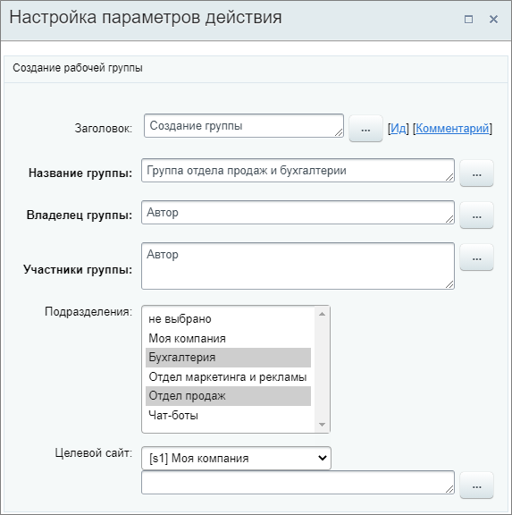
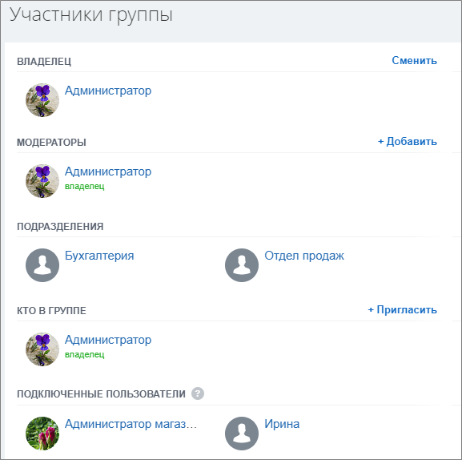
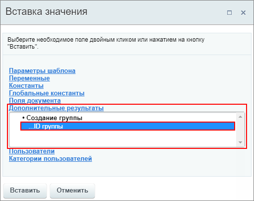

# Создание группы

**Навигация**
- [← Оглавление курса](index.md)
- [← Предыдущий: 20830 — Сгенерировать код](lesson_20830.md)
- [Следующий: 12605 — Создать QR-код →](lesson_12605.md)

Официальная страница урока: https://dev.1c-bitrix.ru/learning/course/index.php?COURSE_ID=57&LESSON_ID=7397

Действие позволяет создать

			группу

                    Группы (проекты) помогают сгруппировать все данные, задачи, файлы, сообщения, встречи в одном месте и работать внутри определенного коллектива.

Подробнее на [helpdesk.bitrix24.ru](https://helpdesk.bitrix24.ru/section/45923/)

		.

### Описание параметров

- **Название группы** — укажите название. Обязательный параметр
- **Владелец группы** — выберите пользователя, который будет владельцем. Обязательный параметр
  **Важно!** У группы может быть только один владелец.
- **Участники группы** — добавьте участников. Можно выбрать как отдельных пользователей, так отделы и членов другой рабочей группы. Обязательный параметр
- **Подразделения** — выберите подразделения для привязки их к новой группе, если необходимо. Сотрудники выбранных подразделений
  			автоматически привяжутся к группе
                      **Подключенные пользователи** — это те пользователи, кого добавили в группу или проект в составе подразделения или отдела.
  Подробнее на [helpdesk.bitrix24.ru](https://helpdesk.bitrix24.ru/open/3135195/).
  		 после её создания и смогут покинуть её, только если подразделение будет удалено из группы
- **Целевой сайт** — выберите из списка, к какому сайту относится группа:

  - в облачном Битрикс24 выбор осуществляется из двух сайтов, основного портала и [экстранет](https://helpdesk.bitrix24.ru/open/17983050/). Если выбран экстранет, группа будет создана для экстранет-пользователей
  - в коробочных продуктах сайтов
    			может быть несколько
                        Подробнее смотрите в учебном курсе [Многосайтовость](https://dev.1c-bitrix.ru/learning/course/index.php?COURSE_ID=103&INDEX=Y) или в уроке [Многодепартаментность](https://dev.1c-bitrix.ru/learning/course/index.php?COURSE_ID=48&LESSON_ID=4781) для коробочной версии Битрикс24

### Пример

Создадим **Группу отдела продаж и бухгалтерии**. Владельцем будет пользователь, запустивший бизнес-процесс. В участниках тоже укажем только Автора. В подразделениях выберем **Бухгалтерию** и **Отдел продаж**.

В результате работы действия, при запуске бизнес-процесса, создастся новая группа с указанным названием. При этом владельцем и участником будет только Автор (*на скриншоте ниже такой пользователь это Администратор*), а все остальные – подключенные пользователи из выбранных подразделений (*на скриншоте ниже это пользователи: Администратор магазина из Отдела продаж и Ирина из Бухгалтерии*).

### Результаты выполнения действия

В результате выполнения действия в секции **Дополнительные результаты** формы **Вставка значения** станет доступен **ID** новой группы:

